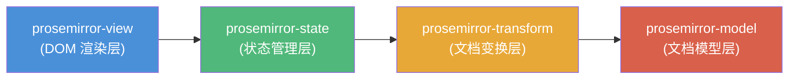
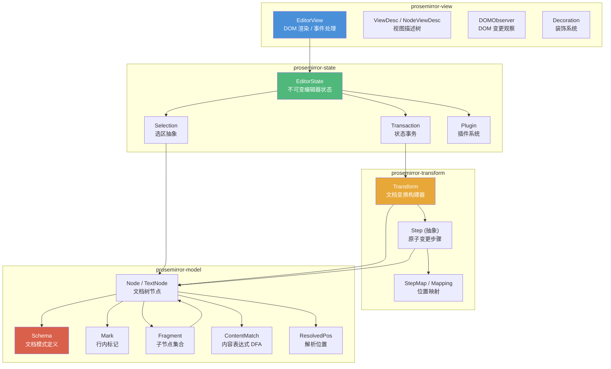

# ProseMirror 富文本编辑器框架 · 核心源码深度分析

> 本仓库基于 ProseMirror monorepo 的 TypeScript 源码，对其文档模型、事务机制、选区系统和模块架构进行逐行级分析。
> 所有代码片段均忠实引用原始源码，不使用伪代码或简化版本；所有源码引用均为可点击跳转的绝对路径。

---

## 一、项目介绍

### 1.1 什么是 ProseMirror

ProseMirror 是一个由 Marijn Haverbeke 开发的**结构化、可扩展的富文本编辑器框架**，官方描述为 "Structured WYSIWYM editor"（结构化的所见即所得编辑器）。它不是一个开箱即用的编辑器组件，而是一组**模块化的底层积木**，开发者可以基于这些积木构建任意复杂度的编辑器。

ProseMirror 的核心设计目标：

- **结构化文档模型**：文档是受 Schema 约束的不可变树，而非 HTML 字符串，从根本上避免了 contenteditable 的混乱
- **可协作编辑**：变更以可序列化、可反转、可 rebase 的 Step 对象表示，原生支持多人实时协作
- **完全可定制**：Schema、命令、插件、节点视图均可自定义，不绑定任何 UI 框架
- **不可变状态**：编辑器状态是持久化数据结构，每次变更产生新状态，支持时间旅行、撤销重做、状态回放

### 1.2 核心特性

| 特性 | 说明 |
|------|------|
| 强 Schema 约束 | content 表达式在编译期转为 DFA 自动机，非法文档无法存在 |
| 不可变文档树 | Node/Fragment/Mark 全部只读，修改即创建，结构共享保证性能 |
| Step 事务系统 | 每个变更都是可序列化、可反转、可映射的原子步骤 |
| 插件全栈扩展 | Plugin 可同时拥有状态字段、事务钩子、DOM 事件和视图组件 |
| 自定义选区 | 支持文本选区、节点选区、全选，并可扩展自定义选区类型 |
| 装饰系统 | Decoration 可在不修改文档的前提下影响渲染 |
| 协作编辑 | prosemirror-collab 包提供完整的 rebase 协作方案 |
| 框架无关 | 核心不依赖 React/Vue，可绑定任何 UI 层 |

### 1.3 基本使用示例

以下是一个最小化的 ProseMirror 编辑器初始化代码（源自 [demo/demo.ts](file:///Users/tog/Desktop/code/gsb/gsb-731/xyj-731-4/xyj-731-4_Steve/demo/demo.ts)）：

```typescript
import {Schema, DOMParser} from "prosemirror-model"
import {EditorView} from "prosemirror-view"
import {EditorState} from "prosemirror-state"
import {schema} from "prosemirror-schema-basic"
import {addListNodes} from "prosemirror-schema-list"
import {exampleSetup} from "prosemirror-example-setup"

const demoSchema = new Schema({
  nodes: addListNodes(schema.spec.nodes as any, "paragraph block*", "block"),
  marks: schema.spec.marks
})

let state = EditorState.create({
  doc: DOMParser.fromSchema(demoSchema).parse(document.querySelector("#content")!),
  plugins: exampleSetup({schema: demoSchema})
})

let view = new EditorView(document.querySelector(".full"), {state})
```

---

## 二、源码目录架构

本仓库是 ProseMirror 的 **monorepo**，通过 npm workspaces 管理多个独立发布的包。根目录下的每个子目录都是一个独立的 npm 包。

### 2.1 核心包（自底向上四层）

```
prosemirror/
├── model/          ← 第1层：文档模型（零 DOM 依赖，可在 Node.js 运行）
│   └── src/
│       ├── schema.ts          Schema / NodeType / MarkType / Spec 接口
│       ├── node.ts            Node / TextNode（不可变文档树节点）
│       ├── fragment.ts        Fragment（子节点持久化集合）
│       ├── mark.ts            Mark（行内标记值对象）
│       ├── content.ts         ContentMatch（content 表达式 DFA 自动机）
│       ├── resolvedpos.ts     ResolvedPos / NodeRange（位置解析）
│       ├── replace.ts         Slice / ReplaceError（文档切片）
│       ├── diff.ts            findDiffStart/End（差异查找）
│       ├── comparedeep.ts     compareDeep（深比较）
│       ├── from_dom.ts        DOMParser（HTML → 文档）
│       └── to_dom.ts          DOMSerializer（文档 → HTML）
│
├── transform/      ← 第2层：文档变换（依赖 model，不依赖 DOM）
│   └── src/
│       ├── transform.ts       Transform（变更构建器，链式 API）
│       ├── step.ts            Step 抽象类 / StepResult
│       ├── map.ts             StepMap / Mapping / MapResult（位置映射）
│       ├── replace_step.ts    ReplaceStep / ReplaceAroundStep
│       ├── replace.ts         replaceStep 工具函数
│       ├── structure.ts       lift / wrap / split / join / setBlockType
│       ├── mark.ts            addMark / removeMark
│       ├── mark_step.ts       AddMarkStep / RemoveMarkStep / AddNodeMarkStep...
│       └── attr_step.ts       AttrStep / DocAttrStep
│
├── state/          ← 第3层：状态管理（依赖 transform + model）
│   └── src/
│       ├── state.ts           EditorState（不可变状态容器）
│       ├── transaction.ts     Transaction（继承 Transform，含选区/元数据）
│       ├── selection.ts       Selection / TextSelection / NodeSelection / AllSelection
│       └── plugin.ts          Plugin / PluginKey / StateField（插件系统）
│
└── view/           ← 第4层：视图渲染（唯一接触 DOM 的层，依赖 state + model）
    └── src/
        ├── index.ts           EditorView（视图主类）+ EditorProps
        ├── viewdesc.ts        ViewDesc / NodeViewDesc（视图描述树）
        ├── input.ts           InputState（输入处理状态机）
        ├── domobserver.ts     DOMObserver（MutationObserver 封装）
        ├── domchange.ts       readDOMChange（DOM 差异 → Step）
        ├── selection.ts       selectionToDOM（选区 DOM 同步）
        ├── decoration.ts      Decoration / DecorationSet（装饰系统）
        ├── domcoords.ts       posAtCoords / coordsAtPos（坐标转换）
        ├── clipboard.ts       复制/粘贴序列化
        └── browser.ts         浏览器特性检测
```

### 2.2 扩展包

| 包目录 | npm 包名 | 职责 |
|--------|----------|------|
| [commands/](file:///Users/tog/Desktop/code/gsb/gsb-731/xyj-731-4/xyj-731-4_Steve/commands/) | prosemirror-commands | 常用编辑命令（toggleMark、joinUp 等） |
| [keymap/](file:///Users/tog/Desktop/code/gsb/gsb-731/xyj-731-4/xyj-731-4_Steve/keymap/) | prosemirror-keymap | 键位绑定 |
| [inputrules/](file:///Users/tog/Desktop/code/gsb/gsb-731/xyj-731-4/xyj-731-4_Steve/inputrules/) | prosemirror-inputrules | 输入规则（如 Markdown 快捷输入） |
| [history/](file:///Users/tog/Desktop/code/gsb/gsb-731/xyj-731-4/xyj-731-4_Steve/history/) | prosemirror-history | 撤销/重做 |
| [collab/](file:///Users/tog/Desktop/code/gsb/gsb-731/xyj-731-4/xyj-731-4_Steve/collab/) | prosemirror-collab | 协作编辑（Step rebase） |
| [gapcursor/](file:///Users/tog/Desktop/code/gsb/gsb-731/xyj-731-4/xyj-731-4_Steve/gapcursor/) | prosemirror-gapcursor | 间隙光标（不可编辑节点间） |
| [dropcursor/](file:///Users/tog/Desktop/code/gsb/gsb-731/xyj-731-4/xyj-731-4_Steve/dropcursor/) | prosemirror-dropcursor | 拖拽落点指示 |
| [schema-basic/](file:///Users/tog/Desktop/code/gsb/gsb-731/xyj-731-4/xyj-731-4_Steve/schema-basic/) | prosemirror-schema-basic | 基础 Schema（paragraph/heading/列表等） |
| [schema-list/](file:///Users/tog/Desktop/code/gsb/gsb-731/xyj-731-4/xyj-731-4_Steve/schema-list/) | prosemirror-schema-list | 列表 Schema 和命令 |
| [menu/](file:///Users/tog/Desktop/code/gsb/gsb-731/xyj-731-4/xyj-731-4_Steve/menu/) | prosemirror-menu | 菜单栏 UI |
| [markdown/](file:///Users/tog/Desktop/code/gsb/gsb-731/xyj-731-4/xyj-731-4_Steve/markdown/) | prosemirror-markdown | Markdown 序列化/解析 |
| [changeset/](file:///Users/tog/Desktop/code/gsb/gsb-731/xyj-731-4/xyj-731-4_Steve/changeset/) | prosemirror-changeset | 变更追踪/审阅 |
| [search/](file:///Users/tog/Desktop/code/gsb/gsb-731/xyj-731-4/xyj-731-4_Steve/search/) | prosemirror-search | 搜索替换 |
| [example-setup/](file:///Users/tog/Desktop/code/gsb/gsb-731/xyj-731-4/xyj-731-4_Steve/example-setup/) | prosemirror-example-setup | 示例配置（组合以上插件） |

### 2.3 辅助目录

| 目录 | 作用 |
|------|------|
| [bin/pm.js](file:///Users/tog/Desktop/code/gsb/gsb-731/xyj-731-4/xyj-731-4_Steve/bin/pm.js) | monorepo 管理脚本（build/test/install/release） |
| [demo/](file:///Users/tog/Desktop/code/gsb/gsb-731/xyj-731-4/xyj-731-4_Steve/demo/) | 在线演示页面 |
| [assets/](file:///Users/tog/Desktop/code/gsb/gsb-731/xyj-731-4/xyj-731-4_Steve/assets/) | Logo 等静态资源 |
| [website/](file:///Users/tog/Desktop/code/gsb/gsb-731/xyj-731-4/xyj-731-4_Steve/website/) | 官网源码（prosemirror.net） |

### 2.4 包间依赖关系

核心包形成严格的线性依赖链，**上层可以依赖下层，下层绝不依赖上层**：



这种分层保证了：
- `model` 包可在 Node.js 服务端运行（无 DOM 依赖），用于协作服务端、文档转换
- `transform` 包可在无浏览器环境下做文档变更计算
- `state` 包是纯逻辑，不关心渲染
- `view` 包是唯一接触 DOM 的层，可被替换

---

## 三、整体架构总览



**核心数据流（单向数据流）：**

```
用户操作 → EditorView 创建 Transaction → EditorState.apply(tr) → newState → View 更新 DOM
```

---

## 四、分析文档架构

本分析文档按主题拆分为多个文件，位于 [docs/](file:///Users/tog/Desktop/code/gsb/gsb-731/xyj-731-4/xyj-731-4_Steve/docs/) 目录，建议按顺序阅读：

| 序号 | 文档 | 内容 | 对应源码 |
|------|------|------|----------|
| 01 | [文档模型：Schema、Node、Mark](file:///Users/tog/Desktop/code/gsb/gsb-731/xyj-731-4/xyj-731-4_Steve/docs/01-schema-node-mark.md) | Schema 编译机制、Node/Fragment/Mark 不可变设计、ContentMatch DFA、Slice、核心类关系图 | [model/src/](file:///Users/tog/Desktop/code/gsb/gsb-731/xyj-731-4/xyj-731-4_Steve/model/src/) |
| 02 | [事务机制与状态不可变性](file:///Users/tog/Desktop/code/gsb/gsb-731/xyj-731-4/xyj-731-4_Steve/docs/02-transaction-immutability.md) | Step 抽象、ReplaceStep、StepMap/Mapping 位置映射、Transform、Transaction、EditorState 不可变更新 | [transform/src/](file:///Users/tog/Desktop/code/gsb/gsb-731/xyj-731-4/xyj-731-4_Steve/transform/src/)、[state/src/](file:///Users/tog/Desktop/code/gsb/gsb-731/xyj-731-4/xyj-731-4_Steve/state/src/) |
| 03 | [选区系统实现原理](file:///Users/tog/Desktop/code/gsb/gsb-731/xyj-731-4/xyj-731-4_Steve/docs/03-selection.md) | Selection 抽象、TextSelection/NodeSelection/AllSelection、ResolvedPos 位置解析、选区自动映射与查找算法 | [state/src/selection.ts](file:///Users/tog/Desktop/code/gsb/gsb-731/xyj-731-4/xyj-731-4_Steve/state/src/selection.ts)、[model/src/resolvedpos.ts](file:///Users/tog/Desktop/code/gsb/gsb-731/xyj-731-4/xyj-731-4_Steve/model/src/resolvedpos.ts) |
| 04 | [核心模块依赖关系图](file:///Users/tog/Desktop/code/gsb/gsb-731/xyj-731-4/xyj-731-4_Steve/docs/04-architecture-dependencies.md) | 分层架构图、包间依赖、各包内部依赖图、View 层 DOM 交互时序、状态更新数据流 | 全部核心包 |
| 05 | [与 Slate、Quill 架构差异对比](file:///Users/tog/Desktop/code/gsb/gsb-731/xyj-731-4/xyj-731-4_Steve/docs/05-comparison.md) | 11 维度对比矩阵、文档模型/状态模型/协作/扩展机制差异、架构选型建议 | — |
| 06 | [关键代码索引](file:///Users/tog/Desktop/code/gsb/gsb-731/xyj-731-4/xyj-731-4_Steve/docs/06-code-index.md) | 按包分类的 100+ 个关键类/方法的源码位置索引（全部可点击跳转） | 全部核心包 |

### 文档阅读建议

- **初次接触 ProseMirror**：从本文档的"整体架构总览"开始，然后阅读 [01 文档模型](file:///Users/tog/Desktop/code/gsb/gsb-731/xyj-731-4/xyj-731-4_Steve/docs/01-schema-node-mark.md)
- **想理解不可变更新**：直接阅读 [02 事务机制](file:///Users/tog/Desktop/code/gsb/gsb-731/xyj-731-4/xyj-731-4_Steve/docs/02-transaction-immutability.md)
- **想了解选区定位**：阅读 [03 选区系统](file:///Users/tog/Desktop/code/gsb/gsb-731/xyj-731-4/xyj-731-4_Steve/docs/03-selection.md)
- **想全局把握模块关系**：查看 [04 架构图](file:///Users/tog/Desktop/code/gsb/gsb-731/xyj-731-4/xyj-731-4_Steve/docs/04-architecture-dependencies.md)
- **做技术选型**：参考 [05 架构对比](file:///Users/tog/Desktop/code/gsb/gsb-731/xyj-731-4/xyj-731-4_Steve/docs/05-comparison.md)
- **需要定位具体源码**：使用 [06 代码索引](file:///Users/tog/Desktop/code/gsb/gsb-731/xyj-731-4/xyj-731-4_Steve/docs/06-code-index.md)

---

## 五、核心设计哲学

1. **Schema 即契约**：通过编译期 ContentMatch DFA 自动机严格约束文档结构，从源头保证文档合法性。参见 [Schema 构造函数](file:///Users/tog/Desktop/code/gsb/gsb-731/xyj-731-4/xyj-731-4_Steve/model/src/schema.ts#L595-L630)

2. **不可变即安全**：所有数据结构（Node、Fragment、Mark、EditorState）均为只读，修改产生新实例，结构共享保证性能。参见 [Node.copy()](file:///Users/tog/Desktop/code/gsb/gsb-731/xyj-731-4/xyj-731-4_Steve/model/src/node.ts#L138-L141)

3. **Step 即真理**：所有变更抽象为可序列化、可反转、可映射的 Step 对象，为撤销/重做和协作编辑奠定基础。参见 [Step 抽象类](file:///Users/tog/Desktop/code/gsb/gsb-731/xyj-731-4/xyj-731-4_Steve/transform/src/step.ts#L16-L67)

4. **分层即灵活**：model 不依赖 DOM，transform 不依赖 state，view 可替换，每层可独立使用和测试。参见 [tsconfig.json paths](file:///Users/tog/Desktop/code/gsb/gsb-731/xyj-731-4/xyj-731-4_Steve/tsconfig.json#L14-L34)

5. **Plugin 即全栈扩展**：插件可以同时拥有状态字段、事务钩子、DOM 事件处理和视图组件，是功能聚合的完整单元。参见 [Plugin 类](file:///Users/tog/Desktop/code/gsb/gsb-731/xyj-731-4/xyj-731-4_Steve/state/src/plugin.ts#L71-L89)

---

## 六、快速开始

### 安装依赖

```bash
npm install
```

### 构建所有模块

```bash
./bin/pm build
```

### 运行测试

```bash
npm test
```

### 启动开发服务器（demo）

```bash
./bin/pm dev-start
```

然后访问 `http://localhost:8080/`。

### 查看所有模块

```bash
./bin/pm modules --core
```

输出核心模块列表：
```
model
transform
state
view
keymap
inputrules
history
collab
commands
gapcursor
schema-basic
schema-list
```

---

## 七、技术栈与工具链

| 类别 | 技术 |
|------|------|
| 语言 | TypeScript（strict 模式，target ES6） |
| 模块系统 | ES modules（module: es2020） |
| 包管理 | npm workspaces（monorepo） |
| 构建工具 | @marijn/buildtool |
| 测试框架 | Mocha + @marijn/testtool |
| 外部依赖 | orderedmap（有序 Map） |
| 许可证 | MIT |

---

## 八、参考资源

- **官方网站**：https://prosemirror.net
- **API 文档**：https://prosemirror.net/docs/ref/
- **官方指南**：https://prosemirror.net/docs/guide/
- **论坛**：http://discuss.prosemirror.net
- **源码仓库**：https://code.haverbeke.berlin/prosemirror/prosemirror
- **核心作者**：Marijn Haverbeke（也是 CodeMirror 的作者）
