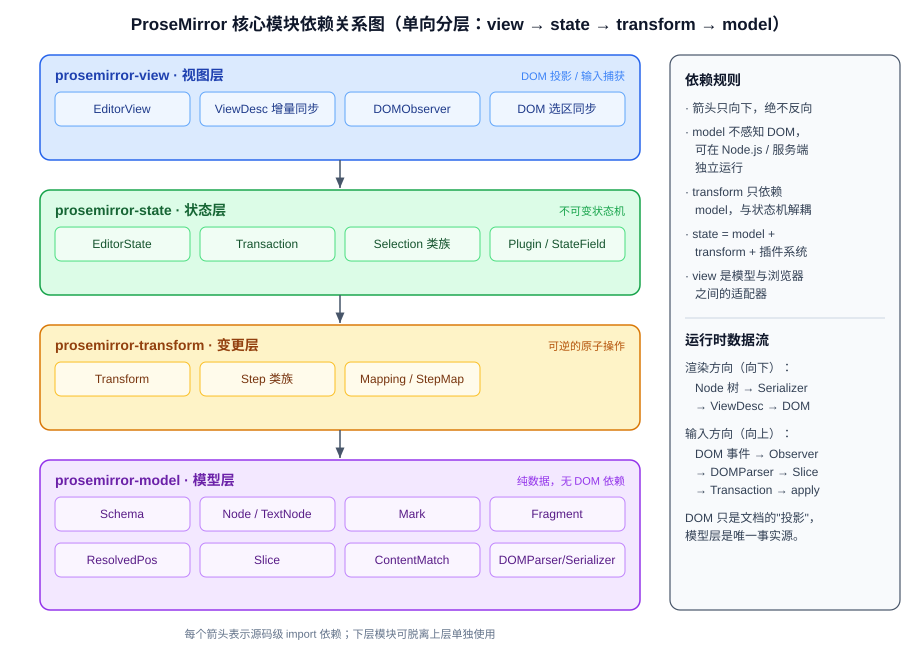
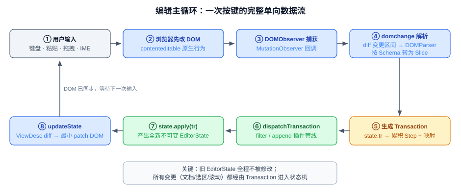

# ProseMirror 核心源码分析：文档模型设计原理

> 基于 ProseMirror 核心仓库源码（`prosemirror-model` / `prosemirror-transform` / `prosemirror-state` / `prosemirror-view`，已克隆在本目录下）的架构解读。
> 文档按专题拆分为 `docs/` 下的多个 Markdown 文件，架构图全部使用 SVG（见 `assets/`），任何 Markdown 渲染器均可显示。

## 核心架构图

ProseMirror 采用严格分层、单向依赖的模块结构：`view → state → transform → model`。



编辑过程是单向数据流：DOM 事件 → Transaction → 新 EditorState → 增量 patch DOM。



## 文档导航

| # | 文档 | 内容 |
|---|---|---|
| 01 | [总体架构与模块依赖](docs/01-总体架构.md) | 四层模块划分、单向数据流、编辑主循环 |
| 02 | [文档模型：Schema、Node、Mark](docs/02-文档模型-Schema-Node-Mark.md) | 三要素关系、内容表达式自动机、持久化树、token 位置索引、Mark 集合代数 |
| 03 | [Transaction 事务机制](docs/03-Transaction事务机制.md) | Step/Transform/Transaction 三层结构、状态不可变性的六项保证、StepMap/Mapping 位置映射 |
| 04 | [Selection 选区系统](docs/04-Selection选区系统.md) | Selection 类族、anchor/head、map 迁移、合法位置搜索、DOM 选区双向同步 |
| 05 | [与 Slate、Quill 的架构对比](docs/05-与Slate-Quill架构对比.md) | 11 维度对比表 + 架构哲学差异分析 |
| 06 | [关键代码索引](docs/06-关键代码索引.md) | 四个核心包全部关键类的 `文件:行号` 速查表 |

## 架构图资源（assets/）

| 文件 | 说明 |
|---|---|
| [arch-modules.svg](assets/arch-modules.svg) | 核心模块依赖关系图 |
| [arch-dataflow.svg](assets/arch-dataflow.svg) | 编辑主循环单向数据流图 |
| [doc-model.svg](assets/doc-model.svg) | 文档模型结构图（Node 树 + token 位置 + Schema/Mark 关系） |
| [transaction.svg](assets/transaction.svg) | Transaction 事务机制图（Step → Transform → Transaction → 新状态） |
| [selection.svg](assets/selection.svg) | Selection 选区系统图（token 流上的 anchor/head 与三种子类） |

## 核心结论速览

1. **文档模型**：Schema 约束的不可变树。块级结构用 Node 嵌套，行内格式用挂在节点上的 rank 有序 Mark 平行数组（不嵌套），Schema 用内容表达式自动机保证文档任何时刻合法。
2. **事务机制**：`Step`（可逆、可序列化的原子变更）→ `Transform`（steps + docs + mapping 审计轨迹）→ `Transaction`（+ 选区/storedMarks/meta）。`EditorState` 永不原地修改，`apply` 产出全新状态，旧状态零成本保留。
3. **选区系统**：基于 `ResolvedPos` 的 anchor/head 位置对，Text/Node/All 三子类；`map` 随文档迁移，`Selection.near` 兜底搜索合法落点；选区变更同样走事务管线。
4. **与 Slate/Quill 的本质差异**：ProseMirror 以 Schema 强约束 + 手写结构共享 + Step 可逆性/位置映射一等公民为代价换取结构严谨与协同可靠；Slate 自由但约束责任在用户；Quill 扁平模型天然 OT 但表达力最弱。

## 源码目录

```
prosemirror-model/      # 文档模型：Schema / Node / Mark / Fragment / ResolvedPos / Slice
prosemirror-transform/  # 变更层：Step / Transform / Mapping
prosemirror-state/      # 状态层：EditorState / Transaction / Selection / Plugin
prosemirror-view/       # 视图层：EditorView / ViewDesc / DOMObserver
docs/                   # 本分析的专题文档（01–06）
assets/                 # 架构图（SVG）
```
