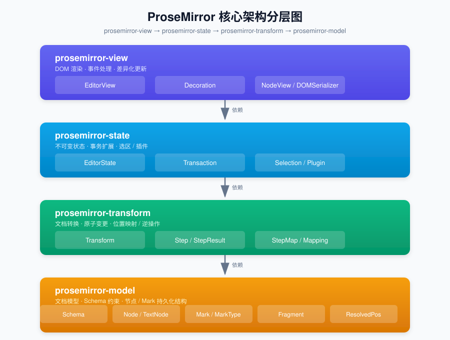
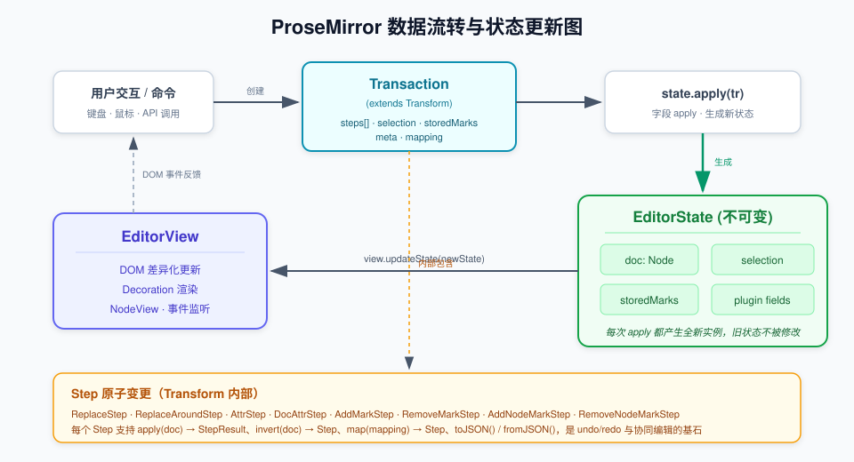

# ProseMirror 核心架构深度解析

> 基于 ProseMirror v1.25.x 核心源码的深度分析，涵盖文档模型、事务机制、选区系统、模块依赖及与 Slate、Quill 的架构对比。
>
> 所有代码引用均指向项目本地源码（[model/src/](model/src)、[transform/src/](transform/src)、[state/src/](state/src)、[view/src/](view/src)），文档内链接使用相对路径。

---

## 架构总览

ProseMirror 采用**分层、模块化、函数式**的架构设计，核心由四个低耦合包组成，自底向上依次为 `model` → `transform` → `state` → `view`，形成清晰的单向依赖链。



### 数据流转全景



1. 用户交互或命令创建 `Transaction`（继承自 `Transform`）
2. Transaction 内部累积 `Step` 数组，并维护选区的懒映射
3. `EditorState.apply(tr)` 依次执行 `filterTransaction`、`applyInner`、`appendTransaction` 循环
4. `applyInner` 为每个状态字段调用 `apply`，生成**全新** `EditorState`（不可变）
5. `EditorView` 收到新状态后进行 DOM 差异化更新

---

## 文档导航

本分析按主题拆分为多个文档：

| 文档 | 内容 | 核心源码 |
|------|------|---------|
| [01 - 文档模型](docs/01-document-model.md) | Schema、Node、TextNode、Mark、Fragment、ResolvedPos 的设计原理 | [schema.ts](model/src/schema.ts)、[node.ts](model/src/node.ts)、[mark.ts](model/src/mark.ts) |
| [02 - Transaction 事务机制](docs/02-transaction.md) | Step 原子变更、StepMap/Mapping 位置映射、Transform、不可变状态更新 | [transform.ts](transform/src/transform.ts)、[step.ts](transform/src/step.ts)、[transaction.ts](state/src/transaction.ts) |
| [03 - Selection 选区系统](docs/03-selection.md) | Selection 基类、TextSelection/NodeSelection/AllSelection、选区映射、Bookmark | [selection.ts](state/src/selection.ts) |
| [04 - 插件系统与模块依赖](docs/04-plugin-and-dependencies.md) | Plugin、StateField、模块依赖关系 | [plugin.ts](state/src/plugin.ts) |
| [05 - 编辑器架构对比](docs/05-comparison.md) | ProseMirror vs Slate vs Quill 在 14 个维度的差异 | — |
| [06 - 关键源码索引](docs/06-source-index.md) | 所有关键类/方法的本地源码位置速查 | 全模块 |

### 架构图文件（独立 SVG）

- [docs/architecture-layered.svg](docs/architecture-layered.svg) — 四层分层架构图
- [docs/architecture-dataflow.svg](docs/architecture-dataflow.svg) — 数据流转与状态更新图
- [docs/architecture-document-model.svg](docs/architecture-document-model.svg) — 文档模型类关系图

---

## 核心结论速览

### 1. Schema、Node、Mark 的关系

- **Schema** 是文档的"宪法"，定义合法的 NodeType 和 MarkType（每个类型在 Schema 中只有一个单例），通过内容表达式（编译为有限状态自动机）强约束嵌套规则。
- **Node** 是文档树的基本单元，持有 `type`（指向 NodeType 单例）、`attrs`、`content`（Fragment）、`marks`。Node 是持久化不可变的，所有修改返回新实例并通过结构共享保证性能。TextNode 继承 Node，承载文本内容。
- **Mark** 是附着在节点上的行内格式标签（加粗、链接等），按 MarkType 的 rank 排序存储，支持互斥（excludes）和包含性（inclusive）。Mark 不是节点，而是 Node.marks 数组中的元素。

参考：[文档模型详解](docs/01-document-model.md)

### 2. Transaction 如何保证不可变性

- 所有文档变更封装为 **Step** 对象（ReplaceStep、AttrStep 等），每个 Step 支持 `apply`、`invert`、`map`、JSON 序列化。
- **Transform** 累积 Step 数组，每步保存旧文档快照，通过 StepMap/Mapping 维护位置映射。
- **Transaction** 继承 Transform，增加选区、storedMarks、meta；选区通过 mapping 懒映射。
- `EditorState.applyInner` 每次 `new EditorState()`，为每个字段调用 `apply` 生成新值，旧状态绝不修改。

参考：[事务机制详解](docs/02-transaction.md)

### 3. Selection 实现原理

- Selection 抽象基类持有 `$anchor`/`$head`（ResolvedPos）和 ranges。
- 三种内置类型：TextSelection（含光标）、NodeSelection（节点选择）、AllSelection（全选），通过 `jsonID` 注册支持序列化。
- 文档变更后，选区通过 `map(doc, mapping)` 自动调整，无效位置通过 `Selection.near` 容错降级。
- Bookmark 是文档无关的轻量选区快照，用于历史记录的保存与恢复。

参考：[选区系统详解](docs/03-selection.md)

---

## 本地源码目录结构

```
.
├── model/src/          # prosemirror-model：文档模型
│   ├── schema.ts       # Schema、NodeType、MarkType
│   ├── node.ts         # Node、TextNode
│   ├── mark.ts         # Mark
│   ├── fragment.ts     # Fragment
│   ├── resolvedpos.ts  # ResolvedPos、NodeRange
│   ├── content.ts      # ContentMatch（内容表达式自动机）
│   └── replace.ts      # Slice、replace 算法
├── transform/src/      # prosemirror-transform：文档转换
│   ├── transform.ts    # Transform
│   ├── step.ts         # Step、StepResult
│   ├── map.ts          # StepMap、Mapping
│   ├── replace_step.ts # ReplaceStep
│   ├── attr_step.ts    # AttrStep、DocAttrStep
│   └── structure.ts    # lift、wrap、split、join
├── state/src/          # prosemirror-state：编辑器状态
│   ├── state.ts        # EditorState
│   ├── transaction.ts  # Transaction
│   ├── selection.ts    # Selection 及子类
│   └── plugin.ts       # Plugin、StateField
├── view/src/           # prosemirror-view：DOM 视图
└── docs/               # 本分析文档与架构图 SVG
    ├── architecture-layered.svg
    ├── architecture-dataflow.svg
    ├── architecture-document-model.svg
    ├── 01-document-model.md
    ├── 02-transaction.md
    ├── 03-selection.md
    ├── 04-plugin-and-dependencies.md
    ├── 05-comparison.md
    └── 06-source-index.md
```

---

## 设计哲学总结

1. **不可变性与结构共享**：Node/Fragment/Mark[]/EditorState 全部不可变，修改产生新对象并通过结构共享保证性能，使状态变化可预测、可追踪、易调试。
2. **显式变更表示**：所有文档修改封装为 Step 对象，天然支持 undo/redo、协同编辑、变更审计。
3. **强 Schema 约束**：Schema 不仅定义文档形态，还在运行时通过 ContentMatch 自动机验证合法性，从源头避免无效状态。
4. **分层解耦**：model 无依赖、transform 依赖 model、state 在二者之上、view 负责 DOM，每层可独立使用和测试。
5. **插件一等公民**：Plugin 拥有自己的 StateField，与内置字段平等参与事务更新，filterTransaction/appendTransaction 赋予强大干预能力。
