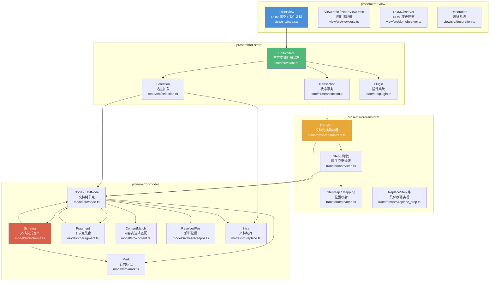

# ProseMirror 富文本编辑器框架核心源码深度分析

> 基于 ProseMirror monorepo 核心包（model / transform / state / view）的 TypeScript 源码分析。
> 所有代码片段均忠实引用原始源码，不使用伪代码或简化版本。

---

## 文档结构

本分析文档按主题拆分为多个文件，位于 [docs/](docs/) 目录：

| 文档 | 内容 |
|------|------|
| [01 文档模型：Schema、Node、Mark](docs/01-schema-node-mark.md) | Schema 编译机制、Node/Fragment/Mark 不可变设计、ContentMatch DFA、核心类关系图 |
| [02 事务机制与状态不可变性](docs/02-transaction-immutability.md) | Step 抽象、ReplaceStep、StepMap/Mapping 位置映射、Transform、Transaction、EditorState 不可变更新 |
| [03 选区系统实现原理](docs/03-selection.md) | Selection 抽象、TextSelection/NodeSelection/AllSelection、ResolvedPos、选区自动映射与查找算法 |
| [04 核心模块依赖关系图](docs/04-architecture-dependencies.md) | 分层架构图、包间依赖、各包内部依赖、View 层交互时序图 |
| [05 与 Slate、Quill 架构差异对比](docs/05-comparison.md) | 11 维度对比矩阵、文档模型/状态模型/协作/扩展机制差异、选型建议 |
| [06 关键代码索引](docs/06-code-index.md) | 按包分类的源码位置索引（可点击跳转） |

---

## 整体架构总览

ProseMirror 采用**严格分层**的模块化架构，核心由四个独立 npm 包组成，自底向上依次为：

**架构分层的核心设计思想：**

1. **model 层**：纯数据层，定义文档的结构约束（Schema）、节点（Node）、标记（Mark），不涉及任何修改逻辑
2. **transform 层**：纯逻辑层，定义如何以可追溯、可反转的步骤（Step）修改文档，不依赖浏览器 DOM
3. **state 层**：状态管理层，将文档、选区、插件状态组合为不可变 `EditorState`，通过 `Transaction` 产生新状态
4. **view 层**：渲染与交互层，将 `EditorState` 渲染到 DOM，监听用户输入并生成 `Transaction`

---

## 核心设计哲学

1. **Schema 即契约**：通过编译期 ContentMatch DFA 自动机严格约束文档结构，从源头保证文档合法性
2. **不可变即安全**：所有数据结构（Node、Fragment、Mark、EditorState）均为只读，修改产生新实例，结构共享保证性能
3. **Step 即真理**：所有变更抽象为可序列化、可反转、可映射的 Step 对象，为撤销/重做和协作编辑奠定基础
4. **分层即灵活**：model 不依赖 DOM，transform 不依赖 state，view 可替换，每层可独立使用和测试
5. **Plugin 即全栈扩展**：插件可以同时拥有状态字段、事务钩子、DOM 事件处理和视图组件

---

## 快速导航

- 想了解文档树如何构建？→ [01 文档模型](docs/01-schema-node-mark.md)
- 想了解状态如何不可变更新？→ [02 事务机制](docs/02-transaction-immutability.md)
- 想了解选区如何定位和映射？→ [03 选区系统](docs/03-selection.md)
- 想了解模块间如何组织？→ [04 架构图](docs/04-architecture-dependencies.md)
- 想了解与其他编辑器的区别？→ [05 架构对比](docs/05-comparison.md)
- 想直接定位源码？→ [06 代码索引](docs/06-code-index.md)
