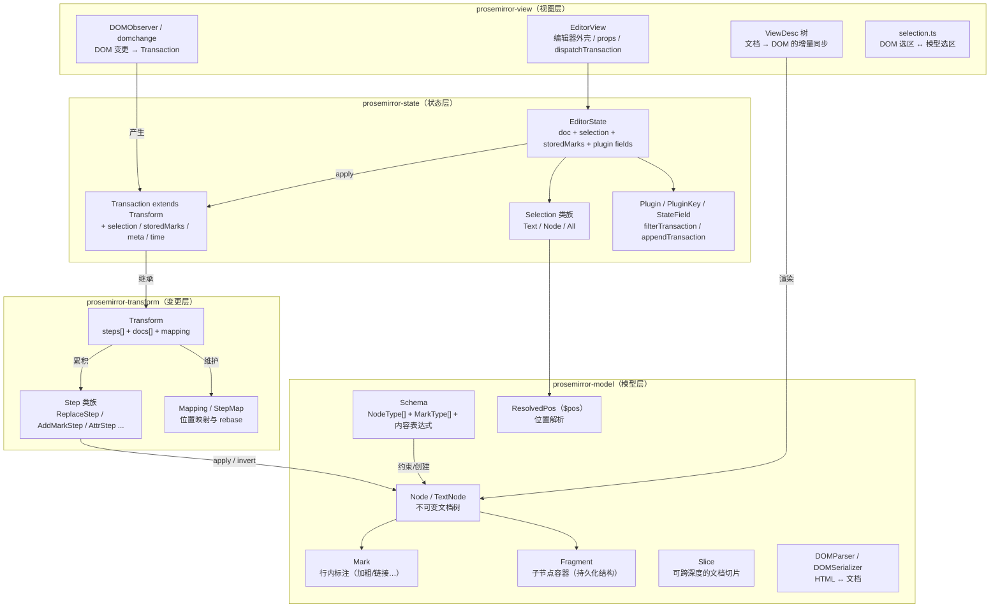
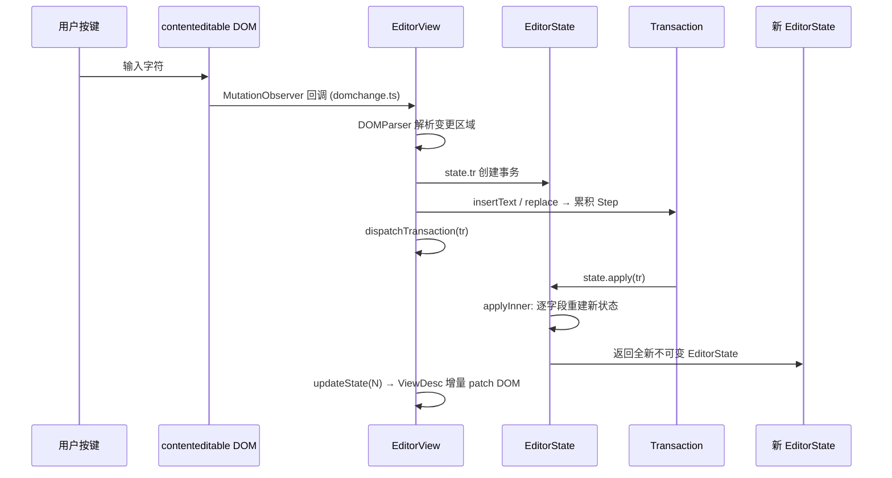
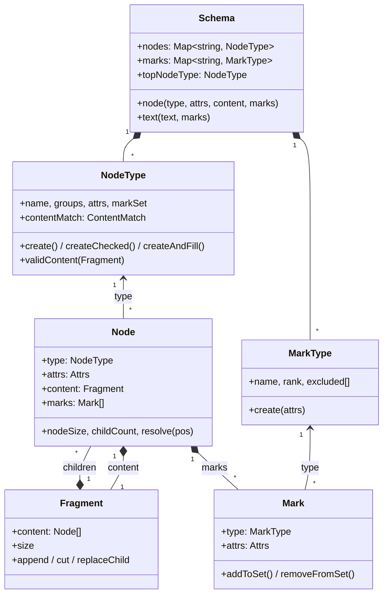
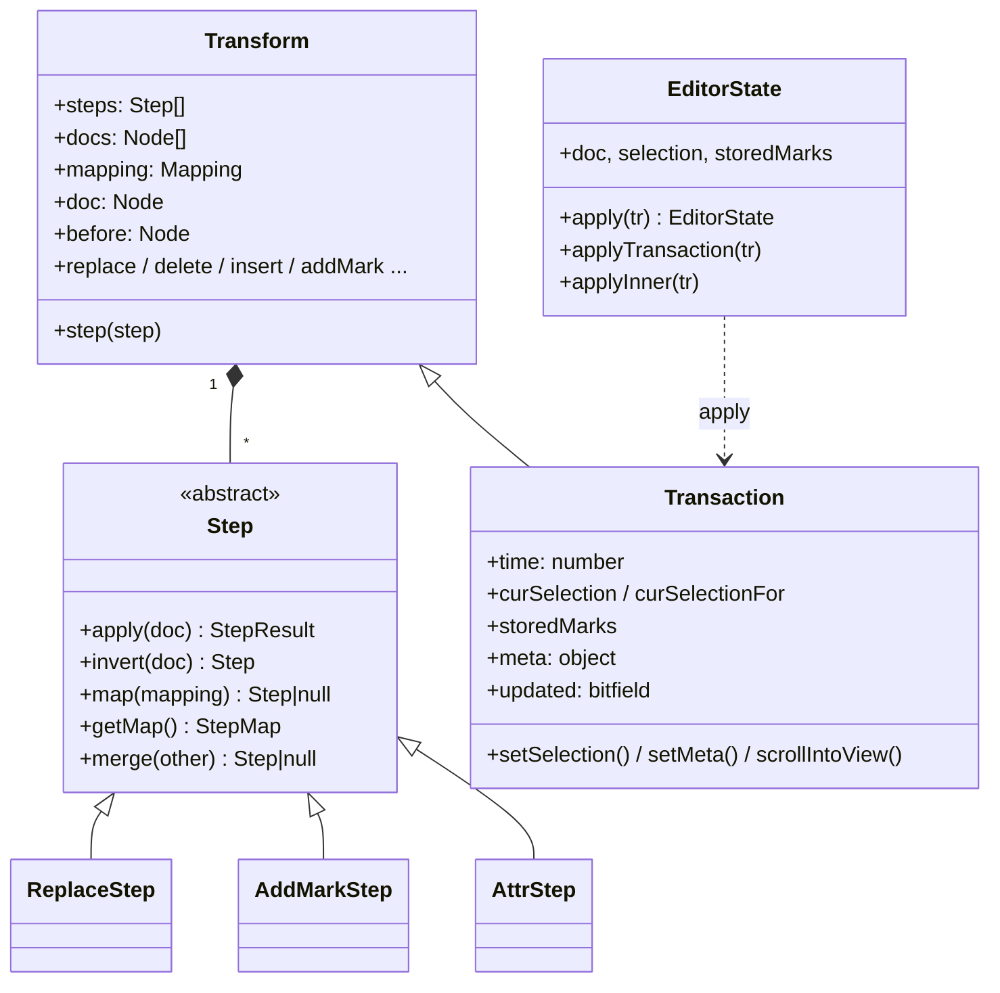
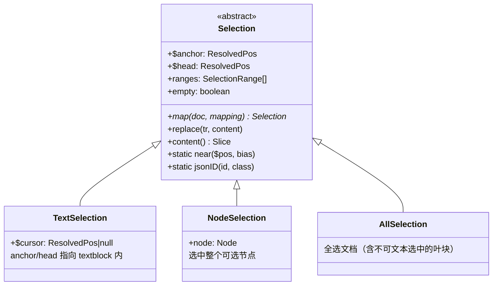

# ProseMirror 核心源码分析：文档模型设计原理

> 基于 ProseMirror 核心仓库源码（`prosemirror-model` / `prosemirror-transform` / `prosemirror-state` / `prosemirror-view`）的架构解读。
> 文中所有 `文件:行号` 均对应本目录下克隆的源码文件。

---

## 目录

1. [总体架构与模块依赖关系图](#1-总体架构与模块依赖关系图)
2. [Schema、Node、Mark：文档模型三要素](#2-schemanodemark文档模型三要素)
3. [Transaction 事务机制与状态不可变性](#3-transaction-事务机制与状态不可变性)
4. [Selection 选区系统实现原理](#4-selection-选区系统实现原理)
5. [编辑主循环：从 DOM 事件到新状态](#5-编辑主循环从-dom-事件到新状态)
6. [与 Slate、Quill 的架构差异对比](#6-与-slatequill-的架构差异对比)
7. [关键代码索引](#7-关键代码索引)

---

## 1. 总体架构与模块依赖关系图

ProseMirror 采用 **严格分层、单向依赖** 的模块结构：`view → state → transform → model`。下层是纯数据与纯逻辑，不感知 DOM；上层负责把模型投射到 DOM 并把 DOM 事件翻译回事务。



**依赖规则**：箭头只向下。`model` 不依赖任何兄弟包；`transform` 只依赖 `model`；`state` 依赖前两者；`view` 依赖全部。这种分层保证文档模型可以在无 DOM 环境（Node.js、协同服务端）中独立使用。

**一次按键的完整数据流**（单向数据流，类似 Redux）：



---

## 2. Schema、Node、Mark：文档模型三要素

### 2.1 设计总览

ProseMirror 的文档不是 HTML 字符串，也不是扁平的 delta，而是一棵 **受 Schema 约束的不可变树**：

- **Node（节点）**：树的骨架。块级结构（段落、标题、列表）用节点嵌套表达。
- **Mark（标记）**：附着在节点上的"标签"。行内格式（加粗、斜体、链接）**不嵌套**，而是作为节点的一个平行数组属性。
- **Schema（模式）**：规则书。定义哪些 NodeType / MarkType 存在、每种节点允许什么内容（内容表达式）、允许哪些 Mark、有哪些属性。

三者关系：



**关键设计决策：行内格式用 Mark 而非嵌套节点。** HTML 中 `<strong>he<em>llo</em></strong>` 这种交叉嵌套在树上很难做局部编辑与 diff；ProseMirror 把"hello"拆成 `text("he", [strong])` + `text("llo", [strong, em])` 两个平铺的文本节点，每个节点挂一个 **按 rank 排序的 Mark 数组**。这使得任意行内范围操作都退化为对扁平序列的分段，极大简化了替换算法。

### 2.2 Schema：编译期一次性构建的规则中心

Schema 构造时把声明式的 `NodeSpec` / `MarkSpec` **编译**成可执行的 `NodeType` / `MarkType`，并把内容表达式解析为自动机（`ContentMatch`），缓存复用。

关键代码 —— `prosemirror-model/src/schema.ts:596`：

```ts
constructor(spec: SchemaSpec<Nodes, Marks>) {
  // ...
  this.nodes = NodeType.compile(this.spec.nodes, this)
  this.marks = MarkType.compile(this.spec.marks, this)

  let contentExprCache = Object.create(null)
  for (let prop in this.nodes) {
    let type = this.nodes[prop], contentExpr = type.spec.content || "", markExpr = type.spec.marks
    type.contentMatch = contentExprCache[contentExpr] ||
      (contentExprCache[contentExpr] = ContentMatch.parse(contentExpr, this.nodes))
    // ...
    type.markSet = markExpr == "_" ? null :
      markExpr ? gatherMarks(this, markExpr.split(" ")) :
      markExpr == "" || !type.inlineContent ? [] : null
  }
  for (let prop in this.marks) {
    let type = this.marks[prop], excl = type.spec.excludes
    type.excluded = excl == null ? [type] : excl == "" ? [] : gatherMarks(this, excl.split(" "))
  }
  // ...
  this.topNodeType = this.nodes[this.spec.topNode || "doc"]
}
```

要点：

1. **内容表达式即正则式**：`"paragraph block*"`、`"heading"` 这类字符串被 `ContentMatch.parse` 编译成 NFA（`prosemirror-model/src/content.ts:10` 的 `ContentMatch`，每个匹配状态持有 `next: MatchEdge[]` 边表），校验内容就是跑一遍自动机：

   ```ts
   // content.ts:43
   matchFragment(frag: Fragment, start = 0, end = frag.childCount): ContentMatch | null {
     let cur: ContentMatch | null = this
     for (let i = start; cur && i < end; i++)
       cur = cur.matchType(frag.child(i).type)
     return cur
   }
   ```

2. **约束在创建与变更两条路径上都强制执行**：`NodeType.createChecked`（schema.ts:160）先 `checkContent` 再构造；`Node.validContent`（schema.ts:188）同时校验内容结构与每个子节点的 marks 是否被允许。
3. **互斥规则在编译期求值**：`excludes` 字符串在构造时被解析成 `MarkType[]`，运行时 `Mark.addToSet` 只做 O(n) 查表。

Schema 还承担 **工厂** 职责（`schema.node()` / `schema.text()` / `schema.mark()`），以及序列化锚点（`nodeFromJSON` / `markFromJSON`），保证 JSON 反序列化也走同一套校验。

### 2.3 Node：持久化（不可变）的文档树

关键代码 —— `prosemirror-model/src/node.ts:22`：

```ts
export class Node {
  constructor(
    readonly type: NodeType,
    readonly attrs: Attrs,
    content?: Fragment | null,
    readonly marks = Mark.none
  ) {
    this.content = content || Fragment.empty
  }
  // ...
  get nodeSize(): number { return this.isLeaf ? 1 : 2 + this.content.size }
}
```

源码注释直接点明设计原理（node.ts:14-18）：

> Nodes are persistent data structures. Instead of changing them, you create new ones with the content you want. Old ones keep pointing at the old document shape. This is made cheaper by sharing structure between the old and new data as much as possible, which a tree shape like this (without back pointers) makes easy.

即：**无父指针的树 + 结构共享**。修改一个节点时，只重建从它到根的路径上的节点，其余子树原样引用（`copy()` 只在内容变化时新建，node.ts:138）。这让"保留历史版本"零成本，是撤销/重做、协同编辑、DOM diff 的基础。

**整数位置索引（token-based addressing）**：文档位置不是 (路径, 偏移) 二元组，而是把整个文档线性化为 token 流后的整数下标——每个非叶节点贡献 2 个 token（开/闭标签，见 `nodeSize`），叶节点 1 个，文本节点为其字符数。例如：

```
doc
├─ paragraph          ← pos 0 在 paragraph 前，pos 1 进入内容
│  └─ text("hello")   ← pos 1..6
└─ blockquote         ← pos 7
   └─ paragraph
      └─ text("hi")   ← pos 9..11
```

`Fragment.findIndex`（fragment.ts:193）把整数位置翻译成 (childIndex, offset)：

```ts
findIndex(pos: number): {index: number, offset: number} {
  if (pos == 0) return retIndex(0, pos)
  if (pos == this.size) return retIndex(this.content.length, pos)
  // ... 线性扫描累加 nodeSize，找到落在哪个 child 内
}
```

整数位置的收益：位置可以排序、比较、差值运算，选区就是两个整数；代价是文档变化后旧位置失效——这正是 `StepMap`/`Mapping`（第 3 节）要解决的问题。

**ResolvedPos（$pos）**：把裸整数"解析"为带上下文的位置对象。`Node.resolve`（node.ts:211）返回 `ResolvedPos`，内部用一个扁平 `path` 数组（每 3 个元素记录 [node, index, offset]，resolvedpos.ts:19-28）表示从根到该位置的完整路径，从而提供 `depth` / `parent` / `node(d)` / `before(d)` / `after(d)` / `marks()` 等查询，并带缓存（`resolveCached`）。它是所有编辑 API 的"游标"。

### 2.4 Fragment：结构共享的子节点容器

`Fragment`（fragment.ts:10）包装 `readonly Node[]` 并预缓存总 `size`，所有"修改"都返回新 Fragment：

```ts
// fragment.ts:115
replaceChild(index: number, node: Node) {
  let current = this.content[index]
  if (current == node) return this            // 无变化直接复用
  let copy = this.content.slice()
  let size = this.size + node.nodeSize - current.nodeSize
  copy[index] = node
  return new Fragment(copy, size)
}
```

两个细节体现不可变设计的工程化：

- **文本节点自动合并**：`Fragment.append` / `fromArray`（fragment.ts:76-83、227-242）在拼接时把相邻同 markup 的文本节点合并，保证文档的**规范化**（canonical form）——两个语义相同的文档在结构上也相同，diff 才有意义。
- **惰性相等**：`Node.eq` 先比引用（`this == other`），引用相等立即返回。配合结构共享，未修改的子树比较是 O(1)。

### 2.5 Mark：带类型的平行标签

`Mark` 本体极小（mark.ts:10）：只有 `type` + `attrs`。复杂度都在**集合运算**上：

```ts
// mark.ts:24 —— 加入集合时按 rank 排序、按 excludes 互斥
addToSet(set: readonly Mark[]): readonly Mark[] {
  let copy, placed = false
  for (let i = 0; i < set.length; i++) {
    let other = set[i]
    if (this.eq(other)) return set                       // 已存在 → 原样返回（保引用）
    if (this.type.excludes(other.type)) {
      if (!copy) copy = set.slice(0, i)                  // 排除已有 mark
    } else if (other.type.excludes(this.type)) {
      return set                                         // 被对方排除 → 拒绝加入
    } else {
      if (!placed && other.type.rank > this.type.rank) {
        if (!copy) copy = set.slice(0, i)
        copy.push(this); placed = true                   // 按 rank 插入有序位置
      }
      if (copy) copy.push(other)
    }
  }
  if (!copy) copy = set.slice()
  if (!placed) copy.push(this)
  return copy
}
```

设计要点：

- **同一 mark 类型默认互斥**（`excluded` 默认为 `[type]` 自身，schema.ts:624），所以"加粗"只能有一份；link 类 mark 通过 `excludes: ""` 允许不同 href 的多实例共存。
- **rank 排序**保证 mark 集合有唯一规范顺序，序列化/DOM 输出稳定。
- `MarkType.create` 对全默认属性做了**单例缓存**（schema.ts:302-303：`this.instance = defaults ? new Mark(this, defaults) : null`），绝大多数"加粗"标签在内存中是同一个对象。

---

## 3. Transaction 事务机制与状态不可变性

### 3.1 三层结构：Step → Transform → Transaction



**Step（原子变更）** 是不可变性的基石：`apply(doc)` 接收旧文档、返回 `{doc: 新文档}`，旧文档原封不动；`invert(doc)` 返回逆操作（撤销/协同 rebase 的关键）；`getMap()` 返回位置映射。以 `ReplaceStep` 为例（`prosemirror-transform/src/replace_step.ts:28`）：

```ts
apply(doc: Node) {
  if (this.structure && contentBetween(doc, this.from, this.to))
    return StepResult.fail("Structure replace would overwrite content")
  return StepResult.fromReplace(doc, this.from, this.to, this.slice)
}

getMap() {
  return new StepMap([this.from, this.to - this.from, this.slice.size])
}

invert(doc: Node) {
  return new ReplaceStep(this.from, this.from + this.slice.size, doc.slice(this.from, this.to))
}
```

**Transform（变更批次）** 记录完整审计轨迹（transform.ts:28-44）：

```ts
export class Transform {
  readonly steps: Step[] = []
  readonly docs: Node[] = []        // 每个 step 之前的文档
  readonly mapping: Mapping = new Mapping

  constructor(public doc: Node) {}

  get before() { return this.docs.length ? this.docs[0] : this.doc }

  addStep(step: Step, doc: Node) {
    this.docs.push(this.doc)        // 留存旧文档（结构共享，代价极小）
    this.steps.push(step)
    this.mapping.appendMap(step.getMap())
    this.doc = doc                  // 只换引用，旧 doc 仍可回溯
  }
}
```

**Transaction（事务）** = Transform + 非文档状态。关键代码 `prosemirror-state/src/transaction.ts:42-65`：

```ts
export class Transaction extends Transform {
  time: number
  private curSelection: Selection
  private curSelectionFor = 0   // 惰性：选区只对当前 step 数有效
  private updated = 0           // 位标记：SEL / MARKS / SCROLL
  private meta: {[name: string]: any} = Object.create(null)
  storedMarks: readonly Mark[] | null

  constructor(state: EditorState) {
    super(state.doc)            // 以当前文档为起点
    this.time = Date.now()
    this.curSelection = state.selection
    this.storedMarks = state.storedMarks
  }
}
```

### 3.2 不可变性是如何被保证的

**(1) 状态不可更新，只能被替换。** `EditorState.apply`（state.ts:117-179）每次都 new 一个全新的状态对象，逐字段重建：

```ts
applyInner(tr: Transaction) {
  if (!tr.before.eq(this.doc)) throw new RangeError("Applying a mismatched transaction")
  let newInstance = new EditorState(this.config), fields = this.config.fields
  for (let i = 0; i < fields.length; i++) {
    let field = fields[i]
    ;(newInstance as any)[field.name] = field.apply(tr, (this as any)[field.name], this, newInstance)
  }
  return newInstance
}
```

- 内置字段（state.ts:21-41）的更新规则是纯函数：`doc → tr.doc`、`selection → tr.selection`、`storedMarks → 光标时取 tr.storedMarks`。
- 状态被建模为 **字段的集合**，插件通过 `StateField`（plugin.ts:95-115）注入自己的 `init/apply` 纯函数，享受同一条不可变流水线——这就是 ProseMirror 版的 "reducer"。

**(2) 前置校验。** `tr.before.eq(this.doc)` 保证事务只能应用到它出生时看到的那份文档上，错位应用立即抛错——这是乐观并发控制，也是协同编辑 rebasing 能正确工作的前提。

**(3) 选区的惰性重映射。** 事务中途添加 step 会移动位置，Transaction 不急着更新选区，只在被读取时把旧选区 map 过新增 step 的映射（transaction.ts:71-77）：

```ts
get selection(): Selection {
  if (this.curSelectionFor < this.steps.length) {
    this.curSelection = this.curSelection.map(this.doc, this.mapping.slice(this.curSelectionFor))
    this.curSelectionFor = this.steps.length
  }
  return this.curSelection
}
```

**(4) 事务管线：过滤 → 应用 → 追加。** `applyTransaction`（state.ts:137-168）让插件参与事务生命周期：`filterTransaction` 可否决事务；`appendTransaction` 可基于刚产生的新状态追加修正事务（如自动补全、规范化），循环直到没有插件再产出新事务。所有中间事务都被记录返回，保证可审计、可回放。

**(5) 元数据通道。** `tr.setMeta/getMeta`（transaction.ts:187-195）让"这个事务因何而起"（输入、粘贴、协同远端、undo…）随事务一起流动，插件据此决定自己的 state field 如何响应——例如 history 插件靠 meta 区分本地编辑与 undo 产生的事务，避免把 undo 再次记入历史。

**(6) 位置映射：StepMap / Mapping。** 文档变了，旧位置怎么办？`StepMap`（map.ts:72）把一次替换编码为 `[start, oldSize, newSize]` 三元组序列；`Mapping`（map.ts:236+）把一串 StepMap 串起来，支持 `map(pos, assoc)`（assoc 决定位置偏向插入内容的哪一侧）、`deleted` 检测、以及 rebase 用的 mirror 机制。选区、装饰（decoration）、协同光标全都靠它在新文档上"着陆"。

---

## 4. Selection 选区系统实现原理

### 4.1 类族结构



关键代码 `prosemirror-state/src/selection.ts:9-23`：

```ts
export abstract class Selection {
  constructor(
    readonly $anchor: ResolvedPos,   // 锚点：拖动时不动的一端
    readonly $head: ResolvedPos,     // 头部：拖动时移动的一端
    ranges?: readonly SelectionRange[]
  ) {
    this.ranges = ranges || [new SelectionRange($anchor.min($head), $anchor.max($head))]
  }
}
```

### 4.2 实现要点

**(1) 选区 = 已解析位置对，而非 DOM Range。** anchor/head 存的是 `ResolvedPos`（见 2.3），选区天然携带文档上下文；`anchor`/`head`/`from`/`to` 等 getter 只是取出裸整数（selection.ts:29-38）。`ranges` 数组目前长度恒为 1，但结构为多选区预留。

**(2) 三种语义的子类。**

- `TextSelection`（selection.ts:229）：经典文本选区，两端必须在 `inlineContent` 节点内；`$cursor` 属性（239 行）区分"光标"与"范围选区"，storedMarks 只在光标时保留（state.ts:34）。
- `NodeSelection`（selection.ts:325）：选中一个 `selectable` 节点（图片、分割线等），anchor=from、head=to 恰好包住该节点；`visible = false`（378 行）告诉视图不要用浏览器原生高亮，而靠 decoration 渲染选中态。
- `AllSelection`（selection.ts:399）：处理"全选"边界情况——当文档首尾是不可被文本选区覆盖的叶块节点时，普通 TextSelection 表达不了 Ctrl+A。

**(3) 选区随文档变迁：map。** 每个子类实现 `map(doc, mapping)`，把旧选区翻译到新文档。TextSelection 的版本（selection.ts:241-246）：

```ts
map(doc: Node, mapping: Mappable): Selection {
  let $head = doc.resolve(mapping.map(this.head))
  if (!$head.parent.inlineContent) return Selection.near($head)   // 落点不再合法 → 就近找合法位置
  let $anchor = doc.resolve(mapping.map(this.anchor))
  return new TextSelection($anchor.parent.inlineContent ? $anchor : $head, $head)
}
```

NodeSelection 则处理"节点被删掉"的情况：`mapResult` 返回 `deleted` 时降级为 `Selection.near`（selection.ts:338-343）。

**(4) 合法位置搜索：`Selection.near / findFrom / findSelectionIn`。** 这是选区系统的"安全网"：任何操作后若选区不合法，沿树向上/向下搜索最近的合法落点（selection.ts:118-151、439-452）：

```ts
static near($pos: ResolvedPos, bias = 1): Selection {
  return this.findFrom($pos, bias) || this.findFrom($pos, -bias) || new AllSelection($pos.node(0))
}
```

`findSelectionIn` 递归下降：遇到有 inline 内容的节点就建 TextSelection；遇到 atom 且 selectable 的节点就建 NodeSelection；`textOnly` 参数可强制只要文本光标。

**(5) 选区即编辑入口。** `Selection.replace(tr, content)`（selection.ts:72-89）把"删除选区并插入内容"实现为：对所有 range 反向映射位置 → `tr.replaceRange` → 用 `selectionToInsertionEnd`（454-462）把光标放到插入内容末尾。`Transaction.deleteSelection/replaceSelection/insertText` 全部委托给它，保证"输入"与"粘贴"走同一条规范化路径。

**(6) 与 DOM 选区的双向同步（view 层）。** `prosemirror-view/src/selection.ts` 负责模型选区 → DOM Range；`domchange.ts:87` 的 `selectionFromDOM` 负责反向。MutationObserver 发现 DOM 选区与状态不一致时，生成一个只含 `setSelection` 的事务回流到状态机——选区变更也走事务管线，与文档变更完全同构。

**(7) Bookmark：无文档上下文的位置记忆。** `getBookmark()`（selection.ts:180、309-318）把选区降级为两个裸整数，供 history 插件在撤销栈里保存选区，恢复时再 `resolve(doc)` 回真正的选区。

---

## 5. 编辑主循环：从 DOM 事件到新状态

`EditorView`（`prosemirror-view/src/index.ts:30`）是状态机与浏览器之间的适配器：

1. **渲染**：`ViewDesc` 树（viewdesc.ts）与文档树同构，状态更新时对新旧文档做 diff，只 patch 变化的子树（配合 Node 的引用比较快速跳过未变子树）。
2. **输入捕获**：不拦截每次按键，而是让浏览器先改 DOM，再由 `DOMObserver`/`readDOMChange`（domchange.ts:81）diff 出变更区间，用 `DOMParser` 转回模型 Slice，包装成 Transaction。
3. **派发**：默认走 `dispatchTransaction` prop → 通常是 `view.updateState(view.state.apply(tr))`，完成单向数据流闭环。
4. **插件视图**：`updatePluginViews`（index.ts:255）管理有 DOM 副作用的插件（如下拉菜单）的生命周期。

要点：**DOM 只是文档的"投影"，模型才是唯一事实源。** 浏览器输入的脏数据在 domchange 阶段被 Schema 重新校验、规范化后才进入状态。

---

## 6. 与 Slate、Quill 的架构差异对比

| 维度 | **ProseMirror** | **Slate** | **Quill** |
|---|---|---|---|
| 文档模型 | 受 Schema 强约束的不可变树；块级嵌套 + 行内 Mark 平行数组 | 嵌套 JSON 树（Element/Text），约定俗成、无强 Schema 校验（normalize 靠用户规则） | Parchment 文档对应 **Delta**：扁平的「插入 retain/insert/delete」操作序列 |
| 格式表达 | Mark 挂在节点上，rank 排序、excludes 互斥，schema 级校验 | Text 节点上的普通属性（`{bold: true}`），无集合代数 | inline attributes 键值对，Delta 属性语义宽松 |
| 位置系统 | 全局整数 token 位置 + ResolvedPos 深度解析 | Path（`[0,2,1]` 数组）+ Point `{path, offset}` | 扁平 index/length（纯文本偏移） |
| 不可变性 | 手写持久化结构 + 结构共享（无外部依赖） | 全面依赖 **Immer**（immutable + draft API） | Delta 本身不可变，但文档（Parchment blot）是可变的 |
| 变更模型 | **Step**（可序列化、可逆、可 rebase）→ Transform → Transaction；Mapping 是一等公民 | Operation（insert_text/remove_node…）+ `withoutNormalizing`；变换函数在 slate-transforms | Delta 天然就是操作；OT 由 Delta 的 compose/transform 提供 |
| 状态机 | EditorState 字段集合 + apply 纯函数 + 插件事务管线（filter/append） | 编辑器对象本身可变，靠 `onChange` + React 重渲染；无事务批处理概念 | 单一 Editor 实例持有可变文档，`updateContents(delta)` |
| 协同编辑 | Step/Mapping 原生支持 rebase（prosemirror-collab） | Operation 需自行 transform（shareDB 集成示例为主） | Delta 的 transform 使 OT 最直接，社区方案成熟（quill-delta） |
| DOM 策略 | DOM 为只读投影，MutationObserver 回收输入，ViewDesc 增量 patch | React 受控渲染 contenteditable，输入靠 beforeinput 拦截 | 自有 blot 体系渲染，输入拦截与 DOM 观察混合 |
| 规范化 | Schema 内容表达式自动机在创建/替换时强制校验，结构性不可能非法 | 靠用户编写的 `normalizeNode` 事后修复 | 模型扁平，天然少结构性非法状态 |
| 扩展机制 | Plugin（StateField + 事务钩子 + 视图钩子 + props） | 高阶函数包裹 editor 对象（`withXxx`） | Module（注册式，工具栏/快捷键/剪贴板） |

**架构哲学的核心差异：**

1. **模型形状**：Quill 选了最简的扁平线性模型（适合 OT、牺牲深层结构表达）；Slate 选了最自由的嵌套 JSON（上手简单，约束责任转移给用户）；ProseMirror 居中偏严——**树表达结构、Mark 表达格式、Schema 保证任何时刻文档合法**。代价是概念多（Slice 的 openStart/openEnd、ResolvedPos），收益是所有编辑算法可以假设输入合法，极大简化。
2. **不可变性的实现路径**：ProseMirror 手写结构共享，零依赖且可控（`eq` 引用短路贯穿 diff 全链路）；Slate 用 Immer 换取可变风格 API，本质相同但多一层代理开销；Quill 的文档是可变的，不可变性只在 Delta 层面存在。
3. **变更即数据**：三家都认识到"操作对象"对协同/撤销的价值，但 ProseMirror 把 Step 的可逆性（`invert`）和位置映射（`Mapping` 含 mirror/rebase）做成了库内一等公民，因此 prosemirror-collab 只需几百行就实现中心化协同；Slate 把 transform 留给集成方；Quill 靠 Delta 数学性质天然具备，但文档结构表达力最弱。
4. **状态管线**：ProseMirror 的 Transaction 管线（filter → apply → append）相当于 Redux middleware，插件可以否决、追加、注解变更；Slate 没有等价物（只能包裹 editor.apply）；Quill 通过 Delta 的 `source` 参数区分来源，粒度较粗。

**选型速记**：需要严格结构（表格、脚注、学术写作）和可靠协同 → ProseMirror；需要快速定制、React 技术栈、结构自由 → Slate；需要经典工具栏编辑器、最少概念负担、成熟 OT → Quill。

---

## 7. 关键代码索引

| 主题 | 文件 | 关键位置 |
|---|---|---|
| Schema 编译与约束 | `prosemirror-model/src/schema.ts` | `Schema.constructor` L596；`NodeType.createChecked` L160；`validContent` L188；`MarkType` L281 |
| 内容表达式自动机 | `prosemirror-model/src/content.ts` | `ContentMatch` L10；`matchFragment` L43；`fillBefore` L79 |
| 不可变文档节点 | `prosemirror-model/src/node.ts` | `Node` L22（持久化注释 L14-18）；`nodeSize` L54；`copy` L138；`TextNode` L353 |
| 子节点容器 | `prosemirror-model/src/fragment.ts` | `Fragment` L10；`replaceChild` L115；`findIndex` L193；`fromArray` 文本合并 L227 |
| Mark 集合代数 | `prosemirror-model/src/mark.ts` | `Mark` L10；`addToSet` L24；`setFrom` L101 |
| 位置解析 | `prosemirror-model/src/resolvedpos.ts` | `ResolvedPos` L12；path 结构 L19-28 |
| 原子步骤 | `prosemirror-transform/src/step.ts` | `Step` 抽象类 L16；`StepResult` L71 |
| Replace 步骤 | `prosemirror-transform/src/replace_step.ts` | `ReplaceStep.apply` L28；`invert` L38；`getMap` L34 |
| 变更批次 | `prosemirror-transform/src/transform.ts` | `Transform` L28；`addStep` L89 |
| 位置映射 | `prosemirror-transform/src/map.ts` | `StepMap` L72；`_map` L98；`Mapping.map` L252 |
| 状态机 | `prosemirror-state/src/state.ts` | `baseFields` L21；`applyTransaction` L137；`applyInner` L171 |
| 事务 | `prosemirror-state/src/transaction.ts` | `Transaction` L42；惰性选区 L71；`setMeta` L187 |
| 选区 | `prosemirror-state/src/selection.ts` | `Selection` L9；`TextSelection` L229；`NodeSelection` L325；`near` L135；`findSelectionIn` L439 |
| 插件系统 | `prosemirror-state/src/plugin.ts` | `PluginSpec` L7；`StateField` L95；`PluginKey` L129 |
| 视图与 DOM 同步 | `prosemirror-view/src/index.ts` / `domchange.ts` | `EditorView` L30；`updateStateInner` L153；`readDOMChange` L81 |
