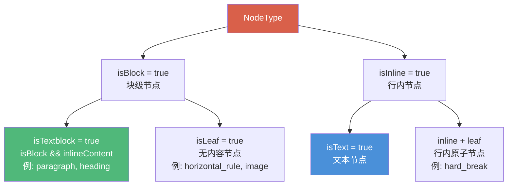
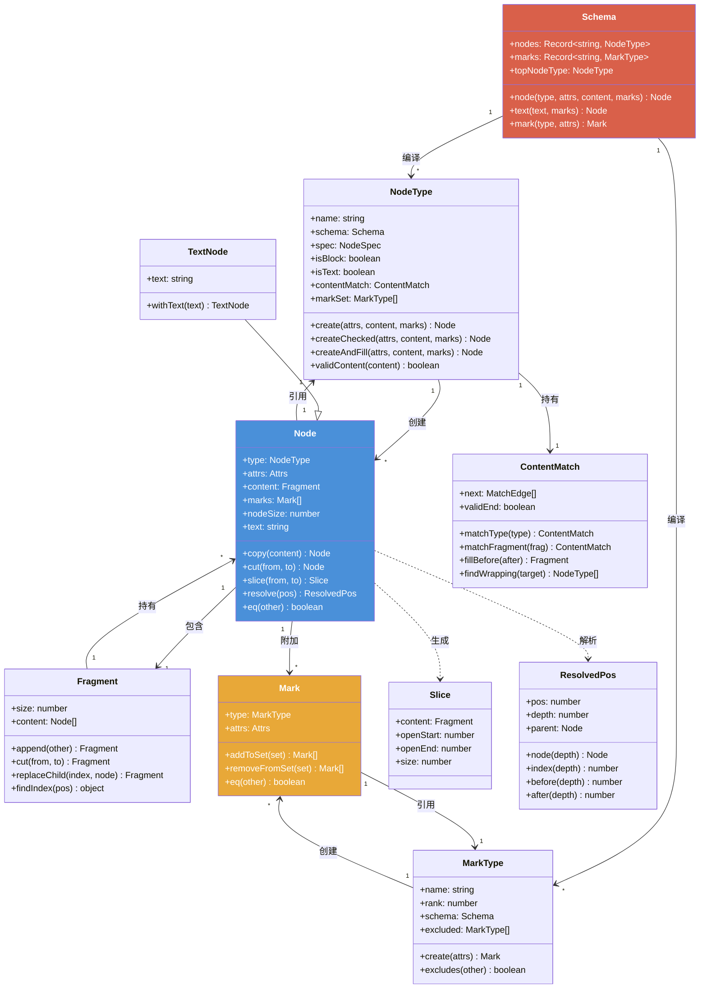

# 01 文档模型：Schema、Node、Mark

> 对应源码包：[prosemirror-model](../model/src/)

本章详细分析 ProseMirror 文档模型的三大核心概念：Schema（模式）、Node（节点）、Mark（标记），以及它们之间的关系。

---

## 目录

- [1.1 Schema：文档的"宪法"](#11-schema文档的宪法)
- [1.2 NodeType：节点类型描述](#12-nodetype节点类型描述)
- [1.3 Node：持久化文档树节点](#13-node持久化文档树节点)
- [1.4 TextNode：文本节点](#14-textnode文本节点)
- [1.5 Fragment：子节点的有序持久化集合](#15-fragment子节点的有序持久化集合)
- [1.6 Mark：行内标记](#16-mark行内标记)
- [1.7 MarkType：标记类型](#17-marktype标记类型)
- [1.8 ContentMatch：基于自动机的内容约束](#18-contentmatch基于自动机的内容约束)
- [1.9 Slice：文档切片](#19-slice文档切片)
- [1.10 核心概念关系图](#110-核心概念关系图)

---

## 1.1 Schema：文档的"宪法"

`Schema` 是整个文档模型的基石，它定义了文档中**允许出现哪些节点类型和标记类型**，以及它们之间的**内容约束关系**。

**关键源码：** [schema.ts#L571-L630](../model/src/schema.ts#L571-L630)

```typescript
export class Schema<Nodes extends string = any, Marks extends string = any> {
  spec: {
    nodes: OrderedMap<NodeSpec>,
    marks: OrderedMap<MarkSpec>,
    topNode?: string
  }

  nodes: {readonly [name in Nodes]: NodeType} & {readonly [key: string]: NodeType}
  marks: {readonly [name in Marks]: MarkType} & {readonly [key: string]: MarkType}
  linebreakReplacement: NodeType | null = null
  topNodeType: NodeType
  cached: {[key: string]: any} = Object.create(null)

  constructor(spec: SchemaSpec<Nodes, Marks>) {
    let instanceSpec = this.spec = {} as any
    for (let prop in spec) instanceSpec[prop] = (spec as any)[prop]
    instanceSpec.nodes = OrderedMap.from(spec.nodes),
    instanceSpec.marks = OrderedMap.from(spec.marks || {}),

    this.nodes = NodeType.compile(this.spec.nodes, this)
    this.marks = MarkType.compile(this.spec.marks, this)

    let contentExprCache = Object.create(null)
    for (let prop in this.nodes) {
      if (prop in this.marks)
        throw new RangeError(prop + " can not be both a node and a mark")
      let type = this.nodes[prop], contentExpr = type.spec.content || "", markExpr = type.spec.marks
      type.contentMatch = contentExprCache[contentExpr] ||
        (contentExprCache[contentExpr] = ContentMatch.parse(contentExpr, this.nodes))
      ;(type as any).inlineContent = type.contentMatch.inlineContent
      if (type.spec.linebreakReplacement) {
        if (this.linebreakReplacement) throw new RangeError("Multiple linebreak nodes defined")
        if (!type.isInline || !type.isLeaf) throw new RangeError("Linebreak replacement nodes must be inline leaf nodes")
        this.linebreakReplacement = type
      }
      type.markSet = markExpr == "_" ? null :
        markExpr ? gatherMarks(this, markExpr.split(" ")) :
        markExpr == "" || !type.inlineContent ? [] : null
    }
    for (let prop in this.marks) {
      let type = this.marks[prop], excl = type.spec.excludes
      type.excluded = excl == null ? [type] : excl == "" ? [] : gatherMarks(this, excl.split(" "))
    }

    this.nodeFromJSON = json => Node.fromJSON(this, json)
    this.markFromJSON = json => Mark.fromJSON(this, json)
    this.topNodeType = this.nodes[this.spec.topNode || "doc"]
    this.cached.wrappings = Object.create(null)
  }
}
```

**核心设计要点：**

- Schema 在构造时会编译所有 `NodeSpec` 和 `MarkSpec`，将字符串形式的 content 表达式（如 `"paragraph+"`、`"(heading | paragraph)*"`）解析为 **ContentMatch 有限状态自动机**
- `contentExprCache` 缓存已解析的 content 表达式，相同表达式的多个 NodeType 共享同一个 ContentMatch 实例
- `markSet` 的三值逻辑：`null` 表示允许所有 marks（行内容器默认），`[]` 表示不允许任何 marks（块级容器默认），数组表示明确的白名单
- marks 的 `excluded` 默认排除自身（同类型 mark 互斥），`""` 表示不排除任何（允许同类型共存）
- Schema 是不可变的，创建后不会改变

`gatherMarks` 辅助函数将 mark 名称（含 group 名称 `"_"`）解析为 MarkType 数组：

**关键源码：** [schema.ts#L688-L704](../model/src/schema.ts#L688-L704)

```typescript
function gatherMarks(schema: Schema, marks: readonly string[]) {
  let found: MarkType[] = []
  for (let i = 0; i < marks.length; i++) {
    let name = marks[i], mark = schema.marks[name], ok = mark
    if (mark) {
      found.push(mark)
    } else {
      for (let prop in schema.marks) {
        let mark = schema.marks[prop]
        if (name == "_" || (mark.spec.group && mark.spec.group.split(" ").indexOf(name) > -1))
          found.push(ok = mark)
      }
    }
    if (!ok) throw new SyntaxError("Unknown mark type: '" + marks[i] + "'")
  }
  return found
}
```

---

## 1.2 NodeType：节点类型描述

`NodeType` 描述一类节点的元信息，每个 Schema 中每种节点类型只有一个 NodeType 实例（享元模式）。

**关键源码：** [schema.ts#L59-L246](../model/src/schema.ts#L59-L246)

```typescript
export class NodeType {
  groups: readonly string[]
  attrs: {[name: string]: Attribute}
  defaultAttrs: Attrs

  constructor(
    readonly name: string,
    readonly schema: Schema,
    readonly spec: NodeSpec
  ) {
    this.groups = spec.group ? spec.group.split(" ") : []
    this.attrs = initAttrs(name, spec.attrs)
    this.defaultAttrs = defaultAttrs(this.attrs)

    ;(this as any).contentMatch = null
    ;(this as any).inlineContent = null

    this.isBlock = !(spec.inline || name == "text")
    this.isText = name == "text"
  }

  declare inlineContent: boolean
  isBlock: boolean
  isText: boolean
  declare contentMatch: ContentMatch
  markSet: readonly MarkType[] | null = null

  get isInline() { return !this.isBlock }
  get isTextblock() { return this.isBlock && this.inlineContent }
  get isLeaf() { return this.contentMatch == ContentMatch.empty }
  get isAtom() { return this.isLeaf || !!this.spec.atom }

  isInGroup(group: string) {
    return this.groups.indexOf(group) > -1
  }

  computeAttrs(attrs: Attrs | null): Attrs {
    if (!attrs && this.defaultAttrs) return this.defaultAttrs
    else return computeAttrs(this.attrs, attrs)
  }

  create(attrs: Attrs | null = null, content?: Fragment | Node | readonly Node[] | null, marks?: readonly Mark[]) {
    if (this.isText) throw new Error("NodeType.create can't construct text nodes")
    return new Node(this, this.computeAttrs(attrs), Fragment.from(content), Mark.setFrom(marks))
  }

  createChecked(attrs: Attrs | null = null, content?: Fragment | Node | readonly Node[] | null, marks?: readonly Mark[]) {
    content = Fragment.from(content)
    this.checkContent(content)
    return new Node(this, this.computeAttrs(attrs), content, Mark.setFrom(marks))
  }

  createAndFill(attrs: Attrs | null = null, content?: Fragment | Node | readonly Node[] | null, marks?: readonly Mark[]) {
    attrs = this.computeAttrs(attrs)
    content = Fragment.from(content)
    if (content.size) {
      let before = this.contentMatch.fillBefore(content)
      if (!before) return null
      content = before.append(content)
    }
    let matched = this.contentMatch.matchFragment(content)
    let after = matched && matched.fillBefore(Fragment.empty, true)
    if (!after) return null
    return new Node(this, attrs, (content as Fragment).append(after), Mark.setFrom(marks))
  }

  validContent(content: Fragment) {
    let result = this.contentMatch.matchFragment(content)
    if (!result || !result.validEnd) return false
    for (let i = 0; i < content.childCount; i++)
      if (!this.allowsMarks(content.child(i).marks)) return false
    return true
  }

  allowsMarkType(markType: MarkType) {
    return this.markSet == null || this.markSet.indexOf(markType) > -1
  }

  allowsMarks(marks: readonly Mark[]) {
    if (this.markSet == null) return true
    for (let i = 0; i < marks.length; i++) if (!this.allowsMarkType(marks[i].type)) return false
    return true
  }

  static compile<Nodes extends string>(nodes: OrderedMap<NodeSpec>, schema: Schema<Nodes>): {readonly [name in Nodes]: NodeType} {
    let result = Object.create(null)
    nodes.forEach((name, spec) => result[name] = new NodeType(name, schema, spec))

    let topType = schema.spec.topNode || "doc"
    if (!result[topType]) throw new RangeError("Schema is missing its top node type ('" + topType + "')")
    if (!result.text) throw new RangeError("Every schema needs a 'text' type")
    for (let _ in result.text.attrs) throw new RangeError("The text node type should not have attributes")

    return result
  }
}
```

Node 的分类体系：



三种工厂方法的区别：
- `create`：不校验内容，直接构造 Node
- `createChecked`：校验内容是否符合 contentMatch，不合法则抛异常
- `createAndFill`：自动填充必要的包裹节点使内容合法，无法填充则返回 null

---

## 1.3 Node：持久化文档树节点

`Node` 是文档树的基本单元。**所有 Node 实例都是不可变的（persistent data structure）**——修改文档不会改变现有节点，而是通过结构共享创建新节点。

**关键源码：** [node.ts#L22-L349](../model/src/node.ts#L22-L349)

```typescript
export class Node {
  constructor(
    readonly type: NodeType,
    readonly attrs: Attrs,
    content?: Fragment | null,
    readonly marks = Mark.none
  ) {
    this.content = content || Fragment.empty
  }

  readonly content: Fragment

  get children() { return this.content.content }
  readonly text: string | undefined

  get nodeSize(): number { return this.isLeaf ? 1 : 2 + this.content.size }
  get childCount() { return this.content.childCount }

  child(index: number) { return this.content.child(index) }
  maybeChild(index: number) { return this.content.maybeChild(index) }

  forEach(f: (node: Node, offset: number, index: number) => void) { this.content.forEach(f) }

  nodesBetween(from: number, to: number,
               f: (node: Node, pos: number, parent: Node | null, index: number) => void | boolean,
               startPos = 0) {
    this.content.nodesBetween(from, to, f, startPos, this)
  }

  descendants(f: (node: Node, pos: number, parent: Node | null, index: number) => void | boolean) {
    this.nodesBetween(0, this.content.size, f)
  }

  get textContent() {
    return (this.isLeaf && this.type.spec.leafText)
      ? this.type.spec.leafText(this)
      : this.textBetween(0, this.content.size, "")
  }

  textBetween(from: number, to: number, blockSeparator?: string | null,
              leafText?: null | string | ((leafNode: Node) => string)) {
    return this.content.textBetween(from, to, blockSeparator, leafText)
  }

  get firstChild(): Node | null { return this.content.firstChild }
  get lastChild(): Node | null { return this.content.lastChild }

  eq(other: Node) {
    return this == other || (this.sameMarkup(other) && this.content.eq(other.content))
  }

  sameMarkup(other: Node) {
    return this.hasMarkup(other.type, other.attrs, other.marks)
  }

  hasMarkup(type: NodeType, attrs?: Attrs | null, marks?: readonly Mark[]): boolean {
    return this.type == type &&
      compareDeep(this.attrs, attrs || type.defaultAttrs || emptyAttrs) &&
      Mark.sameSet(this.marks, marks || Mark.none)
  }

  copy(content: Fragment | null = null): Node {
    if (content == this.content) return this
    return new Node(this.type, this.attrs, content, this.marks)
  }

  mark(marks: readonly Mark[]): Node {
    return marks == this.marks ? this : new Node(this.type, this.attrs, this.content, marks)
  }

  cut(from: number, to: number = this.content.size): Node {
    if (from == 0 && to == this.content.size) return this
    return this.copy(this.content.cut(from, to))
  }

  slice(from: number, to: number = this.content.size, includeParents = false) {
    if (from == to) return Slice.empty

    let $from = this.resolve(from), $to = this.resolve(to)
    let depth = includeParents ? 0 : $from.sharedDepth(to)
    let start = $from.start(depth), node = $from.node(depth)
    let content = node.content.cut($from.pos - start, $to.pos - start)
    return new Slice(content, $from.depth - depth, $to.depth - depth)
  }

  replace(from: number, to: number, slice: Slice) {
    return replace(this.resolve(from), this.resolve(to), slice)
  }

  nodeAt(pos: number): Node | null {
    for (let node: Node | null = this;;) {
      let {index, offset} = node.content.findIndex(pos)
      node = node.maybeChild(index)
      if (!node) return null
      if (offset == pos || node.isText) return node
      pos -= offset + 1
    }
  }

  resolve(pos: number) { return ResolvedPos.resolveCached(this, pos) }

  rangeHasMark(from: number, to: number, type: Mark | MarkType): boolean {
    let found = false
    if (to > from) this.nodesBetween(from, to, node => {
      if (type.isInSet(node.marks)) found = true
      return !found
    })
    return found
  }

  get isBlock() { return this.type.isBlock }
  get isTextblock() { return this.type.isTextblock }
  get inlineContent() { return this.type.inlineContent }
  get isInline() { return this.type.isInline }
  get isText() { return this.type.isText }
  get isLeaf() { return this.type.isLeaf }
  get isAtom() { return this.type.isAtom }

  canReplace(from: number, to: number, replacement = Fragment.empty, start = 0, end = replacement.childCount) {
    let one = this.contentMatchAt(from).matchFragment(replacement, start, end)
    let two = one && one.matchFragment(this.content, to)
    if (!two || !two.validEnd) return false
    for (let i = start; i < end; i++) if (!this.type.allowsMarks(replacement.child(i).marks)) return false
    return true
  }

  check() {
    this.type.checkContent(this.content)
    this.type.checkAttrs(this.attrs)
    let copy = Mark.none
    for (let i = 0; i < this.marks.length; i++) {
      let mark = this.marks[i]
      mark.type.checkAttrs(mark.attrs)
      copy = mark.addToSet(copy)
    }
    if (!Mark.sameSet(copy, this.marks))
      throw new RangeError(`Invalid collection of marks for node ${this.type.name}: ${this.marks.map(m => m.type.name)}`)
    this.content.forEach(node => node.check())
  }

  toJSON(): any {
    let obj: any = {type: this.type.name}
    for (let _ in this.attrs) {
      obj.attrs = this.attrs
      break
    }
    if (this.content.size)
      obj.content = this.content.toJSON()
    if (this.marks.length)
      obj.marks = this.marks.map(n => n.toJSON())
    return obj
  }

  static fromJSON(schema: Schema, json: any): Node {
    if (!json) throw new RangeError("Invalid input for Node.fromJSON")
    let marks: Mark[] | undefined = undefined
    if (json.marks) {
      if (!Array.isArray(json.marks)) throw new RangeError("Invalid mark data for Node.fromJSON")
      marks = json.marks.map(schema.markFromJSON)
    }
    if (json.type == "text") {
      if (typeof json.text != "string") throw new RangeError("Invalid text node in JSON")
      return schema.text(json.text, marks)
    }
    let content = Fragment.fromJSON(schema, json.content)
    let node = schema.nodeType(json.type).create(json.attrs, content, marks)
    node.type.checkAttrs(node.attrs)
    return node
  }
}
```

**不可变设计的关键体现：**

- 所有实例属性均为 `readonly`
- `copy()` 方法在 content 相同时直接返回 `this`（结构共享）
- `mark()` 方法在 marks 相同时直接返回 `this`
- `cut()` 方法在范围为整个 content 时直接返回 `this`
- `nodeSize` 的计算：叶子节点为 1，文本节点为字符数（在 TextNode 中覆写），非叶子节点为 `2 + content.size`（首尾各占一个 token 位置）

---

## 1.4 TextNode：文本节点

`TextNode` 继承自 Node，专门表示文本内容。文本节点没有 content（Fragment 为空），而是直接持有 `text` 字符串。

**关键源码：** [node.ts#L353-L397](../model/src/node.ts#L353-L397)

```typescript
export class TextNode extends Node {
  readonly text: string

  constructor(type: NodeType, attrs: Attrs, content: string, marks?: readonly Mark[]) {
    super(type, attrs, null, marks)
    if (!content) throw new RangeError("Empty text nodes are not allowed")
    this.text = content
  }

  toString() {
    if (this.type.spec.toDebugString) return this.type.spec.toDebugString(this)
    return wrapMarks(this.marks, JSON.stringify(this.text))
  }

  get textContent() { return this.text }

  textBetween(from: number, to: number) { return this.text.slice(from, to) }

  get nodeSize() { return this.text.length }

  mark(marks: readonly Mark[]) {
    return marks == this.marks ? this : new TextNode(this.type, this.attrs, this.text, marks)
  }

  withText(text: string) {
    if (text == this.text) return this
    return new TextNode(this.type, this.attrs, text, this.marks)
  }

  cut(from = 0, to = this.text.length) {
    if (from == 0 && to == this.text.length) return this
    return this.withText(this.text.slice(from, to))
  }

  eq(other: Node) {
    return this.sameMarkup(other) && this.text == other.text
  }

  toJSON() {
    let base = super.toJSON()
    base.text = this.text
    return base
  }
}
```

---

## 1.5 Fragment：子节点的有序持久化集合

`Fragment` 不是 DOM 中的 DocumentFragment，而是 Node 子节点的**不可变有序集合**，维护子节点数组和总大小。

**关键源码：** [fragment.ts#L10-L261](../model/src/fragment.ts#L10-L261)

```typescript
export class Fragment {
  readonly size: number

  constructor(
    readonly content: readonly Node[],
    size?: number
  ) {
    this.size = size || 0
    if (size == null) for (let i = 0; i < content.length; i++)
      this.size += content[i].nodeSize
  }

  nodesBetween(from: number, to: number,
               f: (node: Node, start: number, parent: Node | null, index: number) => boolean | void,
               nodeStart = 0,
               parent?: Node) {
    for (let i = 0, pos = 0; pos < to; i++) {
      let child = this.content[i], end = pos + child.nodeSize
      if (end > from && f(child, nodeStart + pos, parent || null, i) !== false && child.content.size) {
        let start = pos + 1
        child.nodesBetween(Math.max(0, from - start),
                           Math.min(child.content.size, to - start),
                           f, nodeStart + start)
      }
      pos = end
    }
  }

  textBetween(from: number, to: number, blockSeparator?: string | null, leafText?: string | null | ((leafNode: Node) => string)) {
    let text = "", first = true
    this.nodesBetween(from, to, (node, pos) => {
      let nodeText = node.isText ? node.text!.slice(Math.max(from, pos) - pos, to - pos)
        : !node.isLeaf ? ""
        : leafText ? (typeof leafText === "function" ? leafText(node) : leafText)
        : node.type.spec.leafText ? node.type.spec.leafText(node)
        : ""
      if (node.isBlock && (node.isLeaf && nodeText || node.isTextblock) && blockSeparator) {
        if (first) first = false
        else text += blockSeparator
      }
      text += nodeText
    }, 0)
    return text
  }

  append(other: Fragment) {
    if (!other.size) return this
    if (!this.size) return other
    let last = this.lastChild!, first = other.firstChild!, content = this.content.slice(), i = 0
    if (last.isText && last.sameMarkup(first)) {
      content[content.length - 1] = (last as TextNode).withText(last.text! + first.text!)
      i = 1
    }
    for (; i < other.content.length; i++) content.push(other.content[i])
    return new Fragment(content, this.size + other.size)
  }

  cut(from: number, to = this.size) {
    if (from == 0 && to == this.size) return this
    let result: Node[] = [], size = 0
    if (to > from) for (let i = 0, pos = 0; pos < to; i++) {
      let child = this.content[i], end = pos + child.nodeSize
      if (end > from) {
        if (pos < from || end > to) {
          if (child.isText)
            child = child.cut(Math.max(0, from - pos), Math.min(child.text!.length, to - pos))
          else
            child = child.cut(Math.max(0, from - pos - 1), Math.min(child.content.size, to - pos - 1))
        }
        result.push(child)
        size += child.nodeSize
      }
      pos = end
    }
    return new Fragment(result, size)
  }

  replaceChild(index: number, node: Node) {
    let current = this.content[index]
    if (current == node) return this
    let copy = this.content.slice()
    let size = this.size + node.nodeSize - current.nodeSize
    copy[index] = node
    return new Fragment(copy, size)
  }

  addToStart(node: Node) {
    return new Fragment([node].concat(this.content), this.size + node.nodeSize)
  }

  addToEnd(node: Node) {
    return new Fragment(this.content.concat(node), this.size + node.nodeSize)
  }

  eq(other: Fragment): boolean {
    if (this.content.length != other.content.length) return false
    for (let i = 0; i < this.content.length; i++)
      if (!this.content[i].eq(other.content[i])) return false
    return true
  }

  get firstChild(): Node | null { return this.content.length ? this.content[0] : null }
  get lastChild(): Node | null { return this.content.length ? this.content[this.content.length - 1] : null }
  get childCount() { return this.content.length }

  child(index: number) {
    let found = this.content[index]
    if (!found) throw new RangeError("Index " + index + " out of range for " + this)
    return found
  }

  maybeChild(index: number): Node | null {
    return this.content[index] || null
  }

  forEach(f: (node: Node, offset: number, index: number) => void) {
    for (let i = 0, p = 0; i < this.content.length; i++) {
      let child = this.content[i]
      f(child, p, i)
      p += child.nodeSize
    }
  }

  findIndex(pos: number): {index: number, offset: number} {
    if (pos == 0) return retIndex(0, pos)
    if (pos == this.size) return retIndex(this.content.length, pos)
    if (pos > this.size || pos < 0) throw new RangeError(`Position ${pos} outside of fragment (${this})`)
    for (let i = 0, curPos = 0;; i++) {
      let cur = this.child(i), end = curPos + cur.nodeSize
      if (end >= pos) {
        if (end == pos) return retIndex(i + 1, end)
        return retIndex(i, curPos)
      }
      curPos = end
    }
  }

  static fromArray(array: readonly Node[]) {
    if (!array.length) return Fragment.empty
    let joined: Node[] | undefined, size = 0
    for (let i = 0; i < array.length; i++) {
      let node = array[i]
      size += node.nodeSize
      if (i && node.isText && array[i - 1].sameMarkup(node)) {
        if (!joined) joined = array.slice(0, i)
        joined[joined.length - 1] = (node as TextNode)
                                      .withText((joined[joined.length - 1] as TextNode).text + (node as TextNode).text)
      } else if (joined) {
        joined.push(node)
      }
    }
    return new Fragment(joined || array, size)
  }

  static from(nodes?: Fragment | Node | readonly Node[] | null) {
    if (!nodes) return Fragment.empty
    if (nodes instanceof Fragment) return nodes
    if (Array.isArray(nodes)) return this.fromArray(nodes)
    if ((nodes as Node).attrs) return new Fragment([nodes as Node], (nodes as Node).nodeSize)
    throw new RangeError("Can not convert " + nodes + " to a Fragment" +
      ((nodes as any).nodesBetween ? " (looks like multiple versions of prosemirror-model were loaded)" : ""))
  }

  static empty: Fragment = new Fragment([], 0)
}
```

**关键设计要点：**

- `append()` 在追加时会自动合并相邻且 markup 相同的文本节点，避免碎片化
- `cut()` 精确处理跨界节点：文本节点按字符偏移切分，非文本节点按 content 位置切分（需要 `-1` 跳过节点开始 token）
- `fromArray()` 同样会合并相邻同 markup 的文本节点
- `findIndex()` 返回的结果对象是复用的单例（`retIndex`），避免高频调用时的对象分配

---

## 1.6 Mark：行内标记

`Mark` 表示附加在行内节点上的格式信息（如粗体、斜体、链接）。Mark 本身是**不可变值对象**，通过 `type + attrs` 唯一标识。

**关键源码：** [mark.ts#L10-L111](../model/src/mark.ts#L10-L111)

```typescript
export class Mark {
  constructor(
    readonly type: MarkType,
    readonly attrs: Attrs
  ) {}

  addToSet(set: readonly Mark[]): readonly Mark[] {
    let copy, placed = false
    for (let i = 0; i < set.length; i++) {
      let other = set[i]
      if (this.eq(other)) return set
      if (this.type.excludes(other.type)) {
        if (!copy) copy = set.slice(0, i)
      } else if (other.type.excludes(this.type)) {
        return set
      } else {
        if (!placed && other.type.rank > this.type.rank) {
          if (!copy) copy = set.slice(0, i)
          copy.push(this)
          placed = true
        }
        if (copy) copy.push(other)
      }
    }
    if (!copy) copy = set.slice()
    if (!placed) copy.push(this)
    return copy
  }

  removeFromSet(set: readonly Mark[]): readonly Mark[] {
    for (let i = 0; i < set.length; i++)
      if (this.eq(set[i]))
        return set.slice(0, i).concat(set.slice(i + 1))
    return set
  }

  isInSet(set: readonly Mark[]) {
    for (let i = 0; i < set.length; i++)
      if (this.eq(set[i])) return true
    return false
  }

  eq(other: Mark) {
    return this == other ||
      (this.type == other.type && compareDeep(this.attrs, other.attrs))
  }

  toJSON(): any {
    let obj: any = {type: this.type.name}
    for (let _ in this.attrs) {
      obj.attrs = this.attrs
      break
    }
    return obj
  }

  static fromJSON(schema: Schema, json: any) {
    if (!json) throw new RangeError("Invalid input for Mark.fromJSON")
    let type = schema.marks[json.type]
    if (!type) throw new RangeError(`There is no mark type ${json.type} in this schema`)
    let mark = type.create(json.attrs)
    type.checkAttrs(mark.attrs)
    return mark
  }

  static sameSet(a: readonly Mark[], b: readonly Mark[]) {
    if (a == b) return true
    if (a.length != b.length) return false
    for (let i = 0; i < a.length; i++)
      if (!a[i].eq(b[i])) return false
    return true
  }

  static setFrom(marks?: Mark | readonly Mark[] | null): readonly Mark[] {
    if (!marks || Array.isArray(marks) && marks.length == 0) return Mark.none
    if (marks instanceof Mark) return [marks]
    let copy = marks.slice()
    copy.sort((a, b) => a.type.rank - b.type.rank)
    return copy
  }

  static none: readonly Mark[] = []
}
```

**Mark 的关键设计：**

- Mark 不形成树，而是**扁平地附加在每个行内节点上**。同一段连续文本如果有多个 mark，每个文本节点的 `marks` 数组包含所有激活的 mark
- `addToSet()` 的互斥处理逻辑：
  - 如果新 mark 与已有 mark 相等，返回原集合（幂等）
  - 如果新 mark 排斥旧 mark（`this.type.excludes(other.type)`），跳过旧 mark（移除）
  - 如果旧 mark 排斥新 mark（`other.type.excludes(this.type)`），直接返回原集合（不添加）
  - 否则按 `rank` 排序插入
- Mark 集合始终按 `MarkType.rank`（Schema 中定义顺序）排序，保证集合的确定性和可比较性
- `Mark.none` 是空集合的单例，避免空数组的重复分配

---

## 1.7 MarkType：标记类型

`MarkType` 是 Mark 的类型描述，每个 Schema 中每种 mark 类型只有一个实例。

**关键源码：** [schema.ts#L280-L346](../model/src/schema.ts#L280-L346)

```typescript
export class MarkType {
  attrs: {[name: string]: Attribute}
  declare excluded: readonly MarkType[]
  instance: Mark | null

  constructor(
    readonly name: string,
    readonly rank: number,
    readonly schema: Schema,
    readonly spec: MarkSpec
  ) {
    this.attrs = initAttrs(name, spec.attrs)
    ;(this as any).excluded = null
    let defaults = defaultAttrs(this.attrs)
    this.instance = defaults ? new Mark(this, defaults) : null
  }

  create(attrs: Attrs | null = null) {
    if (!attrs && this.instance) return this.instance
    return new Mark(this, computeAttrs(this.attrs, attrs))
  }

  static compile(marks: OrderedMap<MarkSpec>, schema: Schema) {
    let result = Object.create(null), rank = 0
    marks.forEach((name, spec) => result[name] = new MarkType(name, rank++, schema, spec))
    return result
  }

  removeFromSet(set: readonly Mark[]): readonly Mark[] {
    for (var i = 0; i < set.length; i++) if (set[i].type == this) {
      set = set.slice(0, i).concat(set.slice(i + 1))
      i--
    }
    return set
  }

  isInSet(set: readonly Mark[]): Mark | undefined {
    for (let i = 0; i < set.length; i++)
      if (set[i].type == this) return set[i]
  }

  excludes(other: MarkType) {
    return this.excluded.indexOf(other) > -1
  }
}
```

**享元优化：** 当 MarkType 的所有 attrs 都有默认值时，`instance` 字段缓存一个默认 Mark 实例，`create(null)` 直接返回该缓存实例，减少对象分配。

---

## 1.8 ContentMatch：基于自动机的内容约束

ContentMatch 将 content 表达式编译为**确定性有限自动机（DFA）**，用于验证内容合法性和计算自动填充。

**关键源码：** [content.ts#L10-L133](../model/src/content.ts#L10-L133)

```typescript
export class ContentMatch {
  readonly next: MatchEdge[] = []
  readonly wrapCache: (NodeType | readonly NodeType[] | null)[] = []

  constructor(
    readonly validEnd: boolean
  ) {}

  static parse(string: string, nodeTypes: {readonly [name: string]: NodeType}): ContentMatch {
    let stream = new TokenStream(string, nodeTypes)
    if (stream.next == null) return ContentMatch.empty
    let expr = parseExpr(stream)
    if (stream.next) stream.err("Unexpected trailing text")
    let match = dfa(nfa(expr))
    checkForDeadEnds(match, stream)
    return match
  }

  matchType(type: NodeType): ContentMatch | null {
    for (let i = 0; i < this.next.length; i++)
      if (this.next[i].type == type) return this.next[i].next
    return null
  }

  matchFragment(frag: Fragment, start = 0, end = frag.childCount): ContentMatch | null {
    let cur: ContentMatch | null = this
    for (let i = start; cur && i < end; i++)
      cur = cur.matchType(frag.child(i).type)
    return cur
  }

  get inlineContent() {
    return this.next.length != 0 && this.next[0].type.isInline
  }

  get defaultType(): NodeType | null {
    for (let i = 0; i < this.next.length; i++) {
      let {type} = this.next[i]
      if (!(type.isText || type.hasRequiredAttrs())) return type
    }
    return null
  }

  compatible(other: ContentMatch) {
    for (let i = 0; i < this.next.length; i++)
      for (let j = 0; j < other.next.length; j++)
        if (this.next[i].type == other.next[j].type) return true
    return false
  }

  fillBefore(after: Fragment, toEnd = false, startIndex = 0): Fragment | null {
    let seen: ContentMatch[] = [this]
    function search(match: ContentMatch, types: readonly NodeType[]): Fragment | null {
      let finished = match.matchFragment(after, startIndex)
      if (finished && (!toEnd || finished.validEnd))
        return Fragment.from(types.map(tp => tp.createAndFill()!))

      for (let i = 0; i < match.next.length; i++) {
        let {type, next} = match.next[i]
        if (!(type.isText || type.hasRequiredAttrs()) && seen.indexOf(next) == -1) {
          seen.push(next)
          let found = search(next, types.concat(type))
          if (found) return found
        }
      }
      return null
    }

    return search(this, [])
  }

  findWrapping(target: NodeType): readonly NodeType[] | null {
    for (let i = 0; i < this.wrapCache.length; i += 2)
      if (this.wrapCache[i] == target) return this.wrapCache[i + 1] as (readonly NodeType[] | null)
    let computed = this.computeWrapping(target)
    this.wrapCache.push(target, computed)
    return computed
  }

  computeWrapping(target: NodeType): readonly NodeType[] | null {
    type Active = {match: ContentMatch, type: NodeType | null, via: Active | null}
    let seen = Object.create(null), active: Active[] = [{match: this, type: null, via: null}]
    while (active.length) {
      let current = active.shift()!, match = current.match
      if (match.matchType(target)) {
        let result: NodeType[] = []
        for (let obj: Active = current; obj.type; obj = obj.via!)
          result.push(obj.type)
        return result.reverse()
      }
      for (let i = 0; i < match.next.length; i++) {
        let {type, next} = match.next[i]
        if (!type.isLeaf && !type.hasRequiredAttrs() && !(type.name in seen) && (!current.type || next.validEnd)) {
          active.push({match: type.contentMatch, type, via: current})
          seen[type.name] = true
        }
      }
    }
    return null
  }
}
```

**编译过程：** content 表达式字符串 → TokenStream 词法分析 → parseExpr 语法分析生成 NFA → dfa() 将 NFA 确定化为 DFA → checkForDeadEnds 检查死端。

`fillBefore` 使用带记忆化的 DFS 搜索需要自动填充哪些节点；`computeWrapping` 使用 BFS 搜索让 target 类型出现在此位置所需的包裹节点链。

---

## 1.9 Slice：文档切片

`Slice` 表示从文档中切出的一片内容，不仅包含 Fragment，还记录了两侧"开放"的深度（即切片在原文档中被切断了多少层父节点）。

**关键源码：** [replace.ts#L13-L75](../model/src/replace.ts#L13-L75)

```typescript
export class Slice {
  constructor(
    readonly content: Fragment,
    readonly openStart: number,
    readonly openEnd: number
  ) {}

  get size(): number {
    return this.content.size - this.openStart - this.openEnd
  }

  eq(other: Slice): boolean {
    return this.content.eq(other.content) && this.openStart == other.openStart && this.openEnd == other.openEnd
  }

  toString() {
    return this.content + "(" + this.openStart + "," + this.openEnd + ")"
  }

  toJSON(): any {
    if (!this.content.size) return null
    let json: any = {content: this.content.toJSON()}
    if (this.openStart > 0) json.openStart = this.openStart
    if (this.openEnd > 0) json.openEnd = this.openEnd
    return json
  }

  static fromJSON(schema: Schema, json: any): Slice {
    if (!json) return Slice.empty
    let openStart = json.openStart || 0, openEnd = json.openEnd || 0
    if (typeof openStart != "number" || typeof openEnd != "number")
      throw new RangeError("Invalid input for Slice.fromJSON")
    return new Slice(Fragment.fromJSON(schema, json.content), openStart, openEnd)
  }

  static empty: Slice = new Slice(Fragment.empty, 0, 0)
}
```

`openStart` 和 `openEnd` 是 Slice 区别于普通 Fragment 的关键：它们告诉替换算法切片两侧有多少层节点是"打开"的，需要与目标位置的父节点拼接。例如从一个段落中间切出的文本，openStart 和 openEnd 都是 1（段落被打开了）。

---

## 1.10 核心概念关系图



**关系解读：**

- **Schema** 是工厂和注册表，编译 NodeSpec/MarkSpec 为 NodeType/MarkType
- **NodeType/MarkType** 是享元，每个类型在 Schema 中唯一，被所有同类型 Node/Mark 共享
- **Node** 通过 `type` 引用 NodeType，通过 `marks` 持有 Mark 数组，通过 `content`(Fragment) 持有子节点
- **Mark** 通过 `type` 引用 MarkType，是值对象（type + attrs 决定唯一性）
- **Fragment** 是 Node 的不可变子节点集合，负责子节点的查找、切片和追加
- **ContentMatch** 是 NodeType 内部的 DFA，用于内容合法性校验和自动填充计算

---

← 返回 [主 README](../README.md) | 继续阅读 [02 事务机制与状态不可变性 →](02-transaction-immutability.md)
