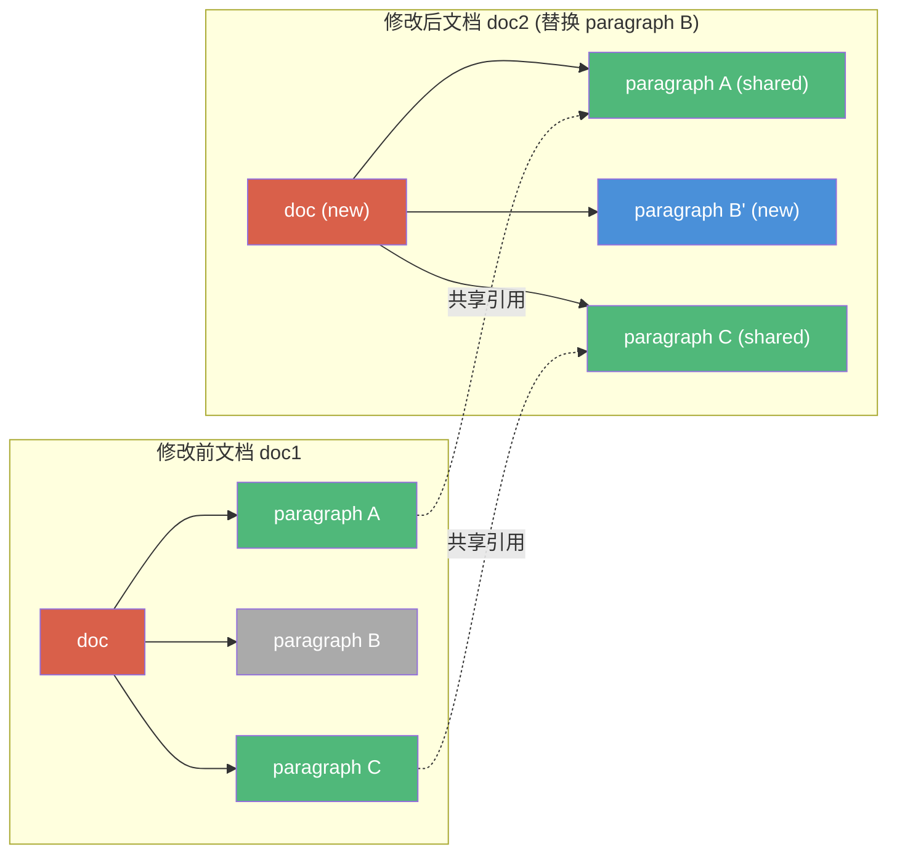
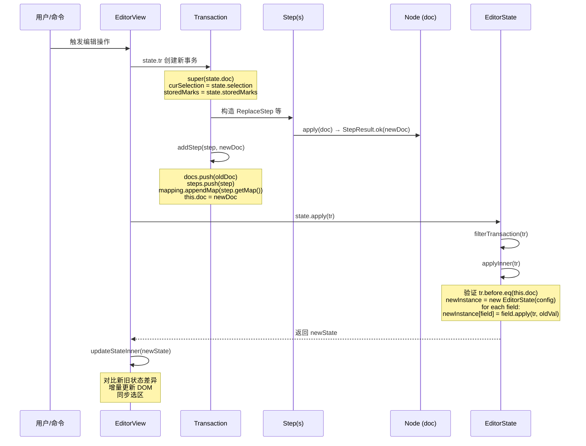

# 02 Transaction 事务机制与状态不可变性

> 对应源码包：[prosemirror-transform](file:///Users/tog/Desktop/code/gsb/gsb-731/xyj-731-4/xyj-731-4_Steve/transform/src/) 和 [prosemirror-state](file:///Users/tog/Desktop/code/gsb/gsb-731/xyj-731-4/xyj-731-4_Steve/state/src/)

本章分析 ProseMirror 如何通过 Step（原子步骤）、Transform（变换构建器）、Transaction（状态事务）和 EditorState（不可变状态）构建完整的不可变更新体系。

---

## 目录

- [2.1 不可变文档树：结构共享的持久化数据结构](#21-不可变文档树结构共享的持久化数据结构)
- [2.2 Step：原子变更单元](#22-step原子变更单元)
- [2.3 StepResult：成功或失败](#23-stepresult成功或失败)
- [2.4 ReplaceStep：最核心的步骤实现](#24-replacestep最核心的步骤实现)
- [2.5 ReplaceAroundStep：保留间隙的替换](#25-replacearoundstep保留间隙的替换)
- [2.6 StepMap：位置映射表](#26-stepmap位置映射表)
- [2.7 Mapping：多步骤映射管道与镜像机制](#27-mapping多步骤映射管道与镜像机制)
- [2.8 Transform：变更构建器](#28-transform变更构建器)
- [2.9 其他内置 Step 类型](#29-其他内置-step-类型)
- [2.10 Transaction：超越文档变更的状态事务](#210-transaction超越文档变更的状态事务)
- [2.11 EditorState：不可变状态容器](#211-editorstate不可变状态容器)
- [2.12 状态字段机制（FieldDesc）](#212-状态字段机制fielddesc)
- [2.13 不可变性保证的完整流程](#213-不可变性保证的完整流程)

---

## 2.1 不可变文档树：结构共享的持久化数据结构

ProseMirror 文档是一棵**持久化树（Persistent Tree）**。核心原则是：**永远不修改已存在的节点，修改时创建新节点，尽可能共享未变化的子树**。



Node 的 `copy()` 方法体现了这一点——当 content 不变时直接返回 `this`：

**关键源码：** [node.ts#L138-L141](file:///Users/tog/Desktop/code/gsb/gsb-731/xyj-731-4/xyj-731-4_Steve/model/src/node.ts#L138-L141)

```typescript
copy(content: Fragment | null = null): Node {
  if (content == this.content) return this
  return new Node(this.type, this.attrs, content, this.marks)
}
```

---

## 2.2 Step：原子变更单元

所有文档修改都被建模为 `Step` 对象。Step 是一个抽象类，每个具体步骤必须实现 `apply`、`invert`、`map`、`getMap`、`toJSON` 等方法。

**关键源码：** [step.ts#L16-L67](file:///Users/tog/Desktop/code/gsb/gsb-731/xyj-731-4/xyj-731-4_Steve/transform/src/step.ts#L16-L67)

```typescript
export abstract class Step {
  abstract apply(doc: Node): StepResult

  getMap(): StepMap { return StepMap.empty }

  abstract invert(doc: Node): Step

  abstract map(mapping: Mappable): Step | null

  merge(other: Step): Step | null { return null }

  abstract toJSON(): any

  static fromJSON(schema: Schema, json: any): Step {
    if (!json || !json.stepType) throw new RangeError("Invalid input for Step.fromJSON")
    let type = stepsByID[json.stepType]
    if (!type) throw new RangeError(`No step type ${json.stepType} defined`)
    return type.fromJSON(schema, json)
  }

  static jsonID(id: string, stepClass: {fromJSON(schema: Schema, json: any): Step}) {
    if (id in stepsByID) throw new RangeError("Duplicate use of step JSON ID " + id)
    stepsByID[id] = stepClass
    ;(stepClass as any).prototype.jsonID = id
    return stepClass
  }
}
```

Step 的五个核心方法构成了完整的变更契约：

| 方法 | 作用 | 使用者 |
|------|------|--------|
| `apply(doc)` | 将步骤应用到文档，返回 StepResult | Transform |
| `getMap()` | 返回位置映射表 StepMap | Transform |
| `invert(doc)` | 创建反转步骤（用于 undo） | history 插件 |
| `map(mapping)` | 通过位置映射调整步骤位置（用于 rebase） | collab 插件 |
| `merge(other)` | 尝试合并相邻步骤（优化） | Transform |
| `toJSON()` / `fromJSON()` | 序列化/反序列化 | 协作传输、持久化 |

---

## 2.3 StepResult：成功或失败

StepResult 区分成功和失败，不抛异常（除非是 ReplaceError 等结构性错误）：

**关键源码：** [step.ts#L71-L97](file:///Users/tog/Desktop/code/gsb/gsb-731/xyj-731-4/xyj-731-4_Steve/transform/src/step.ts#L71-L97)

```typescript
export class StepResult {
  constructor(
    readonly doc: Node | null,
    readonly failed: string | null
  ) {}

  static ok(doc: Node) { return new StepResult(doc, null) }

  static fail(message: string) { return new StepResult(null, message) }

  static fromReplace(doc: Node, from: number, to: number, slice: Slice) {
    try {
      return StepResult.ok(doc.replace(from, to, slice))
    } catch (e) {
      if (e instanceof ReplaceError) return StepResult.fail(e.message)
      throw e
    }
  }
}
```

---

## 2.4 ReplaceStep：最核心的步骤实现

`ReplaceStep` 用一个 Slice 替换文档中的一个范围，是绝大多数编辑操作的基础。

**关键源码：** [replace_step.ts#L7-L88](file:///Users/tog/Desktop/code/gsb/gsb-731/xyj-731-4/xyj-731-4_Steve/transform/src/replace_step.ts#L7-L88)

```typescript
export class ReplaceStep extends Step {
  constructor(
    readonly from: number,
    readonly to: number,
    readonly slice: Slice,
    readonly structure = false
  ) {
    super()
  }

  apply(doc: Node) {
    if (this.structure && contentBetween(doc, this.from, this.to))
      return StepResult.fail("Structure replace would overwrite content")
    return StepResult.fromReplace(doc, this.from, this.to, this.slice)
  }

  getMap() {
    return new StepMap([this.from, this.to - this.from, this.slice.size])
  }

  invert(doc: Node) {
    return new ReplaceStep(this.from, this.from + this.slice.size, doc.slice(this.from, this.to))
  }

  map(mapping: Mappable) {
    let to = mapping.mapResult(this.to, -1)
    let from = this.from == this.to && ReplaceStep.MAP_BIAS < 0 ? to : mapping.mapResult(this.from, 1)
    if (from.deletedAcross && to.deletedAcross) return null
    return new ReplaceStep(from.pos, Math.max(from.pos, to.pos), this.slice, this.structure)
  }

  merge(other: Step) {
    if (!(other instanceof ReplaceStep) || other.structure || this.structure) return null

    if (this.from + this.slice.size == other.from && !this.slice.openEnd && !other.slice.openStart) {
      let slice = this.slice.size + other.slice.size == 0 ? Slice.empty
          : new Slice(this.slice.content.append(other.slice.content), this.slice.openStart, other.slice.openEnd)
      return new ReplaceStep(this.from, this.to + (other.to - other.from), slice, this.structure)
    } else if (other.to == this.from && !this.slice.openStart && !other.slice.openEnd) {
      let slice = this.slice.size + other.slice.size == 0 ? Slice.empty
          : new Slice(other.slice.content.append(this.slice.content), other.slice.openStart, this.slice.openEnd)
      return new ReplaceStep(other.from, this.to, slice, this.structure)
    } else {
      return null
    }
  }

  toJSON(): any {
    let json: any = {stepType: "replace", from: this.from, to: this.to}
    if (this.slice.size) json.slice = this.slice.toJSON()
    if (this.structure) json.structure = true
    return json
  }

  static fromJSON(schema: Schema, json: any) {
    if (typeof json.from != "number" || typeof json.to != "number")
      throw new RangeError("Invalid input for ReplaceStep.fromJSON")
    return new ReplaceStep(json.from, json.to, Slice.fromJSON(schema, json.slice), !!json.structure)
  }

  static MAP_BIAS: -1 | 1 = 1
}

Step.jsonID("replace", ReplaceStep)
```

**设计要点：**

- `getMap()` 返回三元组 `[from, oldSize, newSize]`，精确描述位置变化
- `invert()` 用被替换的原始内容作为新 slice，位置为插入后的范围，形成精确反转
- `map()` 中 `from` 用 assoc=1（关联右侧），`to` 用 assoc=-1（关联左侧），确保范围在 rebase 时正确扩展/收缩
- `merge()` 支持相邻替换步骤合并，减少步骤数量（链式输入优化）
- `structure` 标志用于保护结构性操作，防止 rebase 时覆盖内容

---

## 2.5 ReplaceAroundStep：保留间隙的替换

`ReplaceAroundStep` 替换一个范围，但保留范围中间的"间隙"（gap）内容，将其移入 slice 的指定位置。这用于包裹（wrap）、解包（lift）等结构性操作。

**关键源码：** [replace_step.ts#L93-L168](file:///Users/tog/Desktop/code/gsb/gsb-731/xyj-731-4/xyj-731-4_Steve/transform/src/replace_step.ts#L93-L168)

```typescript
export class ReplaceAroundStep extends Step {
  constructor(
    readonly from: number,
    readonly to: number,
    readonly gapFrom: number,
    readonly gapTo: number,
    readonly slice: Slice,
    readonly insert: number,
    readonly structure = false
  ) {
    super()
  }

  apply(doc: Node) {
    if (this.structure && (contentBetween(doc, this.from, this.gapFrom) ||
                           contentBetween(doc, this.gapTo, this.to)))
      return StepResult.fail("Structure gap-replace would overwrite content")

    let gap = doc.slice(this.gapFrom, this.gapTo)
    if (gap.openStart || gap.openEnd)
      return StepResult.fail("Gap is not a flat range")
    let inserted = this.slice.insertAt(this.insert, gap.content)
    if (!inserted) return StepResult.fail("Content does not fit in gap")
    return StepResult.fromReplace(doc, this.from, this.to, inserted)
  }

  getMap() {
    return new StepMap([this.from, this.gapFrom - this.from, this.insert,
                        this.gapTo, this.to - this.gapTo, this.slice.size - this.insert])
  }

  invert(doc: Node) {
    let gap = this.gapTo - this.gapFrom
    return new ReplaceAroundStep(this.from, this.from + this.slice.size + gap,
                                 this.from + this.insert, this.from + this.insert + gap,
                                 doc.slice(this.from, this.to).removeBetween(this.gapFrom - this.from, this.gapTo - this.from),
                                 this.gapFrom - this.from, this.structure)
  }

  map(mapping: Mappable) {
    let from = mapping.mapResult(this.from, 1), to = mapping.mapResult(this.to, -1)
    let gapFrom = this.from == this.gapFrom ? from.pos : mapping.map(this.gapFrom, -1)
    let gapTo = this.to == this.gapTo ? to.pos : mapping.map(this.gapTo, 1)
    if ((from.deletedAcross && to.deletedAcross) || gapFrom < from.pos || gapTo > to.pos) return null
    return new ReplaceAroundStep(from.pos, to.pos, gapFrom, gapTo, this.slice, this.insert, this.structure)
  }

  toJSON(): any {
    let json: any = {stepType: "replaceAround", from: this.from, to: this.to,
                     gapFrom: this.gapFrom, gapTo: this.gapTo, insert: this.insert}
    if (this.slice.size) json.slice = this.slice.toJSON()
    if (this.structure) json.structure = true
    return json
  }

  static fromJSON(schema: Schema, json: any) {
    if (typeof json.from != "number" || typeof json.to != "number" ||
        typeof json.gapFrom != "number" || typeof json.gapTo != "number" || typeof json.insert != "number")
      throw new RangeError("Invalid input for ReplaceAroundStep.fromJSON")
    return new ReplaceAroundStep(json.from, json.to, json.gapFrom, json.gapTo,
                                 Slice.fromJSON(schema, json.slice), json.insert, !!json.structure)
  }
}

Step.jsonID("replaceAround", ReplaceAroundStep)
```

其 `getMap()` 产生两个三元组（gap 前后各一个），因为 gap 内容被保留，位置映射需要分两段处理。

---

## 2.6 StepMap：位置映射表

当文档发生变更时，旧文档中的位置需要映射到新文档。`StepMap` 用紧凑的三元组数组 `[start, oldSize, newSize]` 描述变更范围。

**关键源码：** [map.ts#L36-L164](file:///Users/tog/Desktop/code/gsb/gsb-731/xyj-731-4/xyj-731-4_Steve/transform/src/map.ts#L36-L164)

```typescript
const DEL_BEFORE = 1, DEL_AFTER = 2, DEL_ACROSS = 4, DEL_SIDE = 8

export class MapResult {
  constructor(
    readonly pos: number,
    readonly delInfo: number,
    readonly recover: number | null
  ) {}

  get deleted() { return (this.delInfo & DEL_SIDE) > 0 }
  get deletedBefore() { return (this.delInfo & (DEL_BEFORE | DEL_ACROSS)) > 0 }
  get deletedAfter() { return (this.delInfo & (DEL_AFTER | DEL_ACROSS)) > 0 }
  get deletedAcross() { return (this.delInfo & DEL_ACROSS) > 0 }
}

export class StepMap implements Mappable {
  constructor(
    readonly ranges: readonly number[],
    readonly inverted = false
  ) {
    if (!ranges.length && StepMap.empty) return StepMap.empty
  }

  recover(value: number) {
    let diff = 0, index = recoverIndex(value)
    if (!this.inverted) for (let i = 0; i < index; i++)
      diff += this.ranges[i * 3 + 2] - this.ranges[i * 3 + 1]
    return this.ranges[index * 3] + diff + recoverOffset(value)
  }

  mapResult(pos: number, assoc = 1): MapResult { return this._map(pos, assoc, false) as MapResult }

  map(pos: number, assoc = 1): number { return this._map(pos, assoc, true) as number }

  _map(pos: number, assoc: number, simple: boolean) {
    let diff = 0, oldIndex = this.inverted ? 2 : 1, newIndex = this.inverted ? 1 : 2
    for (let i = 0; i < this.ranges.length; i += 3) {
      let start = this.ranges[i] - (this.inverted ? diff : 0)
      if (start > pos) break
      let oldSize = this.ranges[i + oldIndex], newSize = this.ranges[i + newIndex], end = start + oldSize
      if (pos <= end) {
        let side = !oldSize ? assoc : pos == start ? -1 : pos == end ? 1 : assoc
        let result = start + diff + (side < 0 ? 0 : newSize)
        if (simple) return result
        let recover = pos == (assoc < 0 ? start : end) ? null : makeRecover(i / 3, pos - start)
        let del = pos == start ? DEL_AFTER : pos == end ? DEL_BEFORE : DEL_ACROSS
        if (assoc < 0 ? pos != start : pos != end) del |= DEL_SIDE
        return new MapResult(result, del, recover)
      }
      diff += newSize - oldSize
    }
    return simple ? pos + diff : new MapResult(pos + diff, 0, null)
  }

  forEach(f: (oldStart: number, oldEnd: number, newStart: number, newEnd: number) => void) {
    let oldIndex = this.inverted ? 2 : 1, newIndex = this.inverted ? 1 : 2
    for (let i = 0, diff = 0; i < this.ranges.length; i += 3) {
      let start = this.ranges[i], oldStart = start - (this.inverted ? diff : 0), newStart = start + (this.inverted ? 0 : diff)
      let oldSize = this.ranges[i + oldIndex], newSize = this.ranges[i + newIndex]
      f(oldStart, oldStart + oldSize, newStart, newStart + newSize)
      diff += newSize - oldSize
    }
  }

  invert() {
    return new StepMap(this.ranges, !this.inverted)
  }

  static offset(n: number) {
    return n == 0 ? StepMap.empty : new StepMap(n < 0 ? [0, -n, 0] : [0, 0, n])
  }

  static empty = new StepMap([])
}
```

**映射逻辑详解：**

- `assoc`（association）决定位置在变更范围内时关联哪一侧：`-1` 关联左侧（映射到范围起点），`1` 关联右侧（映射到范围终点）
- 纯插入（oldSize=0）时，位置直接由 assoc 决定放在插入内容前还是后
- `MapResult` 携带删除信息（`deletedBefore`/`deletedAfter`/`deletedAcross`）和 `recover` 标记，供 Mapping 的镜像机制使用
- `recover` 值编码了范围索引和偏移量，用于在镜像步骤中无损恢复位置

---

## 2.7 Mapping：多步骤映射管道与镜像机制

`Mapping` 是多个 StepMap 的管道，支持**镜像映射**（mirroring），用于协作编辑中的 rebase 场景——当一个步骤先被反转再被重放时，镜像机制可以跳过无意义的往返映射。

**关键源码：** [map.ts#L172-L284](file:///Users/tog/Desktop/code/gsb/gsb-731/xyj-731-4/xyj-731-4_Steve/transform/src/map.ts#L172-L284)

```typescript
export class Mapping implements Mappable {
  constructor(
    maps?: readonly StepMap[],
    public mirror?: number[],
    public from = 0,
    public to = maps ? maps.length : 0
  ) {
    this._maps = (maps as StepMap[]) || []
    this.ownData = !(maps || mirror)
  }

  get maps(): readonly StepMap[] { return this._maps }

  private _maps: StepMap[]
  private ownData: boolean

  slice(from = 0, to = this.maps.length) {
    return new Mapping(this._maps, this.mirror, from, to)
  }

  appendMap(map: StepMap, mirrors?: number) {
    if (!this.ownData) {
      this._maps = this._maps.slice()
      this.mirror = this.mirror && this.mirror.slice()
      this.ownData = true
    }
    this.to = this._maps.push(map)
    if (mirrors != null) this.setMirror(this._maps.length - 1, mirrors)
  }

  appendMapping(mapping: Mapping) {
    for (let i = 0, startSize = this._maps.length; i < mapping._maps.length; i++) {
      let mirr = mapping.getMirror(i)
      this.appendMap(mapping._maps[i], mirr != null && mirr < i ? startSize + mirr : undefined)
    }
  }

  getMirror(n: number): number | undefined {
    if (this.mirror) for (let i = 0; i < this.mirror.length; i++)
      if (this.mirror[i] == n) return this.mirror[i + (i % 2 ? -1 : 1)]
  }

  setMirror(n: number, m: number) {
    if (!this.mirror) this.mirror = []
    this.mirror.push(n, m)
  }

  appendMappingInverted(mapping: Mapping) {
    for (let i = mapping.maps.length - 1, totalSize = this._maps.length + mapping._maps.length; i >= 0; i--) {
      let mirr = mapping.getMirror(i)
      this.appendMap(mapping._maps[i].invert(), mirr != null && mirr > i ? totalSize - mirr - 1 : undefined)
    }
  }

  invert() {
    let inverse = new Mapping
    inverse.appendMappingInverted(this)
    return inverse
  }

  map(pos: number, assoc = 1) {
    if (this.mirror) return this._map(pos, assoc, true) as number
    for (let i = this.from; i < this.to; i++)
      pos = this._maps[i].map(pos, assoc)
    return pos
  }

  mapResult(pos: number, assoc = 1) { return this._map(pos, assoc, false) as MapResult }

  _map(pos: number, assoc: number, simple: boolean) {
    let delInfo = 0

    for (let i = this.from; i < this.to; i++) {
      let map = this._maps[i], result = map.mapResult(pos, assoc)
      if (result.recover != null) {
        let corr = this.getMirror(i)
        if (corr != null && corr > i && corr < this.to) {
          i = corr
          pos = this._maps[corr].recover(result.recover)
          continue
        }
      }

      delInfo |= result.delInfo
      pos = result.pos
    }

    return simple ? pos : new MapResult(pos, delInfo, null)
  }
}
```

**镜像机制工作原理：**

1. 当步骤 A 被步骤 B 反转时，`setMirror(indexOfA, indexOfB)` 记录镜像关系
2. 映射位置时，如果在 A 中位置产生了 `recover` 标记（表示位置在被删除/替换范围内），且 A 有镜像 B，则直接跳到 B，用 `recover` 值恢复原始位置
3. 这避免了"先删除再恢复"导致的位置信息丢失，对协作编辑 rebase 至关重要

---

## 2.8 Transform：变更构建器

`Transform` 是构建文档变更的流式 API，内部维护三个核心数组：步骤列表、每步前的文档快照和累积的 Mapping。

**关键源码：** [transform.ts#L28-L94](file:///Users/tog/Desktop/code/gsb/gsb-731/xyj-731-4/xyj-731-4_Steve/transform/src/transform.ts#L28-L94)

```typescript
export class Transform {
  readonly steps: Step[] = []
  readonly docs: Node[] = []
  readonly mapping: Mapping = new Mapping

  constructor(
    public doc: Node
  ) {}

  get before() { return this.docs.length ? this.docs[0] : this.doc }

  step(step: Step) {
    let result = this.maybeStep(step)
    if (result.failed) throw new TransformError(result.failed)
    return this
  }

  maybeStep(step: Step) {
    let result = step.apply(this.doc)
    if (!result.failed) this.addStep(step, result.doc!)
    return result
  }

  get docChanged() {
    return this.steps.length > 0
  }

  addStep(step: Step, doc: Node) {
    this.docs.push(this.doc)
    this.steps.push(step)
    this.mapping.appendMap(step.getMap())
    this.doc = doc
  }
}
```

Transform 提供了丰富的链式方法。每个方法内部构造相应的 Step 并调用 `step()`：

**关键源码：** [transform.ts#L96-L271](file:///Users/tog/Desktop/code/gsb/gsb-731/xyj-731-4/xyj-731-4_Steve/transform/src/transform.ts#L96-L271)

```typescript
replace(from: number, to = from, slice = Slice.empty): this {
  let step = replaceStep(this.doc, from, to, slice)
  if (step) this.step(step)
  return this
}

replaceWith(from: number, to: number, content: Fragment | Node | readonly Node[]): this {
  return this.replace(from, to, new Slice(Fragment.from(content), 0, 0))
}

delete(from: number, to: number): this {
  return this.replace(from, to, Slice.empty)
}

insert(pos: number, content: Fragment | Node | readonly Node[]): this {
  return this.replaceWith(pos, pos, content)
}

replaceRange(from: number, to: number, slice: Slice): this {
  replaceRange(this, from, to, slice)
  return this
}

lift(range: NodeRange, target: number): this {
  lift(this, range, target)
  return this
}

join(pos: number, depth: number = 1): this {
  join(this, pos, depth)
  return this
}

wrap(range: NodeRange, wrappers: readonly {type: NodeType, attrs?: Attrs | null}[]): this {
  wrap(this, range, wrappers)
  return this
}

setBlockType(from: number, to = from, type: NodeType, attrs: Attrs | null | ((oldNode: Node) => Attrs) = null): this {
  setBlockType(this, from, to, type, attrs)
  return this
}

setNodeMarkup(pos: number, type?: NodeType | null, attrs: Attrs | null = null, marks?: readonly Mark[]): this {
  setNodeMarkup(this, pos, type, attrs, marks)
  return this
}

setNodeAttribute(pos: number, attr: string, value: any): this {
  this.step(new AttrStep(pos, attr, value))
  return this
}

setDocAttribute(attr: string, value: any): this {
  this.step(new DocAttrStep(attr, value))
  return this
}

addNodeMark(pos: number, mark: Mark): this {
  this.step(new AddNodeMarkStep(pos, mark))
  return this
}

split(pos: number, depth = 1, typesAfter?: (null | {type: NodeType, attrs?: Attrs | null})[]) {
  split(this, pos, depth, typesAfter)
  return this
}

addMark(from: number, to: number, mark: Mark): this {
  addMark(this, from, to, mark)
  return this
}

removeMark(from: number, to: number, mark?: Mark | MarkType | null) {
  removeMark(this, from, to, mark)
  return this
}
```

`docs` 数组保存了每一步应用前的文档快照，使得任意时刻都可以回溯到之前的版本，也为 `invert(doc)` 提供了原始文档。

---

## 2.9 其他内置 Step 类型

除了 ReplaceStep 和 ReplaceAroundStep，transform 包还提供了以下 Step 类型：

**属性步骤**（[attr_step.ts](file:///Users/tog/Desktop/code/gsb/gsb-731/xyj-731-4/xyj-731-4_Steve/transform/src/attr_step.ts)）：
- `AttrStep(pos, attr, value)`：修改指定位置节点的属性
- `DocAttrStep(attr, value)`：修改文档根节点的属性

**Mark 步骤**（[mark_step.ts](file:///Users/tog/Desktop/code/gsb/gsb-731/xyj-731-4/xyj-731-4_Steve/transform/src/mark_step.ts)）：
- `AddMarkStep(from, to, mark)`：给范围内的行内内容添加 mark
- `RemoveMarkStep(from, to, mark)`：移除范围内的 mark
- `AddNodeMarkStep(pos, mark)`：给节点本身添加 mark（非行内内容）
- `RemoveNodeMarkStep(pos, mark)`：移除节点上的 mark

所有步骤都通过 `Step.jsonID("typeName", StepClass)` 注册类型 ID，以支持 JSON 反序列化。

---

## 2.10 Transaction：超越文档变更的状态事务

`Transaction` 继承自 `Transform`，增加了对**选区（selection）**、**存储标记（storedMarks）**和**元数据（meta）**的跟踪。它是产生新 EditorState 的唯一途径。

**关键源码：** [transaction.ts#L20-L215](file:///Users/tog/Desktop/code/gsb/gsb-731/xyj-731-4/xyj-731-4_Steve/state/src/transaction.ts#L20-L215)

```typescript
const UPDATED_SEL = 1, UPDATED_MARKS = 2, UPDATED_SCROLL = 4

export class Transaction extends Transform {
  time: number

  private curSelection: Selection
  private curSelectionFor = 0
  private updated = 0
  private meta: {[name: string]: any} = Object.create(null)

  storedMarks: readonly Mark[] | null

  constructor(state: EditorState) {
    super(state.doc)
    this.time = Date.now()
    this.curSelection = state.selection
    this.storedMarks = state.storedMarks
  }

  get selection(): Selection {
    if (this.curSelectionFor < this.steps.length) {
      this.curSelection = this.curSelection.map(this.doc, this.mapping.slice(this.curSelectionFor))
      this.curSelectionFor = this.steps.length
    }
    return this.curSelection
  }

  setSelection(selection: Selection): this {
    if (selection.$from.doc != this.doc)
      throw new RangeError("Selection passed to setSelection must point at the current document")
    this.curSelection = selection
    this.curSelectionFor = this.steps.length
    this.updated = (this.updated | UPDATED_SEL) & ~UPDATED_MARKS
    this.storedMarks = null
    return this
  }

  get selectionSet() {
    return (this.updated & UPDATED_SEL) > 0
  }

  setStoredMarks(marks: readonly Mark[] | null): this {
    this.storedMarks = marks
    this.updated |= UPDATED_MARKS
    return this
  }

  ensureMarks(marks: readonly Mark[]): this {
    if (!Mark.sameSet(this.storedMarks || this.selection.$from.marks(), marks))
      this.setStoredMarks(marks)
    return this
  }

  addStoredMark(mark: Mark): this {
    return this.ensureMarks(mark.addToSet(this.storedMarks || this.selection.$head.marks()))
  }

  removeStoredMark(mark: Mark | MarkType): this {
    return this.ensureMarks(mark.removeFromSet(this.storedMarks || this.selection.$head.marks()))
  }

  get storedMarksSet() {
    return (this.updated & UPDATED_MARKS) > 0
  }

  addStep(step: Step, doc: Node) {
    super.addStep(step, doc)
    this.updated = this.updated & ~UPDATED_MARKS
    this.storedMarks = null
  }

  setTime(time: number): this {
    this.time = time
    return this
  }

  replaceSelection(slice: Slice): this {
    this.selection.replace(this, slice)
    return this
  }

  replaceSelectionWith(node: Node, inheritMarks = true): this {
    let selection = this.selection
    if (inheritMarks)
      node = node.mark(this.storedMarks || (selection.empty ? selection.$from.marks() : (selection.$from.marksAcross(selection.$to) || Mark.none)))
    selection.replaceWith(this, node)
    return this
  }

  deleteSelection(): this {
    this.selection.replace(this)
    return this
  }

  insertText(text: string, from?: number, to?: number): this {
    let schema = this.doc.type.schema
    if (from == null) {
      if (!text) return this.deleteSelection()
      return this.replaceSelectionWith(schema.text(text), true)
    } else {
      if (to == null) to = from
      if (!text) return this.deleteRange(from, to)
      let marks = this.storedMarks
      if (!marks) {
        let $from = this.doc.resolve(from)
        marks = to == from ? $from.marks() : $from.marksAcross(this.doc.resolve(to))
      }
      this.replaceRangeWith(from, to, schema.text(text, marks))
      if (!this.selection.empty && this.selection.to == from + text.length)
        this.setSelection(Selection.near(this.selection.$to))
      return this
    }
  }

  setMeta(key: string | Plugin | PluginKey, value: any): this {
    this.meta[typeof key == "string" ? key : key.key] = value
    return this
  }

  getMeta(key: string | Plugin | PluginKey) {
    return this.meta[typeof key == "string" ? key : key.key]
  }

  get isGeneric() {
    for (let _ in this.meta) return false
    return true
  }

  scrollIntoView(): this {
    this.updated |= UPDATED_SCROLL
    return this
  }

  get scrolledIntoView() {
    return (this.updated & UPDATED_SCROLL) > 0
  }
}
```

**关键设计要点：**

- **选区自动映射**：读取 `selection` 时，如果步骤数已增加（`curSelectionFor < steps.length`），惰性地通过 `this.curSelection.map(this.doc, this.mapping.slice(this.curSelectionFor))` 将旧选区映射到新文档
- **显式设置优先**：`setSelection()` 后选区不再自动映射（`curSelectionFor` 被设为当前步骤数）
- **storedMarks 生命周期**：文档步骤添加后（`addStep`）storedMarks 自动清空，因为内容变更后存储的 marks 可能不再适用
- **元数据系统**：`setMeta`/`getMeta` 是插件间通信的通道，支持字符串 key 或 PluginKey
- **updated 位域**：用位运算高效跟踪哪些方面被更新（选区、marks、滚动）

---

## 2.11 EditorState：不可变状态容器

`EditorState` 是不可变的编辑器状态快照，包含文档、选区、存储标记和插件状态。应用 Transaction 会产生一个**全新的** EditorState。

**关键源码：** [state.ts#L90-L179](file:///Users/tog/Desktop/code/gsb/gsb-731/xyj-731-4/xyj-731-4_Steve/state/src/state.ts#L90-L179)

```typescript
export class EditorState {
  constructor(
    readonly config: Configuration
  ) {}

  declare doc: Node
  declare selection: Selection
  declare storedMarks: readonly Mark[] | null

  get schema(): Schema {
    return this.config.schema
  }

  get plugins(): readonly Plugin[] {
    return this.config.plugins
  }

  apply(tr: Transaction): EditorState {
    return this.applyTransaction(tr).state
  }

  filterTransaction(tr: Transaction, ignore = -1) {
    for (let i = 0; i < this.config.plugins.length; i++) if (i != ignore) {
      let plugin = this.config.plugins[i]
      if (plugin.spec.filterTransaction && !plugin.spec.filterTransaction.call(plugin, tr, this))
        return false
    }
    return true
  }

  applyTransaction(rootTr: Transaction): {state: EditorState, transactions: readonly Transaction[]} {
    if (!this.filterTransaction(rootTr)) return {state: this, transactions: []}

    let trs = [rootTr], newState = this.applyInner(rootTr), seen = null
    for (;;) {
      let haveNew = false
      for (let i = 0; i < this.config.plugins.length; i++) {
        let plugin = this.config.plugins[i]
        if (plugin.spec.appendTransaction) {
          let n = seen ? seen[i].n : 0, oldState = seen ? seen[i].state : this
          let tr = n < trs.length &&
              plugin.spec.appendTransaction.call(plugin, n ? trs.slice(n) : trs, oldState, newState)
          if (tr && newState.filterTransaction(tr, i)) {
            tr.setMeta("appendedTransaction", rootTr)
            if (!seen) {
              seen = []
              for (let j = 0; j < this.config.plugins.length; j++)
                seen.push(j < i ? {state: newState, n: trs.length} : {state: this, n: 0})
            }
            trs.push(tr)
            newState = newState.applyInner(tr)
            haveNew = true
          }
          if (seen) seen[i] = {state: newState, n: trs.length}
        }
      }
      if (!haveNew) return {state: newState, transactions: trs}
    }
  }

  applyInner(tr: Transaction) {
    if (!tr.before.eq(this.doc)) throw new RangeError("Applying a mismatched transaction")
    let newInstance = new EditorState(this.config), fields = this.config.fields
    for (let i = 0; i < fields.length; i++) {
      let field = fields[i]
      ;(newInstance as any)[field.name] = field.apply(tr, (this as any)[field.name], this, newInstance)
    }
    return newInstance
  }

  get tr(): Transaction { return new Transaction(this) }

  static create(config: EditorStateConfig) {
    let $config = new Configuration(config.doc ? config.doc.type.schema : config.schema!, config.plugins)
    let instance = new EditorState($config)
    for (let i = 0; i < $config.fields.length; i++)
      (instance as any)[$config.fields[i].name] = $config.fields[i].init(config, instance)
    return instance
  }

  reconfigure(config: {
    plugins?: readonly Plugin[]
  }) {
    let $config = new Configuration(this.schema, config.plugins)
    let fields = $config.fields, instance = new EditorState($config)
    for (let i = 0; i < fields.length; i++) {
      let name = fields[i].name
      ;(instance as any)[name] = this.hasOwnProperty(name) ? (this as any)[name] : fields[i].init(config, instance)
    }
    return instance
  }
}
```

**不可变性的核心保证在 `applyInner`：**

1. 先验证 `tr.before.eq(this.doc)`——事务必须基于当前状态的文档
2. `new EditorState(this.config)` 创建**全新实例**，config 被共享（不可变）
3. 遍历所有字段，每个字段调用 `field.apply(tr, oldValue, oldState, newState)` 产生新值
4. 旧状态的任何字段都不会被修改

`applyTransaction` 还实现了插件事务追加机制：插件可以通过 `appendTransaction` 钩子响应事务并追加新事务，循环直到没有插件追加为止。

---

## 2.12 状态字段机制（FieldDesc）

EditorState 内部使用 `FieldDesc` 描述每个状态字段。内置字段包括 `doc`、`selection`、`storedMarks`、`scrollToSelection`，插件可通过 `StateField` 添加自定义字段。

**关键源码：** [state.ts#L11-L61](file:///Users/tog/Desktop/code/gsb/gsb-731/xyj-731-4/xyj-731-4_Steve/state/src/state.ts#L11-L61)

```typescript
class FieldDesc<T> {
  init: (config: EditorStateConfig, instance: EditorState) => T
  apply: (tr: Transaction, value: T, oldState: EditorState, newState: EditorState) => T

  constructor(readonly name: string, desc: StateField<any>, self?: any) {
    this.init = bind(desc.init, self)
    this.apply = bind(desc.apply, self)
  }
}

const baseFields = [
  new FieldDesc<Node>("doc", {
    init(config) { return config.doc || config.schema!.topNodeType.createAndFill() },
    apply(tr) { return tr.doc }
  }),

  new FieldDesc<Selection>("selection", {
    init(config, instance) { return config.selection || Selection.atStart(instance.doc) },
    apply(tr) { return tr.selection }
  }),

  new FieldDesc<readonly Mark[] | null>("storedMarks", {
    init(config) { return config.storedMarks || null },
    apply(tr, _marks, _old, state) { return (state.selection as TextSelection).$cursor ? tr.storedMarks : null }
  }),

  new FieldDesc<number>("scrollToSelection", {
    init() { return 0 },
    apply(tr, prev) { return tr.scrolledIntoView ? prev + 1 : prev }
  })
]

class Configuration {
  fields: FieldDesc<any>[]
  plugins: Plugin[] = []
  pluginsByKey: {[key: string]: Plugin} = Object.create(null)

  constructor(readonly schema: Schema, plugins?: readonly Plugin[]) {
    this.fields = baseFields.slice()
    if (plugins) plugins.forEach(plugin => {
      if (this.pluginsByKey[plugin.key])
        throw new RangeError("Adding different instances of a keyed plugin (" + plugin.key + ")")
      this.plugins.push(plugin)
      this.pluginsByKey[plugin.key] = plugin
      if (plugin.spec.state)
        this.fields.push(new FieldDesc<any>(plugin.key, plugin.spec.state, plugin))
    })
  }
}
```

字段的 `apply` 函数签名是 `(tr, value, oldState, newState) => T`，其中 `newState` 是半初始化的（后续字段尚未赋值），这要求字段间不能有前向依赖。

---

## 2.13 不可变性保证的完整流程



**不可变性的五层保证：**

1. **Node/Fragment/Mark 全部只读**：所有属性都是 `readonly`，没有 setter
2. **修改即创建**：所有"修改"方法返回新实例，未变化部分通过 `if (x == this.x) return this` 共享引用
3. **Step 是纯值对象**：Step 只记录操作意图和位置数据，不持有文档引用，可序列化、可反转、可重放
4. **EditorState.applyInner 创建全新实例**：`new EditorState(this.config)` 后逐字段赋新值，不修改旧状态的任何字段
5. **Transaction 不修改 State**：Transaction 从 State 创建但独立存在，只有显式调用 `state.apply(tr)` 才产生新 State

---

← 返回 [01 文档模型](file:///Users/tog/Desktop/code/gsb/gsb-731/xyj-731-4/xyj-731-4_Steve/docs/01-schema-node-mark.md) | 返回 [主 README](file:///Users/tog/Desktop/code/gsb/gsb-731/xyj-731-4/xyj-731-4_Steve/README.md) | 继续阅读 [03 选区系统 →](file:///Users/tog/Desktop/code/gsb/gsb-731/xyj-731-4/xyj-731-4_Steve/docs/03-selection.md)
