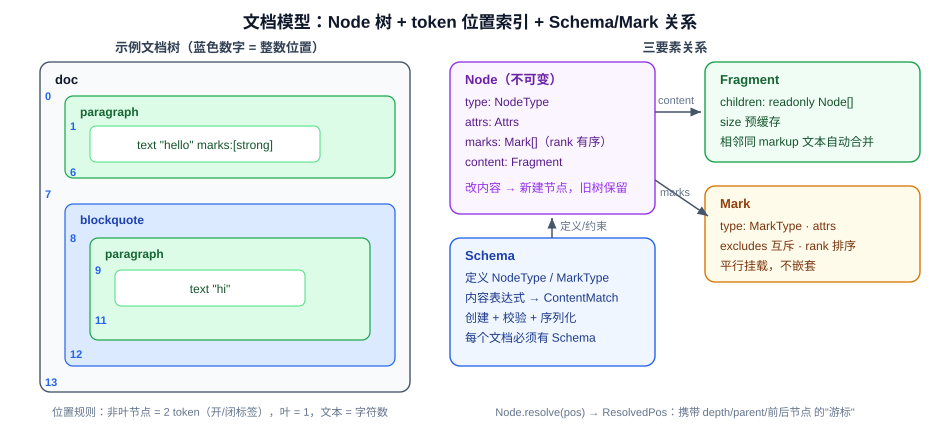

# 02 · 文档模型：Schema、Node、Mark

## 2.1 设计总览

ProseMirror 的文档不是 HTML 字符串，也不是扁平的 delta，而是一棵 **受 Schema 约束的不可变树**：

- **Node（节点）**：树的骨架。块级结构（段落、标题、列表）用节点嵌套表达。
- **Mark（标记）**：附着在节点上的"标签"。行内格式（加粗、斜体、链接）**不嵌套**，而是作为节点的一个平行数组属性。
- **Schema（模式）**：规则书。定义哪些 NodeType / MarkType 存在、每种节点允许什么内容（内容表达式）、允许哪些 Mark、有哪些属性。



**关键设计决策：行内格式用 Mark 而非嵌套节点。** HTML 中 `<strong>he<em>llo</em></strong>` 这种交叉嵌套在树上很难做局部编辑与 diff；ProseMirror 把 "hello" 拆成 `text("he", [strong])` + `text("llo", [strong, em])` 两个平铺的文本节点，每个节点挂一个 **按 rank 排序的 Mark 数组**。任意行内范围操作因此退化为对扁平序列的分段，极大简化替换算法。

## 2.2 Schema：编译期一次性构建的规则中心

Schema 构造时把声明式的 `NodeSpec` / `MarkSpec` **编译**成可执行的 `NodeType` / `MarkType`，并把内容表达式解析为自动机（`ContentMatch`），缓存复用。

关键代码 —— `prosemirror-model/src/schema.ts:596`：

```ts
constructor(spec: SchemaSpec<Nodes, Marks>) {
  // ...
  this.nodes = NodeType.compile(this.spec.nodes, this)
  this.marks = MarkType.compile(this.spec.marks, this)

  let contentExprCache = Object.create(null)
  for (let prop in this.nodes) {
    let type = this.nodes[prop], contentExpr = type.spec.content || "", markExpr = type.spec.marks
    type.contentMatch = contentExprCache[contentExpr] ||
      (contentExprCache[contentExpr] = ContentMatch.parse(contentExpr, this.nodes))
    // ...
    type.markSet = markExpr == "_" ? null :
      markExpr ? gatherMarks(this, markExpr.split(" ")) :
      markExpr == "" || !type.inlineContent ? [] : null
  }
  for (let prop in this.marks) {
    let type = this.marks[prop], excl = type.spec.excludes
    type.excluded = excl == null ? [type] : excl == "" ? [] : gatherMarks(this, excl.split(" "))
  }
  this.topNodeType = this.nodes[this.spec.topNode || "doc"]
}
```

要点：

1. **内容表达式即正则式**：`"paragraph block*"` 这类字符串被 `ContentMatch.parse` 编译成 NFA（`prosemirror-model/src/content.ts:10`，每个匹配状态持有 `next: MatchEdge[]` 边表）。校验内容就是跑一遍自动机：

   ```ts
   // content.ts:43
   matchFragment(frag: Fragment, start = 0, end = frag.childCount): ContentMatch | null {
     let cur: ContentMatch | null = this
     for (let i = start; cur && i < end; i++)
       cur = cur.matchType(frag.child(i).type)
     return cur
   }
   ```

2. **约束在创建与变更两条路径上强制执行**：`NodeType.createChecked`（schema.ts:160）先 `checkContent` 再构造；`Node.validContent`（schema.ts:188）同时校验内容结构与每个子节点的 marks 是否被允许。
3. **互斥规则在编译期求值**：`excludes` 字符串在构造时被解析成 `MarkType[]`，运行时 `Mark.addToSet` 只做 O(n) 查表。

Schema 还承担 **工厂** 职责（`schema.node()` / `schema.text()` / `schema.mark()`，schema.ts:646-671），以及序列化锚点（`nodeFromJSON` / `markFromJSON`），保证 JSON 反序列化也走同一套校验。

## 2.3 Node：持久化（不可变）的文档树

关键代码 —— `prosemirror-model/src/node.ts:22`：

```ts
export class Node {
  constructor(
    readonly type: NodeType,
    readonly attrs: Attrs,
    content?: Fragment | null,
    readonly marks = Mark.none
  ) {
    this.content = content || Fragment.empty
  }

  get nodeSize(): number { return this.isLeaf ? 1 : 2 + this.content.size }
}
```

源码注释直接点明设计原理（node.ts:14-18）：

> Nodes are persistent data structures. Instead of changing them, you create new ones with the content you want. Old ones keep pointing at the old document shape. This is made cheaper by sharing structure between the old and new data as much as possible, which a tree shape like this (without back pointers) makes easy.

即 **无父指针的树 + 结构共享**：修改一个节点时只重建从它到根的路径，其余子树原样引用（`copy()` 只在内容变化时新建，node.ts:138）。保留历史版本因此接近零成本——这是撤销/重做、协同编辑、DOM diff 的共同基础。

### 整数位置索引（token-based addressing）

文档位置不是 (路径, 偏移) 二元组，而是把整个文档线性化为 token 流后的整数下标：每个非叶节点贡献 2 个 token（开/闭标签，见 `nodeSize`），叶节点 1 个，文本节点为其字符数。

`Fragment.findIndex`（fragment.ts:193）把整数位置翻译成 (childIndex, offset)：

```ts
findIndex(pos: number): {index: number, offset: number} {
  if (pos == 0) return retIndex(0, pos)
  if (pos == this.size) return retIndex(this.content.length, pos)
  // 线性扫描累加 nodeSize，定位落在哪个 child 内
}
```

整数位置的收益：可排序、可比较、可差值运算，选区就是两个整数；代价是文档变化后旧位置失效——这正是 `StepMap`/`Mapping`（见 [03](03-Transaction事务机制.md)）要解决的问题。

### ResolvedPos（$pos）

`Node.resolve`（node.ts:211）把裸整数"解析"为带上下文的位置对象。`ResolvedPos`（`prosemirror-model/src/resolvedpos.ts:12`）内部用扁平 `path` 数组（每 3 个元素记录 [node, index, offset]）表示从根到该位置的完整路径，从而提供 `depth` / `parent` / `node(d)` / `before(d)` / `after(d)` / `marks()` 等查询，并带缓存（`resolveCached`）。它是所有编辑 API 的"游标"。

## 2.4 Fragment：结构共享的子节点容器

`Fragment`（`prosemirror-model/src/fragment.ts:10`）包装 `readonly Node[]` 并预缓存总 `size`，所有"修改"都返回新 Fragment：

```ts
// fragment.ts:115
replaceChild(index: number, node: Node) {
  let current = this.content[index]
  if (current == node) return this            // 无变化直接复用（保引用）
  let copy = this.content.slice()
  let size = this.size + node.nodeSize - current.nodeSize
  copy[index] = node
  return new Fragment(copy, size)
}
```

两个工程化细节：

- **文本节点自动合并**：`Fragment.append` / `fromArray`（fragment.ts:76、227）在拼接时合并相邻同 markup 的文本节点，保证文档的**规范化**（canonical form）——两个语义相同的文档在结构上也相同，diff 才有意义。
- **惰性相等**：`Node.eq` 先比引用（`this == other`），引用相等立即返回。配合结构共享，未修改子树的比较是 O(1)。

## 2.5 Mark：带类型的平行标签

`Mark` 本体极小（`prosemirror-model/src/mark.ts:10`）：只有 `type` + `attrs`。复杂度都在**集合运算**上：

```ts
// mark.ts:24 —— 加入集合时按 rank 排序、按 excludes 互斥
addToSet(set: readonly Mark[]): readonly Mark[] {
  let copy, placed = false
  for (let i = 0; i < set.length; i++) {
    let other = set[i]
    if (this.eq(other)) return set                       // 已存在 → 原样返回（保引用）
    if (this.type.excludes(other.type)) {
      if (!copy) copy = set.slice(0, i)                  // 排除已有 mark
    } else if (other.type.excludes(this.type)) {
      return set                                         // 被对方排除 → 拒绝加入
    } else {
      if (!placed && other.type.rank > this.type.rank) {
        if (!copy) copy = set.slice(0, i)
        copy.push(this); placed = true                   // 按 rank 插入有序位置
      }
      if (copy) copy.push(other)
    }
  }
  if (!copy) copy = set.slice()
  if (!placed) copy.push(this)
  return copy
}
```

设计要点：

- **同一 mark 类型默认互斥**（`excluded` 默认为 `[type]` 自身，schema.ts:624），"加粗"只能有一份；link 类 mark 通过 `excludes: ""` 允许不同 href 的多实例共存。
- **rank 排序**保证 mark 集合有唯一规范顺序，序列化/DOM 输出稳定。
- `MarkType.create` 对全默认属性做**单例缓存**（schema.ts:302），绝大多数"加粗"标签在内存中是同一个对象。

---

**上一篇**：[01 · 总体架构](01-总体架构.md) ｜ **下一篇**：[03 · Transaction 事务机制](03-Transaction事务机制.md)
