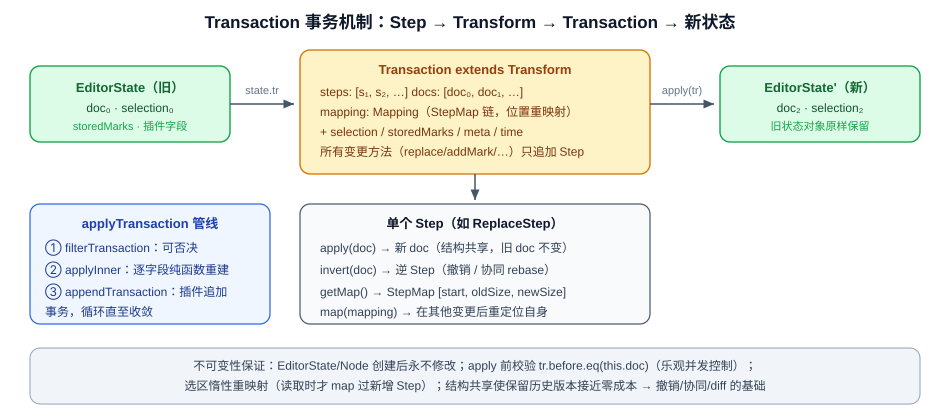

# 03 · Transaction 事务机制与状态不可变性

## 3.1 三层结构：Step → Transform → Transaction



### Step：原子变更（不可变性的基石）

`Step`（`prosemirror-transform/src/step.ts:16`）是抽象基类，约定四个核心方法：`apply`（应用并返回新文档）、`invert`（生成逆操作）、`map`（在其他变更后重定位自身）、`getMap`（返回位置映射）。

以最常用的 `ReplaceStep` 为例（`prosemirror-transform/src/replace_step.ts:28`）：

```ts
apply(doc: Node) {
  if (this.structure && contentBetween(doc, this.from, this.to))
    return StepResult.fail("Structure replace would overwrite content")
  return StepResult.fromReplace(doc, this.from, this.to, this.slice)
}

getMap() {
  return new StepMap([this.from, this.to - this.from, this.slice.size])
}

invert(doc: Node) {
  return new ReplaceStep(this.from, this.from + this.slice.size, doc.slice(this.from, this.to))
}
```

`apply(doc)` 接收旧文档、返回 `{doc: 新文档}`，旧文档原封不动；`invert` 是撤销与协同 rebase 的关键；Step 还可序列化（`toJSON` / `fromJSON` + `jsonID` 注册），因此能跨网络传输。

### Transform：变更批次与审计轨迹

`Transform`（`prosemirror-transform/src/transform.ts:28`）记录完整轨迹：

```ts
export class Transform {
  readonly steps: Step[] = []
  readonly docs: Node[] = []        // 每个 step 之前的文档
  readonly mapping: Mapping = new Mapping

  constructor(public doc: Node) {}

  get before() { return this.docs.length ? this.docs[0] : this.doc }

  addStep(step: Step, doc: Node) {
    this.docs.push(this.doc)        // 留存旧文档（结构共享，代价极小）
    this.steps.push(step)
    this.mapping.appendMap(step.getMap())
    this.doc = doc                  // 只换引用，旧 doc 仍可回溯
  }
}
```

所有编辑 API（`replace` / `delete` / `insert` / `addMark` / `split` / `join` / `lift` / `wrap`…）都只是往数组里追加 Step，方法返回 `this` 以支持链式调用。

### Transaction：Transform + 非文档状态

关键代码 —— `prosemirror-state/src/transaction.ts:42`：

```ts
export class Transaction extends Transform {
  time: number
  private curSelection: Selection
  private curSelectionFor = 0   // 惰性：选区只对当前 step 数有效
  private updated = 0           // 位标记：UPDATED_SEL / MARKS / SCROLL
  private meta: {[name: string]: any} = Object.create(null)
  storedMarks: readonly Mark[] | null

  constructor(state: EditorState) {
    super(state.doc)            // 以当前文档为起点
    this.time = Date.now()
    this.curSelection = state.selection
    this.storedMarks = state.storedMarks
  }
}
```

## 3.2 不可变性是如何被保证的

**(1) 状态不可更新，只能被替换。** `EditorState.applyInner`（`prosemirror-state/src/state.ts:171`）每次都 new 一个全新的状态对象，逐字段重建：

```ts
applyInner(tr: Transaction) {
  if (!tr.before.eq(this.doc)) throw new RangeError("Applying a mismatched transaction")
  let newInstance = new EditorState(this.config), fields = this.config.fields
  for (let i = 0; i < fields.length; i++) {
    let field = fields[i]
    ;(newInstance as any)[field.name] = field.apply(tr, (this as any)[field.name], this, newInstance)
  }
  return newInstance
}
```

- 内置字段（state.ts:21-41）的更新规则是纯函数：`doc → tr.doc`、`selection → tr.selection`、`storedMarks → 光标时取 tr.storedMarks`。
- 状态被建模为**字段的集合**，插件通过 `StateField`（`prosemirror-state/src/plugin.ts:95`）注入自己的 `init/apply` 纯函数，享受同一条不可变流水线——这就是 ProseMirror 版的 "reducer"。

**(2) 前置校验（乐观并发控制）。** `tr.before.eq(this.doc)` 保证事务只能应用到它出生时看到的那份文档上，错位应用立即抛错——协同编辑 rebasing 能正确工作的前提。

**(3) 选区的惰性重映射。** 事务中途添加 step 会移动位置，Transaction 不急着更新选区，只在被读取时把旧选区 map 过新增 step 的映射（transaction.ts:71）：

```ts
get selection(): Selection {
  if (this.curSelectionFor < this.steps.length) {
    this.curSelection = this.curSelection.map(this.doc, this.mapping.slice(this.curSelectionFor))
    this.curSelectionFor = this.steps.length
  }
  return this.curSelection
}
```

**(4) 事务管线：过滤 → 应用 → 追加。** `applyTransaction`（state.ts:137）让插件参与事务生命周期：`filterTransaction` 可否决事务；`appendTransaction` 可基于新状态追加修正事务（自动补全、规范化），循环直到没有插件再产出新事务。所有中间事务都被记录返回，可审计、可回放。

**(5) 元数据通道。** `tr.setMeta/getMeta`（transaction.ts:187）让"这个事务因何而起"（输入、粘贴、协同远端、undo…）随事务流动，插件据此决定自己的 state field 如何响应——history 插件靠 meta 区分本地编辑与 undo 产生的事务，避免把 undo 再次记入历史。

**(6) 位置映射：StepMap / Mapping。** 文档变了，旧位置怎么办？

- `StepMap`（`prosemirror-transform/src/map.ts:72`）把一次替换编码为 `[start, oldSize, newSize]` 三元组序列：

  ```ts
  // map.ts:98 —— 核心映射逻辑
  _map(pos: number, assoc: number, simple: boolean) {
    let diff = 0, oldIndex = this.inverted ? 2 : 1, newIndex = this.inverted ? 1 : 2
    for (let i = 0; i < this.ranges.length; i += 3) {
      let start = this.ranges[i] - (this.inverted ? diff : 0)
      if (start > pos) break
      let oldSize = this.ranges[i + oldIndex], newSize = this.ranges[i + newIndex], end = start + oldSize
      if (pos <= end) {
        let side = !oldSize ? assoc : pos == start ? -1 : pos == end ? 1 : assoc
        let result = start + diff + (side < 0 ? 0 : newSize)
        // ...
      }
      diff += newSize - oldSize
    }
    return simple ? pos + diff : new MapResult(pos + diff, 0, null)
  }
  ```

- `Mapping`（map.ts:236+）把一串 StepMap 串起来，`assoc`（±1）决定位置偏向插入内容的哪一侧，`mapResult` 报告位置是否被删除；mirror 机制支持 rebase（一个分支的位置映射穿过另一个分支的变更）。
- 选区、装饰（decoration）、协同光标全都靠它在新文档上"着陆"。

---

**上一篇**：[02 · 文档模型](02-文档模型-Schema-Node-Mark.md) ｜ **下一篇**：[04 · Selection 选区系统](04-Selection选区系统.md)
