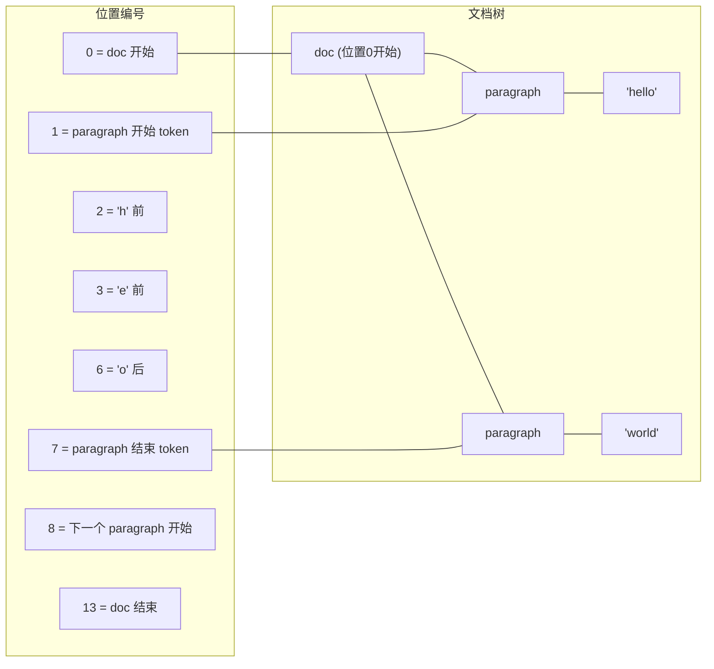
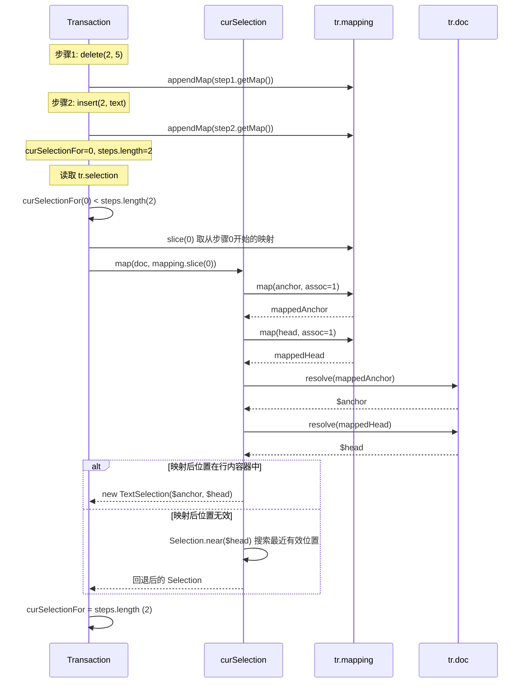

# 03 Selection 选区系统实现原理

> 对应源码：[state/src/selection.ts](../state/src/selection.ts) 和 [model/src/resolvedpos.ts](../model/src/resolvedpos.ts)

本章分析 ProseMirror 的选区系统，包括 Selection 抽象、三种内置选区类型、ResolvedPos 位置解析，以及选区在事务中的自动映射机制。

---

## 目录

- [3.1 Selection 抽象基类](#31-selection-抽象基类)
- [3.2 SelectionRange：选区范围](#32-selectionrange选区范围)
- [3.3 TextSelection：文本选区与光标](#33-textselection文本选区与光标)
- [3.4 NodeSelection：节点选区](#34-nodeselection节点选区)
- [3.5 AllSelection：全选](#35-allselection全选)
- [3.6 ResolvedPos：解析后的位置上下文](#36-resolvedpos解析后的位置上下文)
- [3.7 位置索引方案](#37-位置索引方案)
- [3.8 SelectionBookmark：无文档依赖的选区书签](#38-selectionbookmark无文档依赖的选区书签)
- [3.9 选区在事务中的自动映射](#39-选区在事务中的自动映射)
- [3.10 选区查找算法](#310-选区查找算法)
- [3.11 选区注册与 JSON 序列化](#311-选区注册与-json-序列化)

---

## 3.1 Selection 抽象基类

Selection 表示编辑器中的选区，使用 `$anchor`（锚点，固定端）和 `$head`（头部，移动端）两个 `ResolvedPos` 来描述。这种 anchor/head 模型可以表达有方向的选区（从左向右选还是从右向左选）。

**关键源码：** [selection.ts#L9-L188](../state/src/selection.ts#L9-L188)

```typescript
export abstract class Selection {
  constructor(
    readonly $anchor: ResolvedPos,
    readonly $head: ResolvedPos,
    ranges?: readonly SelectionRange[]
  ) {
    this.ranges = ranges || [new SelectionRange($anchor.min($head), $anchor.max($head))]
  }

  ranges: readonly SelectionRange[]

  get anchor() { return this.$anchor.pos }
  get head() { return this.$head.pos }
  get from() { return this.$from.pos }
  get to() { return this.$to.pos }
  get $from() { return this.ranges[0].$from }
  get $to() { return this.ranges[0].$to }

  get empty(): boolean {
    let ranges = this.ranges
    for (let i = 0; i < ranges.length; i++)
      if (ranges[i].$from.pos != ranges[i].$to.pos) return false
    return true
  }

  abstract eq(selection: Selection): boolean
  abstract map(doc: Node, mapping: Mappable): Selection
  abstract toJSON(): any

  content() {
    return this.$from.doc.slice(this.from, this.to, true)
  }

  replace(tr: Transaction, content = Slice.empty) {
    let lastNode = content.content.lastChild, lastParent = null
    for (let i = 0; i < content.openEnd; i++) {
      lastParent = lastNode!
      lastNode = lastNode!.lastChild
    }

    let mapFrom = tr.steps.length, ranges = this.ranges
    for (let i = 0; i < ranges.length; i++) {
      let {$from, $to} = ranges[i], mapping = tr.mapping.slice(mapFrom)
      tr.replaceRange(mapping.map($from.pos), mapping.map($to.pos), i ? Slice.empty : content)
      if (i == 0)
        selectionToInsertionEnd(tr, mapFrom, (lastNode ? lastNode.isInline : lastParent && lastParent.isTextblock) ? -1 : 1)
    }
  }

  replaceWith(tr: Transaction, node: Node) {
    let mapFrom = tr.steps.length, ranges = this.ranges
    for (let i = 0; i < ranges.length; i++) {
      let {$from, $to} = ranges[i], mapping = tr.mapping.slice(mapFrom)
      let from = mapping.map($from.pos), to = mapping.map($to.pos)
      if (i) {
        tr.deleteRange(from, to)
      } else {
        tr.replaceRangeWith(from, to, node)
        selectionToInsertionEnd(tr, mapFrom, node.isInline ? -1 : 1)
      }
    }
  }

  getBookmark(): SelectionBookmark {
    return TextSelection.between(this.$anchor, this.$head).getBookmark()
  }

  declare visible: boolean

  static findFrom($pos: ResolvedPos, dir: number, textOnly: boolean = false): Selection | null {
    let inner = $pos.parent.inlineContent ? new TextSelection($pos)
        : findSelectionIn($pos.node(0), $pos.parent, $pos.pos, $pos.index(), dir, textOnly)
    if (inner) return inner

    for (let depth = $pos.depth - 1; depth >= 0; depth--) {
      let found = dir < 0
          ? findSelectionIn($pos.node(0), $pos.node(depth), $pos.before(depth + 1), $pos.index(depth), dir, textOnly)
          : findSelectionIn($pos.node(0), $pos.node(depth), $pos.after(depth + 1), $pos.index(depth) + 1, dir, textOnly)
      if (found) return found
    }
    return null
  }

  static near($pos: ResolvedPos, bias = 1): Selection {
    return this.findFrom($pos, bias) || this.findFrom($pos, -bias) || new AllSelection($pos.node(0))
  }

  static atStart(doc: Node): Selection {
    return findSelectionIn(doc, doc, 0, 0, 1) || new AllSelection(doc)
  }

  static atEnd(doc: Node): Selection {
    return findSelectionIn(doc, doc, doc.content.size, doc.childCount, -1) || new AllSelection(doc)
  }

  static fromJSON(doc: Node, json: any): Selection {
    if (!json || !json.type) throw new RangeError("Invalid input for Selection.fromJSON")
    let cls = classesById[json.type]
    if (!cls) throw new RangeError(`No selection type ${json.type} defined`)
    return cls.fromJSON(doc, json)
  }

  static jsonID(id: string, selectionClass: {fromJSON: (doc: Node, json: any) => Selection}) {
    if (id in classesById) throw new RangeError("Duplicate use of selection JSON ID " + id)
    classesById[id] = selectionClass
    ;(selectionClass as any).prototype.jsonID = id
    return selectionClass
  }
}

Selection.prototype.visible = true
```

**核心概念：**

- **anchor（锚点）**：选区的固定端，用户按下鼠标时的位置，扩展选区时不移动
- **head（头部）**：选区的移动端，用户拖动鼠标时的位置
- **from/to**：选区主范围的下界和上界（`min(anchor, head)` 和 `max(anchor, head)`）
- **ranges**：选区可以包含多个范围（为未来的多选区支持预留），目前主范围为 `ranges[0]`
- **empty**：所有范围都为空时选区为空（即光标状态）

`replace()` 和 `replaceWith()` 方法封装了选区替换的通用逻辑：通过 `tr.mapping.slice(mapFrom)` 确保每个范围映射到当前步骤后的正确位置，第一个范围替换为内容，其余范围删除为空。

---

## 3.2 SelectionRange：选区范围

**关键源码：** [selection.ts#L207-L215](../state/src/selection.ts#L207-L215)

```typescript
export class SelectionRange {
  constructor(
    readonly $from: ResolvedPos,
    readonly $to: ResolvedPos
  ) {}
}
```

SelectionRange 是简单的值对象，持有范围两端的 ResolvedPos。

---

## 3.3 TextSelection：文本选区与光标

TextSelection 是最常用的选区类型，表示在行内容器中的文本选区。当 anchor == head 时即为光标。

**关键源码：** [selection.ts#L229-L318](../state/src/selection.ts#L229-L318)

```typescript
export class TextSelection extends Selection {
  constructor($anchor: ResolvedPos, $head = $anchor) {
    checkTextSelection($anchor)
    checkTextSelection($head)
    super($anchor, $head)
  }

  get $cursor() { return this.$anchor.pos == this.$head.pos ? this.$head : null }

  map(doc: Node, mapping: Mappable): Selection {
    let $head = doc.resolve(mapping.map(this.head))
    if (!$head.parent.inlineContent) return Selection.near($head)
    let $anchor = doc.resolve(mapping.map(this.anchor))
    return new TextSelection($anchor.parent.inlineContent ? $anchor : $head, $head)
  }

  replace(tr: Transaction, content = Slice.empty) {
    super.replace(tr, content)
    if (content == Slice.empty) {
      let marks = this.$from.marksAcross(this.$to)
      if (marks) tr.ensureMarks(marks)
    }
  }

  eq(other: Selection): boolean {
    return other instanceof TextSelection && other.anchor == this.anchor && other.head == this.head
  }

  getBookmark() {
    return new TextBookmark(this.anchor, this.head)
  }

  toJSON(): any {
    return {type: "text", anchor: this.anchor, head: this.head}
  }

  static fromJSON(doc: Node, json: any) {
    if (typeof json.anchor != "number" || typeof json.head != "number")
      throw new RangeError("Invalid input for TextSelection.fromJSON")
    return new TextSelection(doc.resolve(json.anchor), doc.resolve(json.head))
  }

  static create(doc: Node, anchor: number, head = anchor) {
    let $anchor = doc.resolve(anchor)
    return new this($anchor, head == anchor ? $anchor : doc.resolve(head))
  }

  static between($anchor: ResolvedPos, $head: ResolvedPos, bias?: number): Selection {
    let dPos = $anchor.pos - $head.pos
    if (!bias || dPos) bias = dPos >= 0 ? 1 : -1
    if (!$head.parent.inlineContent) {
      let found = Selection.findFrom($head, bias, true) || Selection.findFrom($head, -bias, true)
      if (found) $head = found.$head
      else return Selection.near($head, bias)
    }
    if (!$anchor.parent.inlineContent) {
      if (dPos == 0) {
        $anchor = $head
      } else {
        $anchor = (Selection.findFrom($anchor, -bias, true) || Selection.findFrom($anchor, bias, true))!.$anchor
        if (($anchor.pos < $head.pos) != (dPos < 0)) $anchor = $head
      }
    }
    return new TextSelection($anchor, $head)
  }
}

Selection.jsonID("text", TextSelection)

class TextBookmark {
  constructor(readonly anchor: number, readonly head: number) {}

  map(mapping: Mappable) {
    return new TextBookmark(mapping.map(this.anchor), mapping.map(this.head))
  }

  resolve(doc: Node) {
    return TextSelection.between(doc.resolve(this.anchor), doc.resolve(this.head))
  }
}
```

**设计要点：**

- `$cursor` getter 仅在空选区（anchor == head）时返回 ResolvedPos，否则返回 null
- `map()` 方法在文档变更后映射选区：如果映射后的 head 不在行内容器中，通过 `Selection.near()` 回退到最近的有效位置
- `replace()` 覆写了基类方法，在删除选区内容时保留跨越选区的 marks（通过 `marksAcross`）
- `between()` 是核心的容错工厂方法：当给定位置不在行内容器中时，自动搜索附近的有效文本位置
- `TextBookmark` 是轻量书签，只存两个整数位置，不依赖文档，可在历史记录中安全保存

---

## 3.4 NodeSelection：节点选区

NodeSelection 选中整个节点（如图片、分割线等原子节点），anchor 在节点前，head 在节点后。

**关键源码：** [selection.ts#L325-L393](../state/src/selection.ts#L325-L393)

```typescript
export class NodeSelection extends Selection {
  constructor($pos: ResolvedPos) {
    let node = $pos.nodeAfter!
    let $end = $pos.node(0).resolve($pos.pos + node.nodeSize)
    super($pos, $end)
    this.node = node
  }

  node: Node

  map(doc: Node, mapping: Mappable): Selection {
    let {deleted, pos} = mapping.mapResult(this.anchor)
    let $pos = doc.resolve(pos)
    if (deleted) return Selection.near($pos)
    return new NodeSelection($pos)
  }

  content() {
    return new Slice(Fragment.from(this.node), 0, 0)
  }

  eq(other: Selection): boolean {
    return other instanceof NodeSelection && other.anchor == this.anchor
  }

  toJSON(): any {
    return {type: "node", anchor: this.anchor}
  }

  getBookmark() { return new NodeBookmark(this.anchor) }

  static fromJSON(doc: Node, json: any) {
    if (typeof json.anchor != "number")
      throw new RangeError("Invalid input for NodeSelection.fromJSON")
    return new NodeSelection(doc.resolve(json.anchor))
  }

  static create(doc: Node, from: number) {
    return new NodeSelection(doc.resolve(from))
  }

  static isSelectable(node: Node) {
    return !node.isText && node.type.spec.selectable !== false
  }
}

NodeSelection.prototype.visible = false

Selection.jsonID("node", NodeSelection)

class NodeBookmark {
  constructor(readonly anchor: number) {}

  map(mapping: Mappable) {
    let {deleted, pos} = mapping.mapResult(this.anchor)
    return deleted ? new TextBookmark(pos, pos) : new NodeBookmark(pos)
  }

  resolve(doc: Node) {
    let $pos = doc.resolve(this.anchor), node = $pos.nodeAfter
    if (node && NodeSelection.isSelectable(node)) return new NodeSelection($pos)
    return Selection.near($pos)
  }
}
```

**设计要点：**

- NodeSelection 的 `visible` 为 false，因为浏览器原生不显示节点选区（由 ProseMirror 自己绘制选中样式）
- `map()` 使用 `mapResult` 检查节点是否被删除，若删除则回退到文本选区
- `NodeBookmark.map()` 在节点被删除时降级为 TextBookmark（光标位置）
- `isSelectable()` 检查节点非文本且 `spec.selectable !== false`（默认可选）

---

## 3.5 AllSelection：全选

AllSelection 选中整个文档内容。

**关键源码：** [selection.ts#L399-L432](../state/src/selection.ts#L399-L432)

```typescript
export class AllSelection extends Selection {
  constructor(doc: Node) {
    super(doc.resolve(0), doc.resolve(doc.content.size))
  }

  replace(tr: Transaction, content = Slice.empty) {
    if (content == Slice.empty) {
      tr.delete(0, tr.doc.content.size)
      let sel = Selection.atStart(tr.doc)
      if (!sel.eq(tr.selection)) tr.setSelection(sel)
    } else {
      super.replace(tr, content)
    }
  }

  toJSON(): any { return {type: "all"} }

  static fromJSON(doc: Node) { return new AllSelection(doc) }

  map(doc: Node) { return new AllSelection(doc) }

  eq(other: Selection) { return other instanceof AllSelection }

  getBookmark() { return AllBookmark }
}

Selection.jsonID("all", AllSelection)

const AllBookmark = {
  map() { return this },
  resolve(doc: Node) { return new AllSelection(doc) }
}
```

AllSelection 的 `map()` 总是返回新的 AllSelection，因为全选不受文档内容变化影响。`AllBookmark` 是单例对象。

---

## 3.6 ResolvedPos：解析后的位置上下文

ProseMirror 使用扁平的整数位置定位文档中的点。将位置 resolve 后得到 `ResolvedPos`，它提供了完整的树路径上下文。

**关键源码：** [resolvedpos.ts#L12-L250](../model/src/resolvedpos.ts#L12-L250)

```typescript
export class ResolvedPos {
  depth: number

  constructor(
    readonly pos: number,
    readonly path: any[],
    readonly parentOffset: number
  ) {
    this.depth = path.length / 3 - 1
  }

  resolveDepth(val: number | undefined | null) {
    if (val == null) return this.depth
    if (val < 0) return this.depth + val
    return val
  }

  get parent() { return this.node(this.depth) }
  get doc() { return this.node(0) }

  node(depth?: number | null): Node { return this.path[this.resolveDepth(depth) * 3] }
  index(depth?: number | null): number { return this.path[this.resolveDepth(depth) * 3 + 1] }

  indexAfter(depth?: number | null): number {
    depth = this.resolveDepth(depth)
    return this.index(depth) + (depth == this.depth && !this.textOffset ? 0 : 1)
  }

  start(depth?: number | null): number {
    depth = this.resolveDepth(depth)
    return depth == 0 ? 0 : this.path[depth * 3 - 1] + 1
  }

  end(depth?: number | null): number {
    depth = this.resolveDepth(depth)
    return this.start(depth) + this.node(depth).content.size
  }

  before(depth?: number | null): number {
    depth = this.resolveDepth(depth)
    if (!depth) throw new RangeError("There is no position before the top-level node")
    return depth == this.depth + 1 ? this.pos : this.path[depth * 3 - 1]
  }

  after(depth?: number | null): number {
    depth = this.resolveDepth(depth)
    if (!depth) throw new RangeError("There is no position after the top-level node")
    return depth == this.depth + 1 ? this.pos : this.path[depth * 3 - 1] + this.path[depth * 3].nodeSize
  }

  get textOffset(): number { return this.pos - this.path[this.path.length - 1] }

  get nodeAfter(): Node | null {
    let parent = this.parent, index = this.index(this.depth)
    if (index == parent.childCount) return null
    let dOff = this.pos - this.path[this.path.length - 1], child = parent.child(index)
    return dOff ? parent.child(index).cut(dOff) : child
  }

  get nodeBefore(): Node | null {
    let index = this.index(this.depth)
    let dOff = this.pos - this.path[this.path.length - 1]
    if (dOff) return this.parent.child(index).cut(0, dOff)
    return index == 0 ? null : this.parent.child(index - 1)
  }

  posAtIndex(index: number, depth?: number | null): number {
    depth = this.resolveDepth(depth)
    let node = this.path[depth * 3], pos = depth == 0 ? 0 : this.path[depth * 3 - 1] + 1
    for (let i = 0; i < index; i++) pos += node.child(i).nodeSize
    return pos
  }

  marks(): readonly Mark[] {
    let parent = this.parent, index = this.index()

    if (parent.content.size == 0) return Mark.none
    if (this.textOffset) return parent.child(index).marks

    let main = parent.maybeChild(index - 1), other = parent.maybeChild(index)
    if (!main) { let tmp = main; main = other; other = tmp }

    let marks = main!.marks
    for (var i = 0; i < marks.length; i++)
      if (marks[i].type.spec.inclusive === false && (!other || !marks[i].isInSet(other.marks)))
        marks = marks[i--].removeFromSet(marks)

    return marks
  }

  marksAcross($end: ResolvedPos): readonly Mark[] | null {
    let after = this.parent.maybeChild(this.index())
    if (!after || !after.isInline) return null

    let marks = after.marks, next = $end.parent.maybeChild($end.index())
    for (var i = 0; i < marks.length; i++)
      if (marks[i].type.spec.inclusive === false && (!next || !marks[i].isInSet(next.marks)))
        marks = marks[i--].removeFromSet(marks)
    return marks
  }

  sharedDepth(pos: number): number {
    for (let depth = this.depth; depth > 0; depth--)
      if (this.start(depth) <= pos && this.end(depth) >= pos) return depth
    return 0
  }

  blockRange(other: ResolvedPos = this, pred?: (node: Node) => boolean): NodeRange | null {
    if (other.pos < this.pos) return other.blockRange(this)
    for (let d = this.depth - (this.parent.inlineContent || this.pos == other.pos ? 1 : 0); d >= 0; d--)
      if (other.pos <= this.end(d) && (!pred || pred(this.node(d))))
        return new NodeRange(this, other, d)
    return null
  }

  sameParent(other: ResolvedPos): boolean {
    return this.pos - this.parentOffset == other.pos - other.parentOffset
  }

  max(other: ResolvedPos): ResolvedPos {
    return other.pos > this.pos ? other : this
  }

  min(other: ResolvedPos): ResolvedPos {
    return other.pos < this.pos ? other : this
  }

  static resolve(doc: Node, pos: number): ResolvedPos {
    if (!(pos >= 0 && pos <= doc.content.size)) throw new RangeError("Position " + pos + " out of range")
    let path: Array<Node | number> = []
    let start = 0, parentOffset = pos
    for (let node = doc;;) {
      let {index, offset} = node.content.findIndex(parentOffset)
      let rem = parentOffset - offset
      path.push(node, index, start + offset)
      if (!rem) break
      node = node.child(index)
      if (node.isText) break
      parentOffset = rem - 1
      start += offset + 1
    }
    return new ResolvedPos(pos, path, parentOffset)
  }

  static resolveCached(doc: Node, pos: number): ResolvedPos {
    let cache = resolveCache.get(doc)
    if (cache) {
      for (let i = 0; i < cache.elts.length; i++) {
        let elt = cache.elts[i]
        if (elt.pos == pos) return elt
      }
    } else {
      resolveCache.set(doc, cache = new ResolveCache)
    }
    let result = cache.elts[cache.i] = ResolvedPos.resolve(doc, pos)
    cache.i = (cache.i + 1) % resolveCacheSize
    return result
  }
}
```

**path 数组结构：** path 是一个扁平数组，每三个元素为一组 `[node, index, startPos]`：
- `node`：该层的祖先节点
- `index`：位置在该节点 children 中的索引
- `startPos`：该节点内容起始的绝对位置

depth = path.length / 3 - 1。例如 `[doc, 0, 0, paragraph, 2, 1]` 表示 depth=1，在 doc 的第 0 个子节点（paragraph）中，paragraph 内容起始于位置 1。

**marks() 方法的 inclusive 逻辑：** 获取光标位置的 marks 时，优先取前一个节点的 marks，但排除 `inclusive: false` 且在后一个节点中不存在的 mark。这决定了光标在格式边界处是否继续输入带格式的文本。

`resolveCached` 使用 WeakMap + 环形缓存（大小 12）避免重复解析同一位置，优化高频调用场景。

---

## 3.7 位置索引方案

ProseMirror 使用扁平整数位置标识文档中的每个点：



位置计算规则：
- 文档起始为 0
- 进入一个非叶子节点 +1（开始 token）
- 文本节点每个字符 +1
- 叶子原子节点 +1
- 退出一个非叶子节点 +1（结束 token）

因此非叶子节点的 `nodeSize = 2 + content.size`，文本节点的 `nodeSize = text.length`，叶子节点的 `nodeSize = 1`。

---

## 3.8 SelectionBookmark：无文档依赖的选区书签

SelectionBookmark 是选区的轻量表示，不依赖当前文档，可以在文档变更历史中保存和恢复。

**关键源码：** [selection.ts#L195-L204](../state/src/selection.ts#L195-L204)

```typescript
export interface SelectionBookmark {
  map: (mapping: Mappable) => SelectionBookmark
  resolve: (doc: Node) => Selection
}
```

三种选区的书签实现：
- **TextBookmark**：持有 anchor/head 两个整数，map 时逐位置映射，resolve 时用 `TextSelection.between` 容错
- **NodeBookmark**：持有 anchor 一个整数，map 时检查节点是否被删除（删除则降级为 TextBookmark）
- **AllBookmark**：单例对象，map 返回自身，resolve 返回新的 AllSelection

书签主要被 history 插件用于在撤销/重做时保存和恢复选区。

---

## 3.9 选区在事务中的自动映射

当 Transaction 包含文档修改步骤时，选区会自动通过 Mapping 进行映射。这是 Transaction 的核心机制之一。



关键实现在 Transaction 的 selection getter 中：

**关键源码：** [transaction.ts#L71-L77](../state/src/transaction.ts#L71-L77)

```typescript
get selection(): Selection {
  if (this.curSelectionFor < this.steps.length) {
    this.curSelection = this.curSelection.map(this.doc, this.mapping.slice(this.curSelectionFor))
    this.curSelectionFor = this.steps.length
  }
  return this.curSelection
}
```

`mapping.slice(curSelectionFor)` 确保只映射从上次更新选区之后新增的步骤，避免重复映射。

---

## 3.10 选区查找算法

`Selection.findFrom` 在给定位置沿指定方向搜索有效选区，先尝试当前层级，再逐级向上查找：

**关键源码：** [selection.ts#L118-L130](../state/src/selection.ts#L118-L130)

```typescript
static findFrom($pos: ResolvedPos, dir: number, textOnly: boolean = false): Selection | null {
  let inner = $pos.parent.inlineContent ? new TextSelection($pos)
      : findSelectionIn($pos.node(0), $pos.parent, $pos.pos, $pos.index(), dir, textOnly)
  if (inner) return inner

  for (let depth = $pos.depth - 1; depth >= 0; depth--) {
    let found = dir < 0
        ? findSelectionIn($pos.node(0), $pos.node(depth), $pos.before(depth + 1), $pos.index(depth), dir, textOnly)
        : findSelectionIn($pos.node(0), $pos.node(depth), $pos.after(depth + 1), $pos.index(depth) + 1, dir, textOnly)
    if (found) return found
  }
  return null
}
```

内部递归函数 `findSelectionIn` 遍历子节点，在行内容器中创建 TextSelection，在可选择的原子节点上创建 NodeSelection：

**关键源码：** [selection.ts#L439-L452](../state/src/selection.ts#L439-L452)

```typescript
function findSelectionIn(doc: Node, node: Node, pos: number, index: number, dir: number, text = false): Selection | null {
  if (node.inlineContent) return TextSelection.create(doc, pos)
  for (let i = index - (dir > 0 ? 0 : 1); dir > 0 ? i < node.childCount : i >= 0; i += dir) {
    let child = node.child(i)
    if (!child.isAtom) {
      let inner = findSelectionIn(doc, child, pos + dir, dir < 0 ? child.childCount : 0, dir, text)
      if (inner) return inner
    } else if (!text && NodeSelection.isSelectable(child)) {
      return NodeSelection.create(doc, pos - (dir < 0 ? child.nodeSize : 0))
    }
    pos += child.nodeSize * dir
  }
  return null
}
```

辅助函数 `selectionToInsertionEnd` 在替换操作后将选区放到插入内容的末尾：

**关键源码：** [selection.ts#L454-L462](../state/src/selection.ts#L454-L462)

```typescript
function selectionToInsertionEnd(tr: Transaction, startLen: number, bias: number) {
  let last = tr.steps.length - 1
  if (last < startLen) return
  let step = tr.steps[last]
  if (!(step instanceof ReplaceStep || step instanceof ReplaceAroundStep)) return
  let map = tr.mapping.maps[last], end: number | undefined
  map.forEach((_from, _to, _newFrom, newTo) => { if (end == null) end = newTo })
  tr.setSelection(Selection.near(tr.doc.resolve(end!), bias))
}
```

---

## 3.11 选区注册与 JSON 序列化

自定义选区类型通过 `Selection.jsonID(id, selectionClass)` 注册，以支持 JSON 反序列化。三种内置选区分别注册为 `"text"`、`"node"`、`"all"`。

每种选区必须实现：
- `toJSON()`：序列化为 `{type: "...", ...}` 格式
- `static fromJSON(doc, json)`：从 JSON 反序列化
- `eq(other)`：判断两个选区是否相等
- `map(doc, mapping)`：文档变更后映射选区

---

← 返回 [02 事务机制](02-transaction-immutability.md) | 返回 [主 README](../README.md) | 继续阅读 [04 核心模块依赖关系图 →](04-architecture-dependencies.md)
