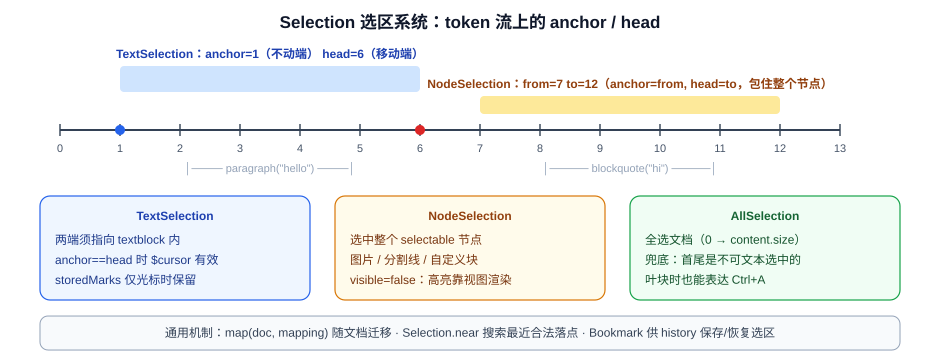

# 04 · Selection 选区系统实现原理

## 4.1 类族结构



选区基类（`prosemirror-state/src/selection.ts:9`）：

```ts
export abstract class Selection {
  constructor(
    readonly $anchor: ResolvedPos,   // 锚点：拖动时不动的一端
    readonly $head: ResolvedPos,     // 头部：拖动时移动的一端
    ranges?: readonly SelectionRange[]
  ) {
    this.ranges = ranges || [new SelectionRange($anchor.min($head), $anchor.max($head))]
  }
}
```

三个内置子类：

| 子类 | 位置 | 语义 |
|---|---|---|
| `TextSelection` | selection.ts:229 | 经典文本选区，两端必须在 `inlineContent` 节点内 |
| `NodeSelection` | selection.ts:325 | 选中一个 `selectable` 节点（图片、分割线等） |
| `AllSelection` | selection.ts:399 | 全选兜底：首尾是不可文本选中的叶块时也能表达 |

## 4.2 实现要点

**(1) 选区 = 已解析位置对，而非 DOM Range。** anchor/head 存的是 `ResolvedPos`（见 [02](02-文档模型-Schema-Node-Mark.md)），选区天然携带文档上下文；`anchor`/`head`/`from`/`to` 等 getter 只是取出裸整数（selection.ts:29-38）。`ranges` 数组目前长度恒为 1，但结构为多选区预留。

**(2) 三种语义的子类差异。**

- `TextSelection` 的 `$cursor` 属性（selection.ts:239）区分"光标"与"范围选区"——storedMarks 只在光标时保留（state.ts:34）。
- `NodeSelection` 令 anchor=from、head=to 恰好包住该节点（selection.ts:328-333）；`visible = false`（378 行）告诉视图不要用浏览器原生高亮，而靠 decoration 渲染选中态。
- `AllSelection` 处理文档首尾是叶块节点时普通 TextSelection 表达不了 Ctrl+A 的边界情况。

**(3) 选区随文档变迁：map。** 每个子类实现 `map(doc, mapping)`，把旧选区翻译到新文档。TextSelection 的版本（selection.ts:241）：

```ts
map(doc: Node, mapping: Mappable): Selection {
  let $head = doc.resolve(mapping.map(this.head))
  if (!$head.parent.inlineContent) return Selection.near($head)   // 落点不合法 → 就近搜索
  let $anchor = doc.resolve(mapping.map(this.anchor))
  return new TextSelection($anchor.parent.inlineContent ? $anchor : $head, $head)
}
```

NodeSelection 处理"节点被删掉"的情况：`mapResult` 返回 `deleted` 时降级为 `Selection.near`（selection.ts:338-343）。

**(4) 合法位置搜索：`near / findFrom / findSelectionIn`。** 这是选区系统的"安全网"：任何操作后若选区不合法，沿树向上/向下搜索最近的合法落点（selection.ts:135、439）：

```ts
static near($pos: ResolvedPos, bias = 1): Selection {
  return this.findFrom($pos, bias) || this.findFrom($pos, -bias) || new AllSelection($pos.node(0))
}
```

`findSelectionIn`（selection.ts:439）递归下降：遇到有 inline 内容的节点建 TextSelection；遇到 atom 且 selectable 的节点建 NodeSelection；`textOnly` 参数可强制只要文本光标。

**(5) 选区即编辑入口。** `Selection.replace(tr, content)`（selection.ts:72）把"删除选区并插入内容"实现为：对所有 range 反向映射位置 → `tr.replaceRange` → 用 `selectionToInsertionEnd`（selection.ts:454）把光标放到插入内容末尾：

```ts
replace(tr: Transaction, content = Slice.empty) {
  let lastNode = content.content.lastChild, lastParent = null
  for (let i = 0; i < content.openEnd; i++) {
    lastParent = lastNode!
    lastNode = lastNode!.lastChild
  }
  let mapFrom = tr.steps.length, ranges = this.ranges
  for (let i = 0; i < ranges.length; i++) {
    let {$from, $to} = ranges[i], mapping = tr.mapping.slice(mapFrom)
    tr.replaceRange(mapping.map($from.pos), mapping.map($to.pos), i ? Slice.empty : content)
    if (i == 0)
      selectionToInsertionEnd(tr, mapFrom, (lastNode ? lastNode.isInline : lastParent && lastParent.isTextblock) ? -1 : 1)
  }
}
```

`Transaction.deleteSelection / replaceSelection / insertText` 全部委托给它，保证"输入"与"粘贴"走同一条规范化路径。

**(6) 与 DOM 选区的双向同步（view 层）。** `prosemirror-view/src/selection.ts` 负责模型选区 → DOM Range；`domchange.ts:87` 的 `selectionFromDOM` 负责反向。MutationObserver 发现 DOM 选区与状态不一致时，生成一个只含 `setSelection` 的事务回流到状态机——**选区变更也走事务管线**，与文档变更完全同构。

**(7) Bookmark：无文档上下文的位置记忆。** `getBookmark()`（selection.ts:180、309）把选区降级为两个裸整数，供 history 插件在撤销栈里保存选区，恢复时再 `resolve(doc)` 回真正的选区：

```ts
class TextBookmark {
  constructor(readonly anchor: number, readonly head: number) {}
  map(mapping: Mappable) {
    return new TextBookmark(mapping.map(this.anchor), mapping.map(this.head))
  }
  resolve(doc: Node) {
    return TextSelection.between(doc.resolve(this.anchor), doc.resolve(this.head))
  }
}
```

---

**上一篇**：[03 · Transaction 事务机制](03-Transaction事务机制.md) ｜ **下一篇**：[05 · 与 Slate、Quill 的架构对比](05-与Slate-Quill架构对比.md)
