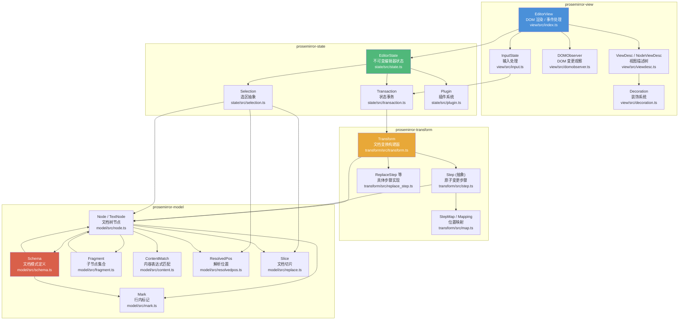
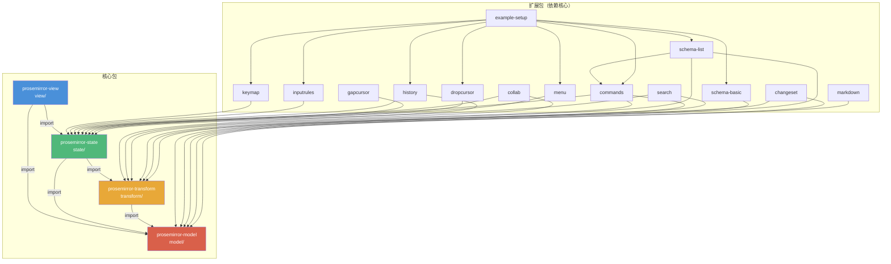
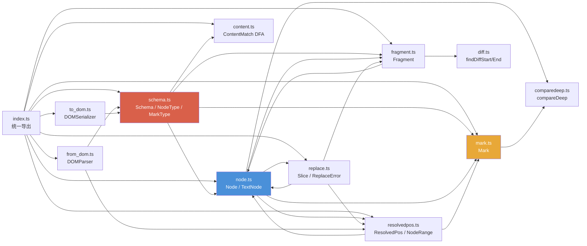
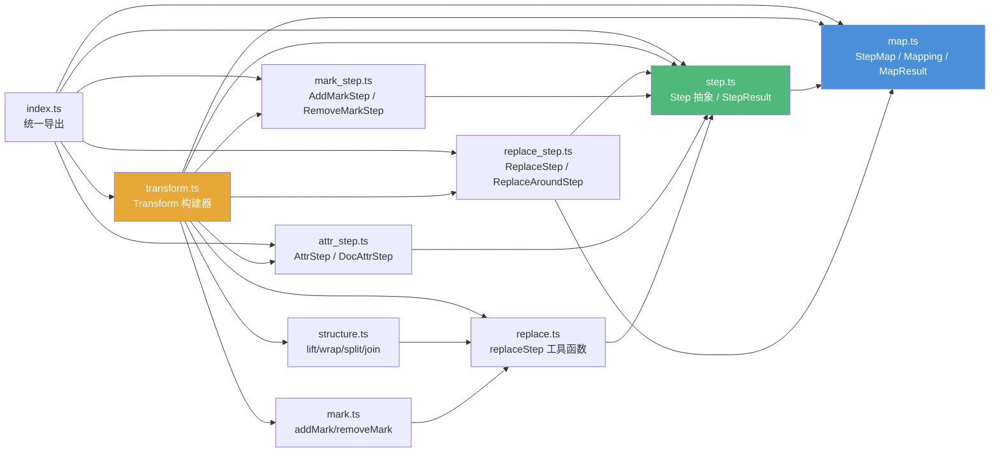
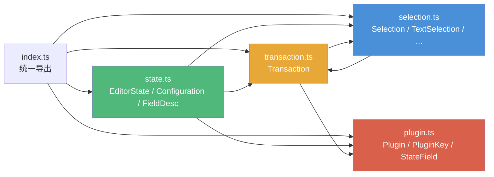
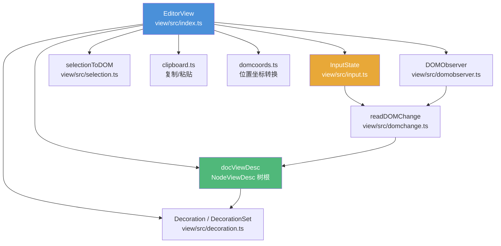
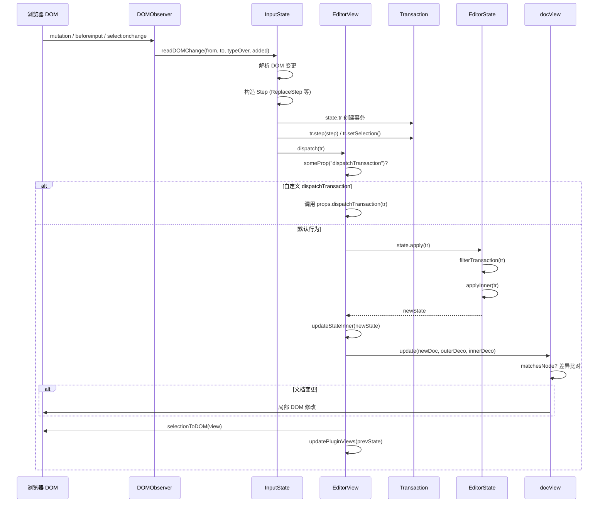
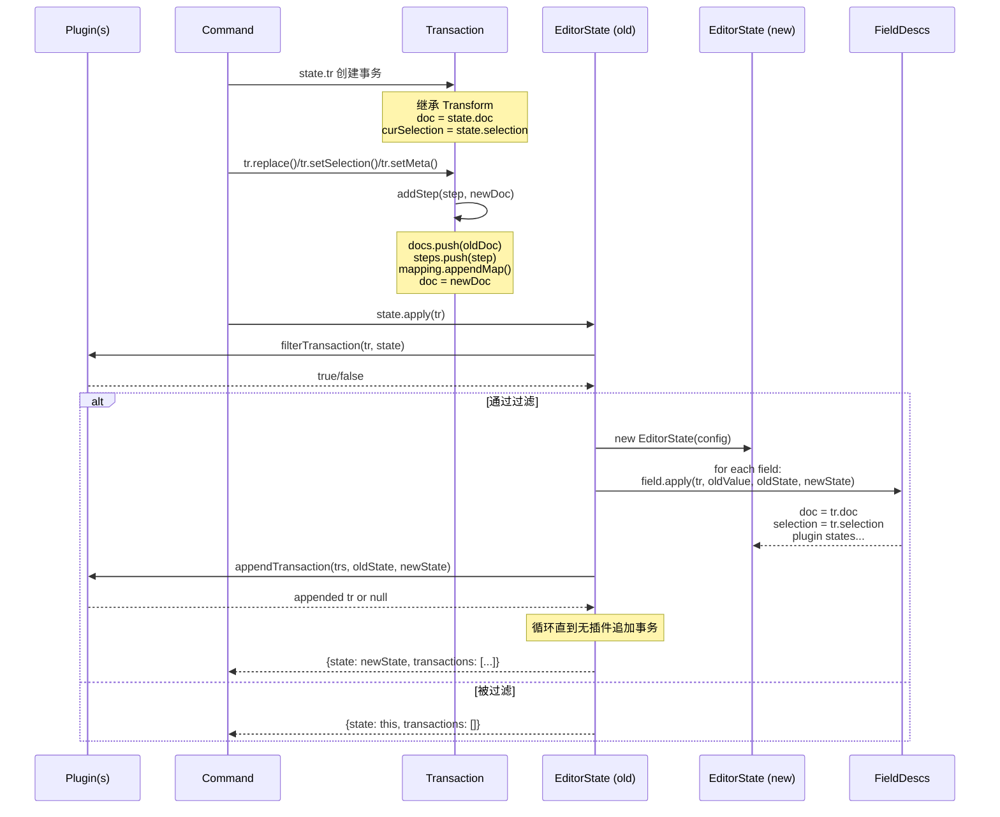

# 04 核心模块依赖关系图

> 本章通过 Mermaid 图表展示 ProseMirror 核心包的分层架构、包间依赖、各包内部模块依赖，以及 View 层的交互时序。

---

## 目录

- [4.1 整体分层架构](#41-整体分层架构)
- [4.2 包间依赖关系](#42-包间依赖关系)
- [4.3 Model 包内部依赖](#43-model-包内部依赖)
- [4.4 Transform 包内部依赖](#44-transform-包内部依赖)
- [4.5 State 包内部依赖](#45-state-包内部依赖)
- [4.6 View 包核心结构](#46-view-包核心结构)
- [4.7 View 层 DOM 交互时序](#47-view-层-dom-交互时序)
- [4.8 状态更新完整数据流](#48-状态更新完整数据流)

---

## 4.1 整体分层架构

**分层原则：**
- 上层可以依赖下层，下层绝不依赖上层
- model 层零外部依赖（仅依赖 orderedmap 工具库）
- transform 层只依赖 model，不依赖 DOM
- state 层依赖 transform 和 model，不依赖浏览器 API
- view 层依赖 state 和 model，是唯一接触 DOM 的层

---

## 4.2 包间依赖关系

核心包形成严格的线性依赖链：`view → state → transform → model`。这保证了底层包可以在无 DOM 环境（如 Node.js 服务端协作服务）中独立使用。

---

## 4.3 Model 包内部依赖

**关键依赖说明：**

- `schema.ts` 是核心枢纽，编译 Spec 为 Type/MarkType，并关联 ContentMatch
- `node.ts` 是最复杂的模型文件，依赖 Fragment、Mark、Replace、ResolvedPos
- `fragment.ts` 依赖 `diff.ts` 做差异查找
- `from_dom.ts` 和 `to_dom.ts` 是 DOM 序列化/解析，单向依赖 Schema
- `comparedeep.ts` 是无依赖的工具函数，用于深比较 attrs

---

## 4.4 Transform 包内部依赖

**关键依赖说明：**

- `step.ts` 定义抽象基类和注册表，依赖 `map.ts` 的 Mappable 接口
- `map.ts` 是自包含的位置映射引擎，不依赖其他 transform 文件
- `transform.ts` 是门面类，组合所有具体 Step 和工具函数
- `structure.ts`（lift/wrap/split/join）通过 `replace.ts` 的工具函数构造 ReplaceAroundStep
- 每个具体 Step 文件只依赖 `step.ts` 和 `map.ts`，彼此独立

---

## 4.5 State 包内部依赖

**关键依赖说明：**

- `state.ts` 是核心，管理 Configuration（含 FieldDesc 列表）和 apply 逻辑
- `transaction.ts` 继承 transform 的 Transform，组合 Selection 和 Plugin（用于 setMeta 的 key）
- `selection.ts` 依赖 Transaction 类型（用于 replace/replaceWith 方法签名），但不依赖 State
- `plugin.ts` 是独立的插件描述，不依赖 state.ts，避免循环依赖

---

## 4.6 View 包核心结构

View 包是最大最复杂的包，负责 DOM 渲染、事件监听、选区同步、剪贴板、拖拽、IME 组合输入等。EditorView 持有：
- `docView`：文档的视图描述树（NodeViewDesc），负责增量 DOM 更新
- `input`：输入状态机，处理键盘、粘贴、拖拽等
- `domObserver`：MutationObserver 封装，检测外部 DOM 修改
- `dom`：可编辑的 DOM 根元素

---

## 4.7 View 层 DOM 交互时序

**关键设计：**

1. **DOMObserver** 使用 MutationObserver + 事件监听捕获 DOM 变更，不直接信任 DOM
2. **readDOMChange** 将 DOM 差异转换回 ProseMirror Step，保证单一数据源（EditorState）
3. **dispatch** 是唯一的状态更新出口，所有变更都经过 Transaction
4. **updateStateInner** 对比新旧状态，决定是否需要重绘文档、更新选区、滚动
5. **NodeViewDesc.update** 进行细粒度的 DOM 增量更新，避免全量重渲染

---

## 4.8 状态更新完整数据流

这个流程体现了 ProseMirror 的单向数据流：**Command → Transaction → EditorState.apply → newState → View 更新**。插件可以通过 `filterTransaction` 拦截事务，通过 `appendTransaction` 追加响应事务。

---

← 返回 [03 选区系统](file:///Users/tog/Desktop/code/gsb/gsb-731/xyj-731-4/xyj-731-4_Steve/docs/03-selection.md) | 返回 [主 README](file:///Users/tog/Desktop/code/gsb/gsb-731/xyj-731-4/xyj-731-4_Steve/README.md) | 继续阅读 [05 架构对比 →](file:///Users/tog/Desktop/code/gsb/gsb-731/xyj-731-4/xyj-731-4_Steve/docs/05-comparison.md)
