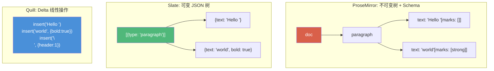
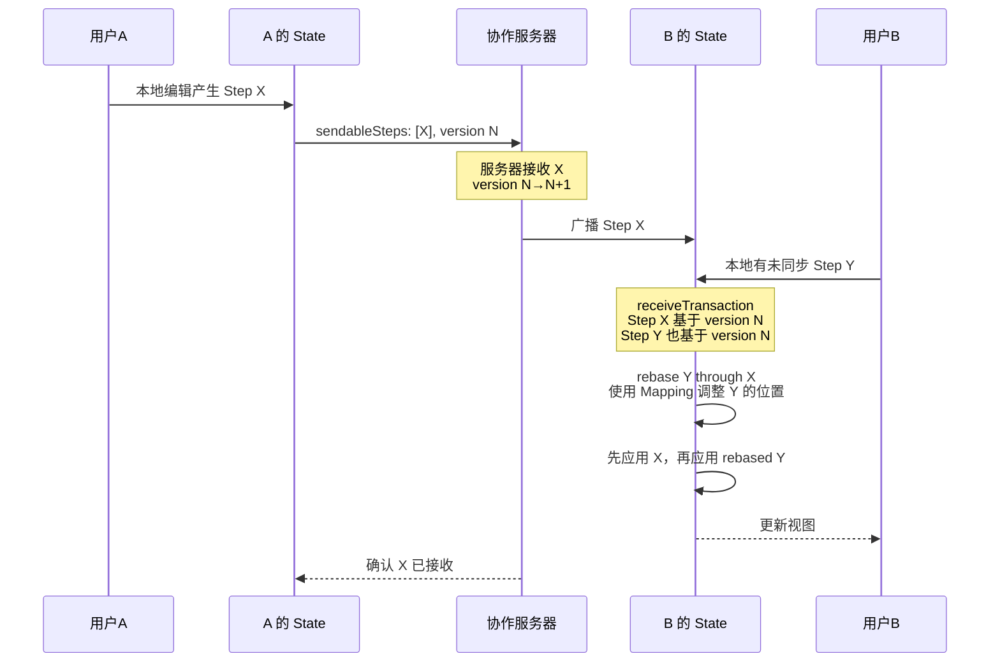

# 05 与 Slate、Quill 架构差异对比

> 本章从文档模型、状态管理、协作编辑、扩展机制等维度对比 ProseMirror、Slate、Quill 三大富文本编辑器框架的架构设计差异。

---

## 目录

- [5.1 架构理念对比矩阵](#51-架构理念对比矩阵)
- [5.2 文档模型差异](#52-文档模型差异)
- [5.3 状态管理：不可变 vs 可变](#53-状态管理不可变-vs-可变)
- [5.4 变更模型对比](#54-变更模型对比)
- [5.5 协作编辑支持](#55-协作编辑支持)
- [5.6 扩展机制差异](#56-扩展机制差异)
- [5.7 视图层与 DOM 同步](#57-视图层与-dom-同步)
- [5.8 架构选择建议](#58-架构选择建议)

---

## 5.1 架构理念对比矩阵

| 维度 | ProseMirror | Slate | Quill |
|------|-------------|-------|-------|
| **文档模型** | 强 Schema 约束的不可变树 | 基于 JSON 的可变树模型 | Delta 格式的线性文档 |
| **数据结构** | Node + Fragment + Mark | Node（可嵌套 children） | Delta（insert/delete/retain ops） |
| **Schema 强度** | 编译期 content 表达式自动机 | 运行时校验，相对宽松 | 格式白名单 + blot 注册 |
| **状态管理** | 不可变 EditorState + Transaction | 可变 Editor 实例 + Operation | Parchment 文档 + Delta |
| **变更模型** | Step（可序列化、可反转、可 rebase） | Operation（transforms） | Delta / API 调用 |
| **协作编辑** | 原生 Step rebase + collab 包 | 需第三方方案 | OT（基于 Delta） |
| **视图层** | 独立 prosemirror-view 包 | 框架无关但需绑定（React/Vue） | 自身 DOM 渲染（Parchment） |
| **扩展机制** | Plugin（状态字段 + props + 视图） | Plugin（编辑器钩子） | Module（格式/模块/主题） |
| **DOM 同步** | 自定义差异比对 + NodeView | 依赖框架虚拟 DOM | Parchment 直接操作 DOM |
| **位置模型** | 扁平整数 + ResolvedPos 路径 | Path 数组（索引路径） | index + length |
| **学习曲线** | 陡峭（概念多、分层严格） | 中等（React 友好） | 平缓（API 简洁） |
| **模块化程度** | 极高（4 个核心包 + 10+ 扩展包） | 高（core + react 等绑定） | 中（单包含模块系统） |

---

## 5.2 文档模型差异

### ProseMirror：强类型、不可变、Schema 驱动

ProseMirror 的文档必须遵守 Schema 定义的 content 表达式。Schema 在构造时将表达式编译为 DFA 自动机，任何不符合 Schema 的节点都无法存在于文档中。

```typescript
import {Schema} from "prosemirror-model"

const schema = new Schema({
  nodes: {
    doc: { content: "paragraph+" },
    paragraph: { content: "text*", group: "block" },
    text: {},
    heading: {
      content: "text*",
      attrs: { level: { default: 1 } }
    },
    image: {
      inline: true,
      attrs: { src: {}, alt: { default: null } },
      group: "inline"
    }
  },
  marks: {
    strong: {},
    em: {},
    link: {
      attrs: { href: {} },
      excludes: "_"
    }
  }
})
```

关键特征：
- **content 表达式**：如 `"paragraph+"`、`"(heading | paragraph)*"`，在编译期验证
- **Mark 扁平附加**：格式信息不形成树，而是附加在行内节点上
- **节点分类严格**：block/inline/text/textblock/leaf/atom 有明确的类型体系
- **文档不可变**：创建后不可修改，变更产生新文档

### Slate：灵活的 JSON 树

Slate 的文档是普通 JavaScript 对象数组，结构自由度高，没有编译期约束。

```typescript
import { createEditor } from 'slate'

const initialValue: Descendant[] = [
  {
    type: 'paragraph',
    children: [
      { text: 'Hello ' },
      { text: 'world', bold: true }
    ]
  }
]
```

关键特征：
- **格式即属性**：粗体等格式直接作为文本节点的属性（`bold: true`），没有独立的 Mark 概念
- **嵌套自由**：任何节点都可以有 children，没有严格的 block/inline 分层
- **运行时校验**：通过 `isInline`、`isVoid` 等运行时配置约束行为
- **可变编辑器实例**：editor 对象直接被 transforms 修改

### Quill：线性 Delta 操作格式

Quill 的底层数据模型不是树，而是 Delta——一种基于操作的线性文档表示。

```javascript
const delta = new Delta()
  .insert('Hello ')
  .insert('world', { bold: true })
  .insert('\n', { header: 1 })
```

关键特征：
- **操作序列**：Delta 由 `insert`、`delete`、`retain` 操作组成
- **行级格式**：换行符 `\n` 携带块级格式（如 header、list）
- **Blot 抽象**：Parchment 库将 Delta 映射为 DOM 节点树
- **扁平模型**：嵌套结构（如表格）支持较弱，复杂结构需要自定义 Blot

### 三种模型对比



---

## 5.3 状态管理：不可变 vs 可变

```mermaid
graph TB
    subgraph "ProseMirror（不可变状态）"
        PS1["EditorState A"] -->|"apply(Transaction)"| PS2["EditorState B"]
        PS2 -->|"apply(Transaction)"| PS3["EditorState C"]
        PS1 -.->|"doc/selection 保持不变"| PS1
        Note1["每次 apply 创建全新 State<br/>旧状态完全保留<br/>支持时间旅行/undo/协作回放<br/>结构共享保证性能"]
    end

    subgraph "Slate（可变编辑器 + Operation）"
        SE1["Editor (同一引用)"]
        SE1 -->|"Transforms<[PLHD80_never_used_51bce0c785ca2f68081bfa7d91973934]>���点)"]
        SE1 -->|"Transforms.select(...)"| SE1
        Note2["editor 实例被原地修改<br/>通过 operation 记录变更<br/>依赖 React 等框架检测重渲染<br/>不可直接回溯旧状态"]
    end

    subgraph "Quill（命令式 API）"
        Q1["Quill 实例"]
        Q1 -->|"insertText()/formatText()"| Q1
        Q1 -->|"updateContents(delta)"| Q1
        Note3["直接调用 API 修改内部状态<br/>通过 text-change 事件通知外部<br/>内部维护 Delta<br/>历史由 history 模块管理"]
    end

    style PS1 fill:#50b87a,color:#fff
    style PS2 fill:#4a90d9,color:#fff
    style PS3 fill:#d9604a,color:#fff
    style SE1 fill:#e8a838,color:#fff
    style Q1 fill:#d9604a,color:#fff
```

**ProseMirror 的不可变优势：**

1. **状态可预测**：给定相同的 State 和 Transaction，必然产生相同的新 State
2. **撤销/重做简单**：只需保留旧 State 或 Transaction 序列
3. **协作友好**：多个事务可以基于同一 State 并发产生，通过 rebase 合并
4. **调试方便**：任何时刻可以检查 State 的完整快照
5. **DOM 更新高效**：通过 `oldDoc.eq(newDoc)` 快速判断是否需要重绘

**ProseMirror 不可变的代价：**

1. 需要理解 Step、Mapping、Transaction 等概念
2. 不能直接修改文档，必须通过事务 API
3. 结构共享虽然高效，但仍有一定的对象分配开销

---

## 5.4 变更模型对比

### ProseMirror Step

ProseMirror 的每个变更都是一个可序列化、可反转、可映射的 Step 对象：

```typescript
// Step 可以序列化为 JSON
const step = new ReplaceStep(2, 5, slice)
const json = step.toJSON()
// {stepType: "replace", from: 2, to: 5, slice: {...}}

// 可以反转（undo 的基础）
const inverted = step.invert(oldDoc)

// 可以通过位置映射调整（rebase 的基础）
const mapped = step.map(mapping)
```

### Slate Operation

Slate 的操作更接近数据库操作，直接描述对节点树的修改：

```typescript
// Slate 的 operation 类型（联合类型，列举全部成员）
type Operation =
  | { type: 'insert_node'; path: Path; node: Node }
  | { type: 'remove_node'; path: Path; node: Node }
  | { type: 'merge_node'; path: Path; position: number; properties: any }
  | { type: 'split_node'; path: Path; position: number; properties: any }
  | { type: 'move_node'; path: Path; newPath: Path }
  | { type: 'set_node'; path: Path; properties: any; newProperties: any }
  | { type: 'insert_text'; path: Path; offset: number; text: string }
  | { type: 'remove_text'; path: Path; offset: number; text: string }
  | { type: 'set_selection'; properties: Partial<Range> | null; newProperties: Partial<Range> | null }
```

### Quill Delta

Quill 的变更本身就是 Delta（与文档格式相同），变更和文档统一表示：

```javascript
// 变更 Delta
const change = new Delta()
  .retain(5)
  .insert(' world')
  .delete(3)

// 应用变更
quill.updateContents(change)
```

### 对比

| 特性 | ProseMirror Step | Slate Operation | Quill Delta |
|------|-----------------|-----------------|-------------|
| 可序列化 | 是（JSON + 类型注册） | 是（JSON） | 是（JSON） |
| 可反转 | `invert(doc)` | 部分支持 | `invert()` |
| 位置映射 | StepMap/Mapping（成熟） | Path 转换（简单） | index 偏移 |
| Rebase 支持 | 原生（mirror 机制） | 需自行实现 | OT transform |
| 自定义类型 | 继承 Step + jsonID | 固定类型集合 | 固定操作类型 |
| 结构化程度 | 高（Slice + open depth） | 中（path 定位） | 低（线性 index） |

---

## 5.5 协作编辑支持

### ProseMirror：原生 Step Rebase

ProseMirror 是三大框架中协作支持最成熟的：

1. **Step 可序列化**：每个变更都是可网络传输的 JSON
2. **Step.invert(doc)**：精确创建反转步骤
3. **Step.map(mapping)**：通过位置映射调整步骤位置
4. **Mapping mirror 机制**：智能处理 rebase 中的位置冲突
5. **prosemirror-collab 包**：提供完整的协作流程：
   - `sendableSteps(state)` 获取待发送步骤
   - `receiveTransaction(state, steps)` 接收远程步骤
   - 自动 rebase 本地未确认步骤
   - 版本号管理

协作流程：



### Quill：OT

Quill 基于 Delta 的 OT（Operational Transformation）：
- Delta 天然支持 `transform()` 方法
- `deltaA.transform(deltaB, priority)` 将 deltaB 基于 deltaA 转换
- 需要外部协作服务（如 ShareDB）处理冲突
- 对复杂嵌套结构支持有限

### Slate：第三方方案

Slate 核心不内置协作支持：
- 历史上有 slate-collaborative 等第三方方案
- 由于数据模型可变且 operation 系统较简单，协作实现更复杂
- 通常需要绑定 Yjs 等 CRDT 库间接实现

---

## 5.6 扩展机制差异

### ProseMirror Plugin：全栈式扩展

ProseMirror 的 Plugin 是最完整的扩展单元，可以同时拥有状态、事务钩子、DOM 事件处理和视图组件。

**关键源码：** [plugin.ts#L71-L89](../state/src/plugin.ts#L71-L89)

```typescript
const myPlugin = new Plugin({
  key: new PluginKey('myPlugin'),

  state: {
    init(config, instance) { return { count: 0 } },
    apply(tr, value, oldState, newState) {
      return tr.getMeta('inc') ? { count: value.count + 1 } : value
    },
    toJSON(value) { return value },
    fromJSON(config, value) { return value }
  },

  filterTransaction(tr, state) { return true },

  appendTransaction(transactions, oldState, newState) { return null },

  props: {
    handleKeyDown(view, event) { return false },
    decorations(state) { return DecorationSet.empty }
  },

  view(editorView) {
    return {
      update(view, prevState) {},
      destroy() {}
    }
  }
})
```

Plugin 的能力覆盖：
- **状态字段**：在 EditorState 中拥有独立的状态槽
- **事务过滤**：`filterTransaction` 可拦截事务
- **事务追加**：`appendTransaction` 可响应事务自动追加新事务
- **编辑器 Props**：注册事件处理、装饰、节点视图等
- **插件视图**：拥有独立的视图生命周期（update/destroy）

### Slate Plugin：钩子函数

Slate 的插件是普通对象，包含各种钩子函数：

```typescript
const withMyPlugin = editor => {
  const { isInline, isVoid, normalizeNode } = editor
  editor.isInline = element => {
    return element.type === 'my-inline' ? true : isInline(element)
  }
  return editor
}
```

Slate 插件通过**重写 editor 方法**实现扩展，更接近函数式装饰器模式。

### Quill Module：功能注册

Quill 的模块更侧重功能注册和事件监听：

```javascript
class WordCountModule {
  constructor(quill, options) {
    this.quill = quill
    this.container = document.querySelector(options.container)
    quill.on('text-change', () => {
      this.container.textContent = quill.getLength() + ' characters'
    })
  }
}
Quill.register('modules/wordCount', WordCountModule)

const quill = new Quill('#editor', {
  modules: { wordCount: { container: '#counter' } }
})
```

### 对比

| 能力 | ProseMirror Plugin | Slate Plugin | Quill Module |
|------|-------------------|-------------|-------------|
| 独立状态 | 是（StateField） | 通过 editor 扩展 | 自行管理 |
| 事务拦截 | filterTransaction | 重写 transforms | 事件监听 |
| 事务追加 | appendTransaction | 无直接等价 | 无直接等价 |
| DOM 事件 | props.handleKeyDown 等 | 框架事件绑定 | 事件监听 |
| 装饰/叠加 | Decoration 系统 | 需自行实现 | 无直接等价 |
| 视图组件 | view() 生命周期 | React 组件 | 无直接等价 |
| 序列化 | state.toJSON | 依赖框架 | 模块自行处理 |

---

## 5.7 视图层与 DOM 同步

### ProseMirror：自定义增量更新

ProseMirror 有独立的 view 包，维护一棵与文档树平行的**视图描述树**（ViewDesc/NodeViewDesc）：

1. State 更新后，view 调用 `docView.update(newDoc, decorations)`
2. 视图树递归比对新旧 Node，复用未变化的 DOM 节点
3. 只更新发生变化的部分
4. NodeView 允许完全自定义单个节点的渲染
5. DOMObserver 检测外部 DOM 修改，通过 readDOMChange 转换回 Step

### Slate：依赖框架虚拟 DOM

Slate 的视图层不内置，通常使用 slate-react：
- 文档变更后触发 React 重渲染
- React 的虚拟 DOM diff 算法决定 DOM 更新
- 自定义渲染通过 `renderElement`/`renderLeaf` props

### Quill：Parchment 直接操作

Quill 通过 Parchment 库直接操作 DOM：
- Delta 变更映射为 Blot 的插入/删除/更新
- Parchment 直接操纵 DOM 节点
- 没有虚拟 DOM 层

---

## 5.8 架构选择建议

| 场景 | 推荐 | 原因 |
|------|------|------|
| 复杂结构化文档（表格、嵌套块、自定义节点） | **ProseMirror** | Schema 约束 + NodeView 完全控制渲染 |
| 需要可靠的实时协作编辑 | **ProseMirror** | 原生 Step rebase + collab 包成熟 |
| React 技术栈、快速上线 | **Slate** | React 绑定自然，模型简单直观 |
| 简单富文本（评论、留言） | **Quill** | API 简洁，上手快，内置主题 |
| 需要高度定制渲染逻辑 | **ProseMirror** | NodeView/MarkView/Decoration 体系完善 |
| 文档格式合法性要求严格 | **ProseMirror** | ContentMatch DFA 在编译期保证 |
| 轻量级、小体积优先 | **Quill** | 单包，API 紧凑 |
| 需要服务端文档处理 | **ProseMirror** | model/transform 包无 DOM 依赖，可在 Node.js 运行 |
| 团队熟悉函数式/不可变数据 | **ProseMirror** | 不可变架构与函数式理念一致 |

---

← 返回 [04 架构图](04-architecture-dependencies.md) | 返回 [主 README](../README.md) | 继续阅读 [06 代码索引 →](06-code-index.md)
